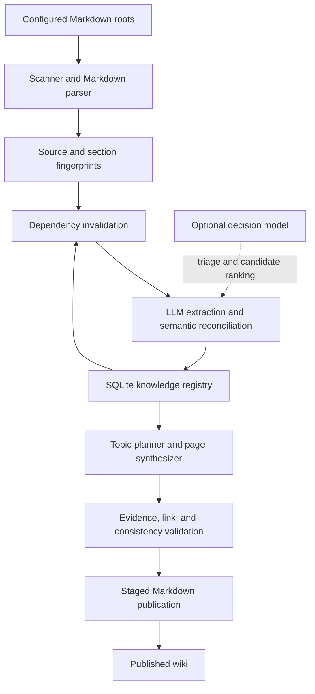

# Lore — Technical Design

**Status:** Draft v0.6 · **Date:** 2026-10-08 · **Implementation status:** Initial end-to-end CLI implemented; see implementation guide for boundaries

The initial Rust CLI now implements ingestion, exact evidence capture, live provider clients, conservative semantic reconciliation, incremental topic generation, audit/search/read commands, and recoverable publication. [The implementation guide](docs/IMPLEMENTATION.md) is the operational reference and explicitly distinguishes tested behavior from remaining design ambitions. Examples elsewhere in this design are architectural illustrations; use the README and generated `lore.yml` for the currently accepted configuration schema. The implementation currently uses `pulldown-cmark` rather than the originally proposed Comrak parser, sequential processing, exhaustive bounded candidate batches, a topic directory with a deterministic index, and whole-project privacy erasure rather than selective pruning.

**Validation-driven refinement (v0.6).** Reaffirming an accepted decision is a distinct, source-backed historical event, represented by an immutable `reaffirms` relationship rather than automatically merging the reaffirmation into the original decision. Explicit `supersedes` and `reaffirms` relations are used across wiki topic boundaries. These relationships affect the input fingerprints of both connected topic pages, are supplied to generative synthesis and verification, and are included in deterministic human-readable decision-history notes. The system distinguishes documented decision relationships from proof of deployment, and treats a document's publication date as distinct from a claimed effective date. The updated benchmark keeps strict and explicitly acceptable classification proxies separate, supports historical relationship scoring, and records stronger run fingerprints for honest repeatability comparisons. See [Atlas findings](evaluation/ATLAS_FINDINGS.md) for evidence and unresolved model-quality questions.

## 1. Overview

Lore is a local-first, incremental knowledge compiler for heterogeneous Markdown project artifacts. It ingests any number of configured source directories belonging to one project, captures immutable source-evidence excerpts, extracts versioned source assertions, reconciles consolidated knowledge with its history, and publishes a linked Markdown wiki. The source material may include architecture notes, ADRs, plans, proposals, exported issues, meeting notes, investigations, operating procedures, or informal ideas. Rather than summarize each file independently, Lore constructs a project-level understanding that distinguishes what is documented as current, what has been decided, what is proposed, and what remains uncertain.

Lore will be implemented as a standalone Rust CLI. Ordinary Rust code owns file discovery, parsing, hashing, dependency management, persistence, validation, and publication. LLMs are used for semantic tasks such as knowledge extraction, concept discovery, equivalence assessment, reconciliation, and prose synthesis. Ollama and OpenAI are both initial inference providers: Ollama supports local generative and Clef-Flash decision inference, while OpenAI supports generative inference via the Responses API and decision inference via the Decisions API. TypeSafe AI's Jev is a candidate for a subsequent decision adapter. All providers operate behind stable, capability-specific interfaces. The output is portable Markdown, and the local knowledge registry is stored in SQLite.

The central abstraction is **documented project knowledge with traceable evidence and historical assertions**, not “a fact asserted by an LLM.” This design deliberately treats documented statements, implementation verification, temporal lifecycle, and source authority as distinct concerns. The implementation should begin with topic-level incremental wiki regeneration while preserving a structured knowledge-unit layer that can support more precise updates later.

## 2. Motivation and illustrative example

Project knowledge is fragmented across documents written at different times and for different reasons. An ADR may declare MySQL the chosen database; an idea may propose PostgreSQL; an issue may request investigation; and a status update may later report that the investigation was postponed. A conventional summarizer may compress these into an incorrect statement such as “the project is migrating to PostgreSQL.” Lore should instead synthesize that MySQL is the documented accepted choice, PostgreSQL has been proposed and investigated, and no available source establishes that the migration was approved or implemented. It should link each part of the explanation to the relevant source.

This is a provenance and lifecycle problem as much as a summarization problem. A later document does not necessarily overrule an earlier one. A source can be reliable evidence that a proposal was made while being weak evidence that a proposal was implemented. Lore's job is to explain these distinctions clearly, preserve relevant history, and make it inexpensive to revisit that understanding when sources change.

## 3. Goals, non-goals, and invariants

### Goals

The MVP must accept multiple local Markdown directories for a single project, produce a coherent and navigable topic-oriented Markdown wiki, and associate material claims in that wiki with precise source evidence. It must represent decisions, proposals, plans, issues, observations, historical context, and unresolved questions without promoting intentions into implementation facts. The incremental engine must detect added, modified, deleted, and potentially moved sources, identify impacted knowledge and topic pages, and avoid model calls on a fully unchanged corpus. It must support local inference through Ollama and explicitly configured hosted inference through OpenAI's Responses and Decisions APIs in the initial release, run on common desktop and CI platforms as a Rust binary, and make failures inspectable and recoverable.

The output should be useful to both humans and coding agents without requiring a special viewer. A user should be able to read a high-level project overview, navigate to a topic, inspect links to source material, and understand what is asserted versus uncertain. The system should not require a graph database, embeddings, MCP, or a separately installed coding agent for basic operation.

### Explicit non-goals for v0.1

The first release will not directly connect to issue trackers, chats, or hosted document services; users can export such material as Markdown. It will not verify implementation behavior against source code or runtime systems, maintain a universally authoritative project truth, resolve every contradictory document automatically, provide a web UI, operate as a continuous daemon, or support multi-project cross-repository reasoning. Semantic search, vector embeddings, advanced claim-level page patching, and agentic autonomous exploration are deferred unless MVP evaluation demonstrates a concrete need.

### Architectural invariants

1. Every material source-dependent conclusion presented as documented knowledge must have at least one valid evidence reference; unsupported synthesis is either excluded or explicitly flagged as an inference requiring review.
2. Documented intent, accepted decision, observed behavior, and confirmed implementation must remain distinguishable. The status of an issue alone must not be treated as proof of implementation.
3. Immutable exact-text evidence snapshots and versioned, source-specific assertions must preserve prior observations, even when the live source changes or disappears; historical evidence is never automatically treated as current proof.
4. Source data is untrusted input. Model responses and content embedded in Markdown cannot authorize arbitrary shell execution, remote access, or edits outside the generated output and state directories.
5. Deterministic code owns evidence resolution, content hashing, stable identity bookkeeping, dependency invalidation, and publishing. Models propose semantic changes but cannot directly mutate the authoritative database.
6. A complete no-op update must perform zero model calls and produce no wiki file changes. Failed processing must not advance the successful source baseline or leave a mixed, falsely “up-to-date” publication.
7. The generated wiki must never be ingested as original evidence. Local-only operation must not send project content to any network destination other than explicitly configured local inference endpoints.
8. Stable source-assertion, knowledge, and topic identities must be preserved across normal updates, even if descriptions or source positions change. Deleting a source must not silently erase knowledge that other surviving sources still support.

## 4. User experience and CLI contract

The proposed configuration file is `lore.yml` in the project root. A project is a logical knowledge base rather than necessarily a Git repository: source roots can be separate directories, with explicit stable `id` values to distinguish similarly named files. Paths are resolved relative to the configuration directory. The scanner visits Markdown files recursively, honors configured exclusions and sensible ignore rules, and always excludes its own generated wiki and state directories regardless of user patterns. Source roots outside the project directory should require an explicit opt-in or an explicit path in configuration, and symlink traversal is disabled by default.

```yaml
# Proposed schema; subject to a versioned configuration specification.
schema_version: 1
project:
  name: payments

sources:
  roots:
    - id: docs
      path: ./docs
    - id: plans
      path: ./plans
    - id: issues
      path: ./issue-export
  exclude:
    - node_modules
    - target

output:
  wiki_dir: ./lore
  state_dir: ./.lore

models:
  decision:
    provider: ollama
    model: clef-flash
    enabled: true
  generative:
    provider: ollama
    model: gemma4:12b

providers:
  ollama:
    base_url: http://127.0.0.1:11434

processing:
  max_parallel_requests: 2
  require_evidence: true
```

`lore init` is proposed to bootstrap the configuration and produce the initial wiki, with explicit behavior if either already exists. `lore update` performs an incremental refresh; `lore status` reports the current source inventory, last successful baseline, dirty topics, and unresolved work without invoking a model; `lore audit` rereads a wider set of source and wiki relationships to check for missing knowledge, contradictions, and stale explanations. `--config` selects a configuration file, `--json` exposes machine-readable diagnostics, and `--dry-run` on update shows the deterministic candidate work plan without publishing changes or invoking a model. Errors should have stable codes, clear diagnostics, and meaningful process exit statuses. Confirmation should be required before overwriting an existing, non-Lore-owned output directory.

Expected project layout:

```text
my-project/
  lore.yml
  docs/
  plans/
  issue-export/
  lore/                    # readable, generated Markdown; may be committed
    index.md
    architecture/
    concepts/
    decisions/
    initiatives/
    risks-and-questions.md
  .lore/                   # local internal state; ignored by default
    state.db
    staging/
    backups/
```

The SQLite state database is operational state, not a requirement for reading the wiki. Because it may be large and machine-specific, the default should be to ignore `.lore/` in Git while allowing the Markdown wiki to be committed. Incremental CI runs must restore the matching state database from a durable cache or else perform a safe rebuild. Loss of the state database must not make the published Markdown misleadingly claim that it has been incrementally verified.

For the initial release, the same role-based configuration also supports OpenAI. Choosing this configuration is an **explicit opt-in to sending selected source excerpts and inference context to OpenAI**. The model IDs are examples that must pass provider capability and account-availability checks; no default should silently switch local documents to remote processing.

```yaml
# Alternate lore.yml model/provider settings — planned OpenAI configuration
models:
  decision:
    provider: openai
    model: gpt-6-luna
    enabled: true
  generative:
    provider: openai
    model: gpt-6-astra

providers:
  openai:
    base_url: https://api.openai.com/v1
    api_key_env: OPENAI_API_KEY
```

Users may also mix providers, for example Ollama for generative synthesis and OpenAI Decisions for fast classification. Roles never inherit a cloud provider implicitly: the effective provider must be visible in the resolved configuration and run diagnostics. A future TypeSafe decision adapter will use its own explicitly configured credentials, not an OpenAI or Ollama key.

## 5. Architecture and component boundaries



The `sources` subsystem discovers files, parses Markdown front matter and headings, and records full-file plus section-level digests. The `knowledge` subsystem owns typed knowledge units, source evidence, relationships, topic membership, and reconciliation rules. The `models` subsystem offers role-specific, provider-independent inference interfaces. The `synthesis` subsystem plans conceptual pages and writes explanations from the knowledge registry and carefully selected source context. The `storage` subsystem provides SQLite migrations, transactions, run journaling, and recovery. The `cli` subsystem ties these together without containing domain logic.

The orchestration is a bounded pipeline, not a general autonomous agent. Models do not choose arbitrary tools or mutate files; each processing stage receives selected source context and returns schema-constrained proposals validated by Rust. Repeated or recoverable model failures may be retried with bounded backoff; unrecoverable validation failures leave the previous published wiki intact and are surfaced in diagnostics.

## 6. Source model, provenance, and immutable evidence snapshots

**Source identity and revisions.** Each configured root has a stable ID; a source's human-readable locator combines that root ID and a normalized relative path, such as `issues:DB-123.md`. A separate opaque database ID preserves document identity across reliably detected renames. Observed source revisions are immutable records containing a content digest, scan time, path at observation, and available declared document metadata. File modification times are diagnostic only, never proof of semantic change or of when an event occurred. Front matter fields such as status, author, issue ID, and timestamps are assertions made by the source and may need contextual interpretation.

**Section addressing.** Parse Markdown into a heading tree with repeated-heading disambiguation, section ancestry, normalized text fingerprints, content digests, and advisory line spans. Sections can be relocated when a heading or file moves, using content and surrounding-context fingerprints. A line number or heading slug alone is not a stable identity. If matching a moved section is ambiguous, preserve the old evidence and flag the match rather than silently transferring its identity. The parser must handle front matter, fenced code, repeated headings, links, and documents without headings. Limit the size of processed documents, sections, and model excerpts explicitly; report skipped or truncated material rather than pretending extraction was complete.

**Evidence snapshots are first-class and immutable.** When an assertion is extracted, store a verbatim excerpt from the exact source revision, plus bounded neighboring context, in local SQLite. Never replace those bytes with a paraphrase or normalize them for storage. The excerpt's source identity, source revision, section identifier, observed location, content hash, optional line range, capture time, and an extraction/reference record travel together. A compact illustrative record is:

```json
{
  "id": "ev_123",
  "source_id": "src_17",
  "source_revision": "blake3:sourcehash",
  "section_id": "sec_8",
  "section_path": ["Resolution"],
  "line_range": [24, 27],
  "excerpt": "PostgreSQL migration deployed to production.",
  "context": "Issue resolution section",
  "excerpt_digest": "blake3:excerpthash",
  "captured_at": "2026-10-08T12:00:00Z"
}
```

The snippet is illustrative, not a finalized database schema. A content-addressed payload table may deduplicate identical bytes, but individual provenance records must retain their distinct source/revision context. A snapshot records **what Lore observed**, not whether the statement is still current or true. Snapshots survive edits, moves, and removals of source files; their references may change from live/current to historical/missing while the observed bytes remain available for audit. Current-support checks must resolve against active source revisions, whereas historical explanations may cite retained snapshots with an explicit historical qualification.

**Retention, security, and controlled deletion.** Keep bounded evidence snapshots by default for as long as historical assertions reference them. Don't automatically copy entire source documents. Evidence is potentially sensitive: protect the SQLite database as project data, do not put excerpts in ordinary logs or telemetry, do not send them to cloud models unless a cloud provider was explicitly selected, and document the local retention implications. Immutability means a stored snapshot cannot be edited in place during normal reconciliation; it does not override an explicit user-initiated purge. Before broad release, provide a deliberate administrative deletion/pruning path with impact analysis, referential checks, clear warnings, re-evaluation of affected knowledge, and a documented distinction between removing a source from the active scan and permanently erasing its retained content. A privacy purge may remove snapshots and dependent historical detail; Lore must not quietly keep a copy in a cache, backup, or staging directory.
## 7. Knowledge representation and reconciliation contract

### 7.1 Separate source assertions from consolidated knowledge

The central model has four layers: **source revisions and evidence snapshots → source assertions → reconciled knowledge units → generated wiki topics**. A source assertion means “this particular source revision says, proposes, reports, or asks X.” A knowledge unit represents a consolidated project proposition, decision, event, or open question derived from one or more assertions. Wiki pages are rebuildable narrative projections of the knowledge units; they are never the authoritative store of evidence or history.

A **source assertion** has a stable lineage ID plus immutable assertion revisions. It includes a normalized, context-preserving statement; one or more evidence snapshot references; type or modality (fact reported, proposal, requirement, decision, plan, question, reported outcome, etc.); actor or subsystem where known; relevant environment and scope; temporal fields; and the model/prompt version that extracted it. Two different documents stating an equivalent proposition still produce *two* assertions because their provenance and authority may differ. When one source changes, the old assertion revision remains historically visible and a new revision is recorded only if the source's observation or interpretation has changed. Pure relocation of unchanged bytes may update evidence location metadata without inventing a new semantic assertion.

A **knowledge unit** has an opaque stable ID and immutable revisions of its consolidated statement, kind, scope, temporal applicability, epistemic/support description, and relationships. An equivalent source assertion can attach additional support to an existing unit without allocating a duplicate unit. Meaningful change of a real-world or project lifecycle state (for example “migration proposed” becoming “migration completed”) normally creates a distinct knowledge unit or historical event linked to the previous one, *not* a rewrite that erases the former state. Revision of wording, source membership, or a genuinely corrected interpretation may reuse a unit ID while recording a new unit revision. Rust allocates identities; the LLM only proposes candidate operations and references.

### 7.2 Represent semantics without a universal status

A knowledge record needs independent dimensions rather than one overloaded `status`: **kind/modality** (decision, plan, observation, issue state, question); **domain lifecycle** (proposed, accepted, active, completed, rejected, superseded, unknown, when relevant); **evidence freshness** (unchanged, changed, missing, ambiguous) per citation; **support** (currently supported, only historically supported, unsupported, needs review); **conflict** (none, suspected, established, or unresolved); and **temporal applicability** (current, historical, future, unknown with explicit evidence). A current valid excerpt proves that Lore accurately read the source; it does not by itself establish that the documented statement is true in production.

Time is represented with different meanings: source-authored/published time, claimed effective/occurrence time, and Lore's observation time. Missing timestamps stay unknown; model guesses are not acceptable substitutes. The MVP operates on document-based evidence only and therefore does not label implementations `verified` simply because an issue is closed or a plan says it shipped. “Supported” in this model means supported *as a documented assertion*. Model probabilities and multiple correlated documents are not formal truth guarantees.

### 7.3 Reconciliation relationships

A new assertion can have more than one justified relation to existing knowledge. The following classifications guide candidate evaluation and outcome handling:

| Relationship | Meaning | Normal action |
| --- | --- | --- |
| `equivalent` | Same proposition in the same scope, modality, and relevant time | Attach another assertion to the existing unit; retain both sources |
| `elaborates` | Adds qualifying detail without making an identical claim | Preserve a separate unit when independently useful; link to the broader one |
| `contradicts` | Incompatible assertions about the same scope and relevant time | Retain both and mark a supported or suspected conflict |
| `supersedes` | Explicit replacement of an earlier decision, policy, or state | Create/retain successor and predecessor; link both and preserve history |
| `distinct` | Different propositions, even if they share a topic | Keep separate units; optionally relate them |
| `uncertain` | Insufficient evidence to decide the relationship | Keep the statements, queue review, and avoid ungrounded consolidation |

Classification is not necessarily exclusive: an explicit replacement may both contradict and supersede its predecessor. `Distinct` is normally a decision not to merge rather than a persistent graph edge; uncertainty belongs in a review record. Contradictions are only meaningful after checking subject, environment, scope, modality, and time. “MySQL was selected in January” and “PostgreSQL was selected in May” may be successive decisions rather than mutually exclusive current states.

### 7.4 Automatic reconciliation policy

**Automatic equivalence is permitted only when strongly supported.** The candidate statements must have the same material meaning, subject, scope, modality, and time applicability; their evidence must be resolvable; no material qualifier may be lost; and the comparison must survive deterministic schema/ownership checks. Confidence scores alone are insufficient. If equivalence is plausible but material differences remain, keep separate units or mark the match uncertain. A new equivalent assertion adds evidence, not a second copy of the statement.

**Automatic supersession requires explicit supporting evidence.** Examples include an ADR explicitly declaring that it replaces another ADR, or a documented state transition whose object and meaning are unambiguous. The model must identify the precise evidence snapshot and the predecessor being replaced. Rust verifies referenced IDs, evidence existence, transition shape, and acyclicity; it cannot prove semantic truth, so important ambiguity still triggers review. A newer document, a different technical proposal, or a closed issue does **not** automatically supersede an older decision or establish implementation.

**Conflicts and uncertainty are conserved.** A contradictory assertion does not erase or invalidate the opposing source assertion. Lore preserves both and links them as `suspected_conflict` or `established_documentary_conflict` when appropriately supported. An uncertain comparison must not cause silent deduplication, retraction, or supersession. The wiki should describe unresolved evidence in qualified language rather than guessing a winner. Users may eventually override source authority via explicit policy, but the MVP has no automatic “newest wins” rule.

### 7.5 Rust-owned operations and validation

The model proposes small reconciliation operations rather than an entire rewritten database. The contract should support adding assertion revisions, attaching/detaching assertion support for a knowledge unit, creating or revising units, recording relation edges (with supporting assertion IDs and evidence), superseding with an explicit predecessor/successor link, and recording a review item. Removing or superseding a *source assertion revision* does not delete its immutable snapshot or historical knowledge. A retraction in current projections is distinct from historical erasure.

Illustrative proposal:

```json
{
  "source_assertion_id": "as_104",
  "action": "create_knowledge_unit",
  "new_unit": {
    "statement": "The project decided to adopt PostgreSQL.",
    "kind": "decision",
    "lifecycle": "accepted"
  },
  "relations": [{
    "target_unit_id": "ku_mysql_decision",
    "type": "supersedes",
    "evidence_snapshot_ids": ["ev_104"],
    "reason": "ADR-027 explicitly replaces ADR-001."
  }]
}
```

Rust must validate request/run ownership, stable IDs, allowed enum values, source and snapshot existence, exact excerpt integrity, evidence reference freshness, time/scope constraints where machine-checkable, and that supersession does not form cycles. Batch validation is all-or-nothing; persistent IDs are assigned only after the batch passes structural checks. Model-supplied reasoning is retained as an explanation but never substitutes for evidence. Retries must be idempotent for one proposal/run ID. Semantic judgments are fallible even after validation, so the audit workflow must be able to flag suspicious accepted merges or replacements.

### 7.6 Example: proposal, decision, and reported completion

An accepted ADR in January states that MySQL was selected. A March plan proposes PostgreSQL. A May ADR explicitly supersedes the MySQL decision and selects PostgreSQL, and a June issue reports deployment complete. Lore retains four source-specific observations and consolidated units representing the historical MySQL decision, the proposal, the replacement decision, and the *reported* outcome. The May decision can explicitly `supersede` the January decision without proving a June deployment; the issue's reported completion is not independent verification. The wiki can synthesize the history and cite the exact archived passages, qualifying the June outcome as reported rather than verified. If the January source later disappears, its retained snapshot still explains the historical decision, while current validity must be rechecked using surviving live sources.

This four-layer architecture is an intentional difference from treating all document statements as interchangeable factual Claims. It retains the precision of OpenWiki-style source evidence while representing project-document modality, historical context, and uncertain relationships.
## 8. Initial compilation workflow

**Discovery and topic planning.** Lore inventories eligible Markdown source revisions and their sections, stores fingerprints, extracts useful metadata, and samples enough of the corpus to propose a small conceptual information architecture. Source documents are evidence, not a page structure to copy. A bounded planning model proposes major systems, workflows, decisions, initiatives, and open questions with stable topic identities.

**Evidence capture and source-assertion extraction.** Each source section is processed with its heading context. Before persisting an extracted assertion, Rust verifies its exact excerpt against the observed source revision and stores an immutable, bounded evidence snapshot. A generative model proposes source-specific assertions with type, modality, actor, scope, relevant times, and evidence references. Neither a quote nor model output may claim independent verification. Assertions are versioned within their source lineages; identical propositions from different sources remain separate assertions.

**Knowledge reconciliation.** Use SQLite FTS5 and indexed subject/topic hints to retrieve likely knowledge-unit candidates. A decision model may rank candidates, but must not be the sole veto on considering new source knowledge. A generative model compares substantive semantics and returns constrained operations: attach equivalent support, add an elaborating unit, record disagreement, explicitly supersede, keep distinct, or request review. Rust performs deterministic validation and commits a coherent set of changes to staged registry state. Conservative handling is required when the meaning or source authority is ambiguous.

**Wiki synthesis.** Synthesize readable topic pages from consolidated units and their cited assertion/evidence links. Pages explain decisions, alternatives, plans, timelines, conflicts, and unresolved questions as appropriate; they are not raw assertion dumps. Historical-only citations are clearly distinguished from live-current evidence. Stable topic identities organize backlinks and navigation, with the root overview composed after topic pages exist.

**Validation and publication.** Verify that every material claim has a resolvable live citation or an explicitly historical retained snapshot, that source/knowledge support mappings and relative links are consistent, and that no interpretation has been promoted into verified implementation status without external verification. A failed model response or invalid provenance leaves the existing published wiki and successful baseline unchanged. The staged publication is completed only after deterministic validation succeeds.
## 9. Incremental reconciliation and invalidation

Lore requires **two complementary invalidation mechanisms**. *Evidence-based invalidation* tracks edited, deleted, moved, or otherwise stale sections and finds source assertions and knowledge units that cite them. *Semantic invalidation* looks outward from newly extracted assertions to semantically related existing knowledge, even when the older knowledge's supporting files did not change. Without the second mechanism, an entirely new document could change the current project picture while leaving an older, now-misleading wiki page untouched.

1. **Preflight and no-op.** Acquire a project lock; recover any interrupted staged run; compare file/section content digests, root inventory, relevant configuration, model/prompt versions, and schema version against the last successful baseline. An unchanged, successfully validated state returns without calling any models or rewriting pages.
2. **Source deltas.** Detect additions, modifications, deletions, and candidate renames. Re-resolve existing evidence against the active source tree; identical passages relocated within a document may update location records without semantic re-extraction. An ambiguous source move is reviewable, not a destructive delete-and-recreate assumption.
3. **Assertion revisions.** Extract from newly introduced or semantically changed sections, capture exact evidence snapshots, and reconcile changes with existing assertion lineages for that same source. Retire old assertion revisions from the *current* source projection as appropriate, retaining immutable versions and snapshots for history. A deleted document produces missing-current-evidence markers, never proof that its propositions are false.
4. **Affected knowledge.** Find knowledge units supported by the changed assertions. Also search across topics for equivalent, elaborating, contradictory, superseding, or uncertain relationships introduced by *new* assertions. Rank candidates with FTS5 and optional decision inference; use conservative fallback or a broader semantic pass for candidates whose omission could materially change understanding. No fast classifier may silently discard a new source solely because it looks unimportant.
5. **Sparse reconciliation.** Propose and validate attach/detach support, create/revise knowledge, link relationships, explicit supersession, or queue-for-review operations. Unaffected units and evidence are carried forward without model round trips. On deletion of one of several supporting sources, retain a unit if independent current support remains; otherwise mark it as historical-only, unsupported, or review-needed as warranted.
6. **Propagate dependencies.** Mark a wiki topic dirty when its knowledge-unit revision, evidential support, documentary conflict, temporal applicability, relationship, or source citation changed. New topical relationships may also dirty older wiki pages, even if their original source never changed. Regenerate affected full topic pages and truly impacted overview/navigation files; preserve all unrelated pages byte-for-byte.
7. **Validate, publish, and commit baseline.** Run evidence, referential, link, and support-state checks; stage output and database changes; publish through a recoverable journal; and advance the successful source baseline only when both output and state are consistent. Record unresolved review work separately without pretending it has been resolved.

A changes-only processing path cannot guarantee that every missed semantic relationship will be discovered by lexical candidate retrieval. The MVP must err on the side of conservative re-evaluation when matching is uncertain, and `lore audit` will provide periodic broader reconciliation to detect cross-document omissions. The accepted trade-off is more occasional model work rather than silently dropping important knowledge.

The first implementation uses section-level change detection, assertion/knowledge-level reconciliation, and **whole-topic-page regeneration**. In-place sentence patching is deferred because it makes cross-paragraph coherence and citation validation harder. Sparse knowledge updates are still essential: unchanged assertion revisions and knowledge units should not be repeated unnecessarily to the model. Publication and no-op guarantees apply to content and state, not merely to the final CLI exit code.
## 10. SQLite schema, recovery, and retention

SQLite is the durable machine state; the generated wiki is a readable projection. Proposed logical tables now include `projects`, `source_roots`, `sources`, `source_revisions`, `source_sections`, `evidence_snapshots`, `assertions` (stable lineage), `assertion_revisions`, `knowledge_units`, `knowledge_revisions`, `assertion_unit_links` (with support/challenge semantics), `knowledge_relations` (with explicit evidence for supersession), `topics`, `topic_units`, `review_items`, `runs`, `model_calls`, and `publications`. Their exact normalization is an implementation question, but distinct revisions and evidence snapshots must never be flattened into a mutable `knowledge_units.statement` with no history.

Use SQLite foreign keys, unique constraints, explicit indexes on source-to-assertion, assertion-to-unit, and unit-to-topic links, and FTS5 over normalized assertion/knowledge text for candidate retrieval. Deduplicate snapshot payloads where useful while preserving individual source provenance. Store the extraction, reconciliation, and synthesis model/prompt versions and structured proposal IDs so cached results, idempotent retries, and audits can explain why a particular interpretation was published. Historical snapshots must not masquerade as active-source support after source deletion.

A run journal tracks phases such as `scanning`, `extracting`, `reconciling`, `synthesizing`, `validating`, `publishing`, `completed`, and `failed`. Construct proposed mutations and Markdown output in staged state. Only a coherently validated publication advances the successful baseline. Filesystem swaps and SQLite transactions cannot be atomically combined across all platforms; the journal must support roll-forward or rollback after a crash and ensure that interrupted publication is recognized before a new run begins. No-op updates leave the live wiki unchanged.

Evidence retention is reference-aware by default: snapshots needed for historical assertions remain even after the original file is removed. The storage layout should allow explicit, audited pruning and user-directed privacy purges, invalidating any derived records whose retained provenance was destroyed. Purges must include caches, staging content, and managed backups or clearly explain external backups beyond Lore's control. Sensitive snapshot text is never logged by default. Since `.lore/` can contain substantial duplicated project data, it should be ignored by Git by default and protected as confidential local state. CI jobs with no state cache must rebuild safely rather than treat the existing wiki files as a verified baseline.
## 11. Model interfaces and initial inference providers

### 11.1 Two capabilities, independently selectable

Lore distinguishes **generative inference** from **decision inference** at the application boundary. A `GenerativeModel` creates validated structured extraction and reconciliation proposals or narrative Markdown. A `DecisionModel` answers narrow, predefined typed questions for classification, candidate ranking, and review routing. They are separate interfaces, not merely modes of a shared chat API. Model roles (`generative` and `decision`, with potential extraction/synthesis-specific overrides later) may select different providers, models, endpoints, and credentials.

The initial release must include **Ollama and OpenAI as first-class providers** for both capabilities: Ollama's Chat API and Clef-Flash/System One API for local processing, and OpenAI's **Responses API** and **Decisions API** for hosted processing. The decision stage itself remains optional: when disabled, unavailable, refused, or insufficiently certain, Lore must use a conservative generative-model path or request review; it must not silently discard source knowledge. TypeSafe AI's **Jev** is a candidate for a later dedicated decision adapter, not a required initial dependency. Other hosted models can be added after this set is working and tested.

A representative internal Rust contract (illustrative, not final signatures) keeps providers behind one canonical decision vocabulary:

```rust
enum DecisionQuestion {
    Predicate { name: String, instructions: String },
    Choice {
        name: String,
        instructions: String,
        options: Vec<(String, String)>, // stable ID and description
    },
    Score {
        name: String,
        instructions: String,
        levels: Vec<(String, String)>,  // ordered ID and description
    },
}

enum DecisionAnswer {
    Predicate { name: String, probability_true: f64 },
    Choice {
        name: String,
        selected: String,
        probabilities: Vec<(String, f64)>,
        confidence: Option<f64>,
    },
    Score {
        name: String,
        expected_index: f64,
        probabilities: Vec<(String, f64)>,
        confidence: Option<f64>,
    },
    Refusal { name: String },
}
```

The request also contains bounded project evidence as text or canonical structured state, question version, and trace metadata; the response tracks provider/model identifier, latency, usage when supplied, and validation diagnostics. Option IDs and names must be unique and stable. Every probability must be finite and in range, every returned option must be part of the request, and distributions must meet tolerance checks. Native per-provider details should remain available for diagnostics without leaking raw evidence into normal logs. An adapter must never invent a probability or silently coerce a refusal into a negative answer.

### 11.2 OpenAI Responses API — initial generative backend

Implement direct HTTP calls to `POST https://api.openai.com/v1/responses` using `reqwest`, with `OPENAI_API_KEY` read from the environment, configurable compatible endpoint for enterprise gateways where explicitly authorized, timeouts, bounded retries, rate-limit handling, and model selection. Use **Structured Outputs** via `text.format` with `type: "json_schema"` and `strict: true` for knowledge-extraction and reconciliation payloads when supported by the chosen model. A writing task may use ordinary text output; even schema-constrained responses require Rust-side semantic and source-evidence validation. Treat refusals, incomplete/truncated responses, and unsupported JSON Schema constructs as explicit errors or review/fallback conditions, not successful extraction.

Do not assume any ChatGPT subscription provides API access or that every model supports every Responses capability. Preflight should verify credentials, endpoint reachability, selected model/capabilities, request limits, and that source content is allowed to leave the local machine. The selected provider, model ID, prompt/schema revision, and related caching metadata must be recorded in run state so a provider switch can invalidate only relevant stages safely.

Official reference: [OpenAI Structured Outputs for Responses](https://developers.openai.com/api/docs/guides/structured-outputs?api-mode=responses).

### 11.3 OpenAI Decisions API — initial decision backend

Implement `POST https://api.openai.com/v1/decisions`. As documented on **2026-10-08**, the API is in public beta and currently exposes `gpt-6-luna` as its decision model. It accepts `model`, shared `input` (plain text or supported user-message content), and an **array of named `questions`**; each question has type `predicate`, `choice`, or `score`. For the Markdown MVP, send textual evidence only; image-input support is outside scope. `predicate` returns a probability; `choice` returns a selected option plus a probability distribution and confidence; `score` returns a distribution over ordered levels and their probability-weighted index. Each answer may instead be a refusal, which requires explicit handling.

The adapter translates canonical questions to OpenAI's `predicate`/array-based contract, including `choices: [{value, description}]` and `levels: [{label, description}]` where appropriate. Normalize each named result back into Lore's canonical answer structure, preserve the provider's score scale, and never interpret a high predicted probability as guaranteed correctness. The Decisions API performs judgments, **not free-form extraction or wiki writing**. Beta availability, permissions, field shapes, quotas, and model support must be tested with live integration fixtures and rechecked against official documentation during implementation rather than frozen as timeless assumptions.

Official reference: [OpenAI Decisions API](https://developers.openai.com/api/docs/guides/decisions).

### 11.4 Ollama — initial local generative and decision backends

For Ollama, generative inference uses `/api/chat` and its schema-constrained `format` option when supported by the selected model and server. A generative model such as `gemma4:12b` is illustrative, not a fixed requirement or quality guarantee. The Clef-Flash decision adapter uses Ollama's `/v1/systemone` endpoint with `state` and a named `questions` map. Ollama's documented Clef-Flash version requirements and supported model tags must be checked in preflight. The local endpoint defaults to `http://127.0.0.1:11434` and should not be assumed reachable or installed.

Ollama decisions use `noul` for the yes/no primitive. Map Lore's canonical `Predicate` to `noul`, with source-aware choice and score criteria conversion. As with any decision model, use its predictions to prioritize candidate comparisons, never as the sole reason to skip new information. Local configuration must not trigger outbound cloud calls through fallback, diagnostics, or model discovery.

References: [Ollama Clef-Flash](https://ollama.com/library/clef-flash) and [Ollama Gemma 4](https://ollama.com/library/gemma4).

### 11.5 TypeSafe AI Jev — candidate decision adapter

Jev is a promising additional backend for the `DecisionModel` capability. TypeSafe's documented official endpoint is `POST https://api.typesafe.ai/v1/systemone`, using `TYPESAFE_API_KEY`, a model name such as `jev-latest` or a pinned version, shared `state` (string, object, or array), and a **named question map**. Its primitives are `noul`, `choice`, and `score`. It returns answers in a map keyed by question name, with choice/score distributions and confidence. This makes it conceptually similar to Clef-Flash but distinct from OpenAI Decisions' array-based protocol.

If adopted, the adapter must map `Predicate` to `noul`, `Choice` options to Jev's `criteria` map, and `Score` levels to Jev's ordered `criteria` array; map its answers back to the same canonical result type as OpenAI and Ollama. Enforce provider-specific option and rubric limits during preflight, and record the resolved model version instead of relying solely on a mutable `jev-latest` alias for reproducible cache keys. Adding Jev does not require changes to the knowledge schema or reconciliation engine.

Official reference: [TypeSafe AI System One API](https://docs.typesafe.ai/api).

### 11.6 Common normalization, safety, and evaluation policy

The central protocol difference is important: OpenAI sends `input` with a **question array** and `predicate`; TypeSafe/Jev and Ollama System One use `state` with a **question map** and `noul`. In the initial implementation, restrict canonical decision questions to text and stable string option IDs so all adapters have equivalent semantics. Do not flatten a score's ordered rubric into a choice or assume providers' confidence numbers have identical calibration. Where a backend does not expose a field, use an optional value, not a guessed one.

Decision inference is an optimization and a prioritization aid, never an evidence authority. Candidate retrieval must remain recall-oriented; uncertain, refused, unsupported, or conflicting results trigger escalation to generative reconciliation or an explicit review item. Set routing thresholds using labeled Lore fixtures and measure false-negative rates separately for each model/provider. Cross-provider comparison must use the same test corpus, question definitions, and accepted-quality rubric while recording total cost, latency, uncertainty rate, and downstream correctness.

**Privacy and reproducibility:** Lore stays local-first even when hosted inference is supported. An explicit cloud-provider configuration is required before sending Markdown source snippets, stored evidence snapshots, or derived context to OpenAI or TypeSafe. No remote fallback is allowed for a project configured as local-only. Credentials stay outside version control, request payloads and snapshots are not logged by default, and the tool clearly reports which provider receives data. Treat provider/model ID, question/prompt/schema version, selected options, and relevant configuration as part of the inference cache key. Never silently reuse one provider's probabilistic decision as if produced by another.
## 12. Rust implementation plan

A single Cargo package is sufficient at the start. The expected crate set is `clap` for CLI parsing, `tokio` for asynchronous orchestration, `reqwest` for inference HTTP, `comrak` for Markdown parsing, `ignore` for repository-aware discovery, `blake3` for fingerprints, `rusqlite` for SQLite, `serde` and `schemars` for typed data and JSON schemas, and `tracing` for diagnostics. These are proposed choices, not fixed dependencies; pinning and compatibility checks belong to implementation.

```text
src/
  main.rs
  cli/             # init, update, status, audit
  config/          # versioned YAML configuration and validation
  sources/         # discovery, parsing, section identity, fingerprints
  knowledge/       # units, evidence, reconciliation, topic dependencies
  models/          # generative and decision traits; Ollama + OpenAI adapters
  synthesis/       # planning, focused page generation, navigation
  storage/         # SQLite schema, migrations, run journal
  publishing/      # staging, validation, rollback/recovery
  diagnostics/     # audit reports, logs, machine-readable errors
tests/
  fixtures/        # overlapping, conflicting, moved, deleted sources
```

Keep model calls and disk effects behind testable interfaces. Provide fake generative and decision providers that return deterministic fixtures, so knowledge and incremental tests never depend on network access. Add provider contract tests for Ollama Chat and System One, OpenAI Responses Structured Outputs and Decisions, plus test doubles for TypeSafe/Jev's potential future adapter. Exercise schema mismatches, question-map versus question-array translation, refusals, incomplete generations, retries, and local-only egress restrictions. Live integration tests require explicit credentials or a configured local Ollama server.

## 13. Quality, security, and evaluation

Lore's primary quality risks are false equivalence, ungrounded supersession, mistaken temporal interpretation, loss of historical evidence, and missed semantic invalidation. Build a small, human-reviewed Markdown fixture containing overlapping ADRs, unimplemented ideas, issues whose status changed, reports of completion, new contradicting documents, missing dates, source moves, deleted passages, and deleted documents. Compare model proposals against expected assertions, relationships, provenance, and affected topics instead of relying only on prose readability.

MVP acceptance checks must include: unchanged reruns perform zero model calls and modify no wiki bytes; repeated equivalent statements from different documents retain distinct source assertions but consolidate into one unit; an elaborating statement does not erase broader knowledge; a newer idea does not supersede an accepted ADR; explicit, cited supersession preserves both old and new decision histories; unresolved conflicts remain visible; source deletion retains historical snapshots but removes unsupported *current* claims; an issue marked closed without evidence of deployment does not establish implementation; a new document can invalidate an older topic even though that topic's original source did not change; and a failed run cannot publish a mixed registry/wiki state.

Add deterministic tests for relocated section ranges and duplicate headings, missing or ambiguous evidence, stale excerpt hashes, assertion lineage preservation, source-specific quote integrity, supersession cycles, invalid foreign keys, model retries, and interrupted publication recovery. Include equivalent-decision tests across all initial provider adapters and negative tests proving a disabled remote provider cannot receive project content. Evaluate extraction recall, incorrect merges, incorrect supersessions, citation validity, conflict visibility, page churn, inference cost, and human-rated usefulness. Favor conservative uncertainty and explicit review when accuracy and efficiency conflict; do not claim quantitative accuracy or speed before measuring real fixtures.

All input Markdown and model output are untrusted. Validate source-root containment and symlinks, limit context and storage sizes, prohibit execution of embedded document instructions, guard generated output paths, keep diagnostic logs free of raw source excerpts and secrets by default, and send project material to remote inference services only with explicit user configuration. Snapshot persistence raises privacy and retention responsibilities: make the stored data discoverable and provide a deliberate purge path rather than promising deletion by merely removing original files.
## 14. Delivery roadmap

**Milestone 1 — Grounded first compilation and initial provider adapters.** Build the Rust CLI, configuration validation, Markdown scanner, section evidence resolver, immutable excerpt snapshot storage, stable source-assertion lineages, SQLite migrations, typed extraction, basic evidence-linked knowledge units, topic planning, and Markdown publication. Ship the first-class **Ollama generative + Clef-Flash decision** and **OpenAI Responses + Decisions** adapters with credential, capability, and egress preflight checks. The first end-to-end compilation can run without decision calls, but the initial-release provider support must be included and integration-tested before the v0.1 release.

**Milestone 2 — Incremental and reconciliation correctness.** Add persisted source/section revisions, assertion and knowledge revisions, evidence freshness, candidate matching, conservative equivalence, explicit-evidence supersession, conflict/review records, both evidence-based and semantic invalidation, topic-level regeneration, no-op checks, and recoverable publication. Add mixed-provider tests (for example, Ollama generative + OpenAI Decisions), refusal and provider-outage fallbacks, and privacy checks that ensure local-only mode never invokes a remote provider. Create fixtures for changed, moved, conflicting, and deleted sources.

**Milestone 3 — Evaluation, provider optimization, and audits.** Validate that decision inference improves throughput or cost without degrading knowledge recall or evidence quality; tune provider-specific escalation on measured fixtures, implement broader `lore audit` behavior, and evaluate TypeSafe AI Jev as an additional decision-model adapter. Jev can be promoted from candidate to supported provider after a documented compatibility and quality test. Additional cloud generative adapters are subsequent options, not blockers for initial support.

**Later possibilities.** Direct issue-tracker ingestion, GitHub wiki connectors, search/read commands for coding agents, embeddings, visual graph exploration, cross-project workspaces, further cloud providers, claim-level page patching, and independent verification from implementation and runtime observations. Introduce these where evaluation and user needs justify them.
## 15. Agreed policies and remaining design questions

The agreed product direction is a standalone Rust CLI with multiple local Markdown roots, local SQLite state, and portable generated Markdown. The **knowledge architecture is four-layered**: immutable source evidence snapshots, versioned source assertions, reconciled knowledge units with versioned relationships, and regenerable wiki pages. Evidence snapshots preserve exact original excerpts with bounded context by default. The MVP uses section-level source invalidation, assertion/unit-level reconciliation, and whole-topic-page regeneration.

**Initial inference support now includes two complete provider paths.** Ollama supplies generative and local System One decisions; OpenAI supplies generative output through the Responses API and typed decisions through the new Decisions API. Generative and decision roles are separately configurable and can be mixed. Decision inference is optional to the correctness of the pipeline but its adapters are in initial-release scope. TypeSafe AI Jev is explicitly a **candidate** for an additional decision provider after compatibility/evaluation testing. The CLI remains local-first: remote inference is user-selected and does not occur through implicit fallback.

The **automatic reconciliation policy** is conservative. Lore may automatically consolidate equivalent assertions only when scope, meaning, modality, relevant time, and evidence clearly agree; source assertions remain independently traceable. It may mark knowledge superseded automatically only with explicit, attributable replacement or transition evidence. It does not apply “newest document wins,” treat closed issues as proof of shipping, or silently discard conflicts or uncertain comparisons. Every model proposal is structurally validated by Rust and can be inspected later.

Implementation questions remain: normalized SQL keys, identity heuristics for renamed files and sections, assertion lineage across editorial rewrites, snapshot limits and privacy purge behavior, criteria and thresholds for conservative candidate search, optional source-authority tiers, and provider-specific calibration/retry budgets. OpenAI Decisions' beta interface and eligibility, Ollama model capabilities, and potential Jev adoption should be tracked against documented provider contracts during implementation. No provider-specific probability should be treated as a replacement for evidence.
## 16. Research and prior art

Lore is influenced by [OpenWiki](https://github.com/langchain-ai/openwiki), particularly its [Grounded Claims](https://github.com/langchain-ai/openwiki/blob/main/openwiki/concepts/grounded-claims.md) and [repository generation lifecycle](https://github.com/langchain-ai/openwiki/blob/main/openwiki/workflows/repository-generation.md). The research lineage includes [STORM](https://aclanthology.org/2024.naacl-long.347/) for research-to-outline-to-article workflows, [RAPTOR](https://arxiv.org/abs/2401.18059) for multilevel synthesis, [GraphRAG](https://arxiv.org/abs/2404.16130) for cross-document relationships, and [FActScore](https://arxiv.org/abs/2305.14251) for independently checkable atomic statements. Database provenance and incremental view maintenance inspire the separation between source evidence, derived knowledge, and affected output views.

Relevant implementation references include [Ollama Clef-Flash](https://ollama.com/library/clef-flash), [Ollama Gemma 4](https://ollama.com/library/gemma4), [Ollama structured outputs](https://docs.ollama.com/capabilities/structured-outputs), [OpenAI Responses Structured Outputs](https://developers.openai.com/api/docs/guides/structured-outputs?api-mode=responses), [OpenAI Decisions](https://developers.openai.com/api/docs/guides/decisions), and [TypeSafe AI System One](https://docs.typesafe.ai/api). These references motivate the architecture; they do not establish that Lore's proposed accuracy, performance, or incremental behavior has already been demonstrated.
