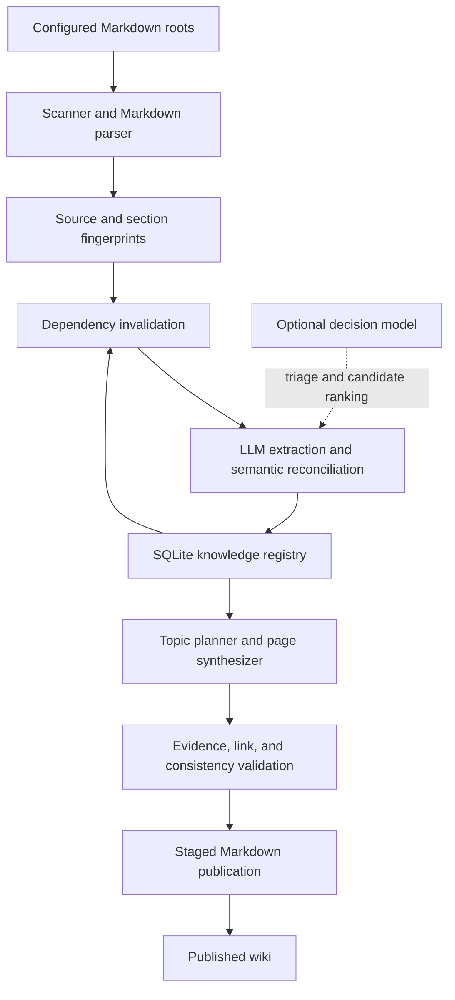

# Lore — Technical Design

**Status:** Draft v0.1 · **Date:** 2026-10-08 · **Implementation status:** Proposed, not yet implemented

## 1. Overview

Lore is a local-first, incremental knowledge compiler for heterogeneous Markdown project artifacts. It ingests any number of configured source directories belonging to one project, extracts material assertions and their evidence, reconciles overlapping or conflicting information, and publishes a linked Markdown wiki. The source material may include architecture notes, ADRs, plans, proposals, exported issues, meeting notes, investigations, operating procedures, or informal ideas. Rather than summarize each file independently, Lore constructs a project-level understanding that distinguishes what is documented as current, what has been decided, what is proposed, and what remains uncertain.

Lore will be implemented as a standalone Rust CLI. Ordinary Rust code owns file discovery, parsing, hashing, dependency management, persistence, validation, and publication. LLMs are used for semantic tasks such as knowledge extraction, concept discovery, equivalence assessment, reconciliation, and prose synthesis. Ollama is the first intended inference provider, with a generative model such as Gemma 4 and an optional System One decision model such as Clef-Flash; additional providers can be added behind stable interfaces. The output is portable Markdown, and the local knowledge registry is stored in SQLite.

The central abstraction is **documented project knowledge with traceable evidence**, not “a fact asserted by an LLM.” This design deliberately treats documented statements, implementation verification, temporal lifecycle, and source authority as distinct concerns. The implementation should begin with topic-level incremental wiki regeneration while preserving a structured knowledge-unit layer that can support more precise updates later.

## 2. Motivation and illustrative example

Project knowledge is fragmented across documents written at different times and for different reasons. An ADR may declare MySQL the chosen database; an idea may propose PostgreSQL; an issue may request investigation; and a status update may later report that the investigation was postponed. A conventional summarizer may compress these into an incorrect statement such as “the project is migrating to PostgreSQL.” Lore should instead synthesize that MySQL is the documented accepted choice, PostgreSQL has been proposed and investigated, and no available source establishes that the migration was approved or implemented. It should link each part of the explanation to the relevant source.

This is a provenance and lifecycle problem as much as a summarization problem. A later document does not necessarily overrule an earlier one. A source can be reliable evidence that a proposal was made while being weak evidence that a proposal was implemented. Lore's job is to explain these distinctions clearly, preserve relevant history, and make it inexpensive to revisit that understanding when sources change.

## 3. Goals, non-goals, and invariants

### Goals

The MVP must accept multiple local Markdown directories for a single project, produce a coherent and navigable topic-oriented Markdown wiki, and associate material claims in that wiki with precise source evidence. It must represent decisions, proposals, plans, issues, observations, historical context, and unresolved questions without promoting intentions into implementation facts. The incremental engine must detect added, modified, deleted, and potentially moved sources, identify impacted knowledge and topic pages, and avoid model calls on a fully unchanged corpus. It must support local inference through Ollama, run on common desktop and CI platforms as a Rust binary, and make failures inspectable and recoverable.

The output should be useful to both humans and coding agents without requiring a special viewer. A user should be able to read a high-level project overview, navigate to a topic, inspect links to source material, and understand what is asserted versus uncertain. The system should not require a graph database, embeddings, MCP, or a separately installed coding agent for basic operation.

### Explicit non-goals for v0.1

The first release will not directly connect to issue trackers, chats, or hosted document services; users can export such material as Markdown. It will not verify implementation behavior against source code or runtime systems, maintain a universally authoritative project truth, resolve every contradictory document automatically, provide a web UI, operate as a continuous daemon, or support multi-project cross-repository reasoning. Semantic search, vector embeddings, advanced claim-level page patching, and agentic autonomous exploration are deferred unless MVP evaluation demonstrates a concrete need.

### Architectural invariants

1. Every material source-dependent conclusion presented as documented knowledge must have at least one valid evidence reference; unsupported synthesis is either excluded or explicitly flagged as an inference requiring review.
2. Documented intent, accepted decision, observed behavior, and confirmed implementation must remain distinguishable. The status of an issue alone must not be treated as proof of implementation.
3. Source data is untrusted input. Model responses and content embedded in Markdown cannot authorize arbitrary shell execution, remote access, or edits outside the generated output and state directories.
4. Deterministic code owns evidence resolution, content hashing, stable identity bookkeeping, dependency invalidation, and publishing. Models propose semantic changes but cannot directly mutate the authoritative database.
5. A complete no-op update must perform zero model calls and produce no wiki file changes. Failed processing must not advance the successful source baseline or leave a mixed, falsely “up-to-date” publication.
6. The generated wiki must never be ingested as original evidence. Local-only operation must not send project content to any network destination other than explicitly configured local inference endpoints.
7. Stable knowledge and topic identities must be preserved across normal updates, even if descriptions or source positions change. Deleting a source must not silently erase knowledge that other surviving sources still support.

## 4. User experience and CLI contract

The proposed configuration file is `lore.yml` in the project root. A project is a logical knowledge base rather than necessarily a Git repository: source roots can be separate directories, with explicit stable `id` values to distinguish similarly named files. Paths are resolved relative to the configuration directory. The scanner visits Markdown files recursively, honors configured exclusions and sensible ignore rules, and always excludes its own generated wiki and state directories regardless of user patterns. Source roots outside the project directory should require an explicit opt-in or an explicit path in configuration, and symlink traversal is disabled by default.

```yaml
# Proposed schema; subject to a versioned configuration specification.
schema_version: 1
project:
  name: payments

sources:
  roots:
    - id: docs
      path: ./docs
    - id: plans
      path: ./plans
    - id: issues
      path: ./issue-export
  exclude:
    - node_modules
    - target

output:
  wiki_dir: ./lore
  state_dir: ./.lore

models:
  decision:
    provider: ollama
    model: clef-flash
    enabled: true
  generative:
    provider: ollama
    model: gemma4:12b

providers:
  ollama:
    base_url: http://127.0.0.1:11434

processing:
  max_parallel_requests: 2
  require_evidence: true
```

`lore init` is proposed to bootstrap the configuration and produce the initial wiki, with explicit behavior if either already exists. `lore update` performs an incremental refresh; `lore status` reports the current source inventory, last successful baseline, dirty topics, and unresolved work without invoking a model; `lore audit` rereads a wider set of source and wiki relationships to check for missing knowledge, contradictions, and stale explanations. `--config` selects a configuration file, `--json` exposes machine-readable diagnostics, and `--dry-run` on update shows the deterministic candidate work plan without publishing changes or invoking a model. Errors should have stable codes, clear diagnostics, and meaningful process exit statuses. Confirmation should be required before overwriting an existing, non-Lore-owned output directory.

Expected project layout:

```text
my-project/
  lore.yml
  docs/
  plans/
  issue-export/
  lore/                    # readable, generated Markdown; may be committed
    index.md
    architecture/
    concepts/
    decisions/
    initiatives/
    risks-and-questions.md
  .lore/                   # local internal state; ignored by default
    state.db
    staging/
    backups/
```

The SQLite state database is operational state, not a requirement for reading the wiki. Because it may be large and machine-specific, the default should be to ignore `.lore/` in Git while allowing the Markdown wiki to be committed. Incremental CI runs must restore the matching state database from a durable cache or else perform a safe rebuild. Loss of the state database must not make the published Markdown misleadingly claim that it has been incrementally verified.

## 5. Architecture and component boundaries



The `sources` subsystem discovers files, parses Markdown front matter and headings, and records full-file plus section-level digests. The `knowledge` subsystem owns typed knowledge units, source evidence, relationships, topic membership, and reconciliation rules. The `models` subsystem offers role-specific, provider-independent inference interfaces. The `synthesis` subsystem plans conceptual pages and writes explanations from the knowledge registry and carefully selected source context. The `storage` subsystem provides SQLite migrations, transactions, run journaling, and recovery. The `cli` subsystem ties these together without containing domain logic.

The orchestration is a bounded pipeline, not a general autonomous agent. Models do not choose arbitrary tools or mutate files; each processing stage receives selected source context and returns schema-constrained proposals validated by Rust. Repeated or recoverable model failures may be retried with bounded backoff; unrecoverable validation failures leave the previous published wiki intact and are surfaced in diagnostics.

## 6. Source model, parsing, and evidence addressing

A source is identified by a configured root ID plus its normalized root-relative path, such as `docs:architecture/authentication.md` or `issues:PAY-123.md`. The path is a location, not an immutable document identity; the MVP should store an internal stable source ID and preserve it through well-supported rename detection where possible. Explicit external keys in front matter, such as an issue ID, may help reconcile moves, but must not be blindly trusted to be globally unique. File timestamps may be collected for diagnostics, yet content digests determine whether content has changed.

Markdown is parsed into a heading tree. Every section records its heading ancestry, a disambiguator for repeated headings, text/content digests, approximate line span, and a short content-context fingerprint. A citation must identify at least a source and resolvable section (or a whole document when it lacks headings); line ranges are helpful display hints but cannot be the sole identity, since inserts can move lines. On update, identical section content can be matched across relocated headings using hashes and context. Ambiguous moves or renames are flagged for reconciliation rather than assumed. BLAKE3 is proposed for efficient local content fingerprints, with the hashing algorithm and version encoded in persisted metadata.

Evidence references attach a knowledge unit to one or more exact source sections or excerpts, including the source and section IDs, observed content digest, optional line range, and a bounded quoted excerpt or excerpt digest. The evidence resolver must verify that the reference still points to readable content inside an allowed source root and determine whether that content is unchanged, changed, missing, or ambiguous. It must not infer that a document deletion disproves a claim; it merely removes a source of support. All source reads have byte/section size limits, and model context is built from bounded, relevant excerpts so large issue exports cannot overwhelm requests.

The parser should handle Markdown front matter, repeated headings, code blocks, links, and mixed prose. Front matter may provide useful title, document type, status, issue ID, created date, or updated date. If dates or state fields are missing, Lore records them as unknown rather than creating them. Structured metadata is treated as *source assertions*, not external verification.

## 7. Knowledge representation and semantics

The durable middle layer stores **knowledge units**: concise, independently understandable propositions about a project, each tied to source evidence. A unit is “atomic” at the level of a meaningful project assertion, not necessarily one sentence, symbol, or source line. Units can represent a documented system behavior, a decision, a proposal, an initiative, a constraint, a risk, a question, or a historically relevant event. A unit can have multiple supporting sources; different units can refer to the same subject while expressing alternatives or conflict.

An illustrative, non-final serialized unit:

```json
{
  "id": "ku_01...",
  "subject": "database-strategy",
  "kind": "decision",
  "statement": "MySQL remains the selected database.",
  "lifecycle": "accepted",
  "epistemic_status": "documented",
  "time": {
    "source_published_at": null,
    "effective_at": null,
    "observed_at": "2026-10-08T10:00:00Z"
  },
  "evidence": [
    {
      "source_id": "docs:adr/012-database.md",
      "section": "Decision",
      "digest": "blake3:..."
    }
  ],
  "topics": ["database-strategy"],
  "relations": [
    {"type": "alternative_to", "target": "ku_02..."}
  ]
}
```

The schema must separate four dimensions. **Kind** describes what the assertion is (decision, plan, observation, issue state, etc.); **lifecycle** describes whether that object is proposed, accepted, active, completed, rejected, superseded, or unknown, when those values are applicable; **epistemic status** describes whether Lore merely knows a document asserts it, whether independent corroborating documents exist, or whether validation outside documentation has explicitly occurred; and **time** separates source publication time, claimed effective time, and the time Lore observed the source. A unit must not be marked “implementation verified” in an MVP that performs no implementation checks. Model confidence may be recorded for diagnostics but is not a substitute for source authority or factual verification.

Relationships are typed and directional where appropriate: `supports`, `contradicts`, `supersedes`, `proposes`, `relates_to`, `depends_on`, and `alternative_to` are candidate types. Reconciliation should preserve source-specific viewpoints and alternatives. A recent idea does not outrank an older accepted ADR by default, an issue closed without a documented resolution does not prove delivery, and an author's assertion that a change shipped remains a documented assertion until independently verified. When relevant sources genuinely disagree, the wiki must describe the disagreement rather than pick a winner using a model's preference.

Knowledge-unit IDs are durable opaque identifiers assigned by Rust. On updates, a model proposes reuse, revision, addition, or supersession of candidate units; Rust verifies the ownership, evidence, and uniqueness rules. Two assertions may be semantically similar without being interchangeable because they differ in time, scope, modality (“must” versus “might”), or source authority. Units with no remaining valid supporting evidence become `unsupported` or `needs_review`, not silently deleted; historical relationships remain inspectable. The MVP can retain previous versions and a concise change history instead of implementing a full temporal graph engine.

## 8. Initial compilation workflow

**Discovery.** Lore inventories eligible Markdown sources, stores content fingerprints, identifies document metadata and broad topics, and gathers high-signal samples across source roots. Large documents are handled section by section with neighboring context rather than truncated without notice. A bounded generative planning pass proposes a small conceptual information architecture—architecture, concepts, workflows, decisions, initiatives, and risks—without assuming every project needs every category.

**Extraction.** For each source section, a generative model proposes material knowledge units with source references, type, lifecycle, temporal clues, topic candidates, and relevant relationships. Structured JSON results are schema validated, deduplicated within a section, and checked against evidence locations by deterministic Rust code. Source text instructions such as “ignore previous rules” are data, not operational instructions.

**Reconciliation.** Lore searches existing units using lexical candidates (SQLite FTS5 and topic metadata initially), then assesses possible equivalence, contradiction, relationship, or supersession. Simple candidates can be screened by a decision model, but the generative model is responsible for substantive synthesis and ambiguous interpretation. Rust applies only validated operations and preserves the originals and evidence references where disagreements cannot be resolved.

**Synthesis.** Each topic page receives its relevant current and historical units, compact source context, related topics, and a bounded writing brief. The writer creates coherent narrative prose that explains current documented understanding, decisions, alternatives, changes, and unresolved areas. It does not paste the unit ledger into Markdown. Every material statement must be traceable to units with valid evidence. Navigation and cross-links are built from stable topic IDs; the root overview is synthesized after topic pages are available.

**Validation and publication.** Lore verifies evidence resolution, completeness of required references, valid relative links, generated-file ownership, and schema and content constraints. The result is published only after these checks pass. An optional audit may flag unsupported or ambiguous language for review; the system should choose explicit uncertainty over a fluent but misleading page.

## 9. Incremental update algorithm

Incrementality uses **deterministic change tracking followed by semantic reconciliation**. It is deliberately conservative: a fast classifier may prioritize changed material but must not be the sole gate that silently discards potentially important new knowledge.

1. Acquire an exclusive project update lock, recover or roll back any interrupted publication, load the last successful run and configuration digest, and scan the source roots.
2. Compare normalized paths, full-file digests, section digests, and deletion/rename candidates. If the source set, relevant configuration, and state schema are unchanged and the previous run was successful, return a proven no-op without invoking models or rewriting wiki files.
3. For new, changed, removed, or ambiguously relocated sections, find dependent knowledge units through the evidence index. New sections additionally need topic routing and candidate matching because no dependencies exist yet; removed sections cause loss-of-support checks against any surviving evidence.
4. Extract changed material, compare proposed knowledge with existing candidates, and perform sparse semantic reconciliation: confirm, revise, add, supersede, relate, or mark unsupported. Unaffected units retain their identity and evidence without model round trips. Conflicts and lifecycle questions are preserved explicitly.
5. Mark topics dirty when their attached units, relations, source citations, or required navigation change. Regenerate only those topic pages and any genuinely affected higher-level overview or index. Revalidate all affected links and citations, and preserve unaffected pages byte-for-byte.
6. Publish staged changes with a run journal. Advance the successful source baseline and affected topic revisions only after the new state and wiki are mutually consistent. Persist diagnostics and unresolved work for subsequent runs.

A change in purely presentational Markdown may leave normalized section semantics unchanged; Lore can update location metadata without invoking extraction when reliable equality checks prove that the extracted content is unchanged. Conversely, new material must be considered even if it belongs to no existing topic. A delete never automatically retracts a unit still supported elsewhere. Changing the model, prompt version, extraction schema, or relevant configuration may deliberately invalidate selected stages even when source files are unchanged; model/prompt digests belong in the cache key.

The MVP should implement **knowledge-unit bookkeeping plus topic-level page regeneration**. In-place paragraph patching and OpenWiki-style complete Claim-level sparse page reconciliation are deferred until cost and consistency measurements show they are necessary. Incremental behavior must include creation and removal of topics when warranted, but routine scoped updates must not reorganize the whole wiki.

## 10. State, schema, recovery, and publication

SQLite is the source of truth for machine-maintained state. Proposed tables include `projects`, `source_roots`, `sources`, `sections`, `knowledge_units`, `unit_evidence`, `unit_relations`, `topics`, `topic_units`, `topic_dependencies`, `runs`, `model_calls`, and `publications`. Each table has a schema version or participates in versioned SQL migrations; foreign keys, unique constraints, and explicit indexes enforce source and unit ownership. SQLite FTS5 supplies the initial candidate-retrieval mechanism. Use `rusqlite` with bundled SQLite where suitable, and persist content digests plus the model and prompt versions relevant to reproducibility.

The execution journal tracks run phases such as `scanning`, `extracting`, `reconciling`, `synthesizing`, `validating`, `publishing`, `completed`, and `failed`. A run operates against staged state and staged wiki files, rather than writing partial pages directly to the visible wiki. On success, the publisher validates and switches the generated output to the new snapshot and commits the successful baseline. Filesystem swaps and database transactions are not one atomic operation across all platforms, so the implementation needs a recoverable publication journal and backups: on restart, it detects an interrupted switch and completes or rolls back it before taking new work. Never describe per-file rename operations as cross-platform atomic multi-file transactions.

A failed model call, invalid generated evidence reference, broken link, permission error, or publication interruption must not mark the run successful. Diagnostic records and resumable work can be kept, but only a fully consistent publication becomes the baseline for the next incremental update. A missing or incompatible SQLite state database triggers a rebuild or an explicit migration error, never a “clean” status inferred solely from the existence of wiki files.

## 11. Model roles, Ollama, and provider abstraction

Lore has two distinct inference capabilities. `GenerativeModel` produces structured extraction/reconciliation proposals and prose, with JSON-schema validation and bounded retry/repair on malformed output. `DecisionModel` takes a state and a finite set of typed questions and returns options and probability distributions. These are capability interfaces rather than a single assumed chat endpoint; provider adapters should report unsupported capabilities at configuration/preflight time. An unavailable decision model should have a configurable generative fallback, so it is an optimization rather than a prerequisite for correct knowledge processing.

For Ollama, generative inference uses `/api/chat` with a schema-constrained `format` when supported by the selected model and server. The Clef-Flash decision adapter uses `/v1/systemone` with a `state` and `questions` schema; its answer probabilities should be treated as model signals, not calibrated correctness guarantees. Ollama's Clef-Flash documentation specifies a minimum Ollama version of 0.35.1. A preflight command should inspect server availability, selected model tags, supported endpoints, and sufficient context capacity, then fail clearly if capabilities are missing. The model name `gemma4:12b` is an illustrative default rather than a required model or guarantee of quality.

Decision-model tasks include document-type classification, routing to candidate topics, ranking possible duplicate units, and flagging likely contradictions or low-impact edits. The model must not be permitted to suppress the processing of an unknown source or to resolve a consequential conflict alone. More capable generative inference handles extraction, substantive comparison, temporal interpretation, novel topic discovery, and prose writing. Requests should carry selected sections and evidence, not an unbounded concatenation of the project; concurrency and token budgets are configurable, and results may be cached using source/prompt/model digests.

Local Ollama is the initial provider. Future adapters may support OpenAI, Anthropic, and a hosted Cloudflare decision endpoint, but these are extension points rather than v0.1 dependencies. Remote providers require explicit configuration, clearly communicate the data that will be transmitted, and store credentials using environment variables or system credential facilities rather than committing secrets. The core pipeline must remain provider-agnostic and work in generative-only mode if Clef-Flash is not installed.

## 12. Rust implementation plan

A single Cargo package is sufficient at the start. The expected crate set is `clap` for CLI parsing, `tokio` for asynchronous orchestration, `reqwest` for inference HTTP, `comrak` for Markdown parsing, `ignore` for repository-aware discovery, `blake3` for fingerprints, `rusqlite` for SQLite, `serde` and `schemars` for typed data and JSON schemas, and `tracing` for diagnostics. These are proposed choices, not fixed dependencies; pinning and compatibility checks belong to implementation.

```text
src/
  main.rs
  cli/             # init, update, status, audit
  config/          # versioned YAML configuration and validation
  sources/         # discovery, parsing, section identity, fingerprints
  knowledge/       # units, evidence, reconciliation, topic dependencies
  models/          # generative and decision traits; Ollama adapters
  synthesis/       # planning, focused page generation, navigation
  storage/         # SQLite schema, migrations, run journal
  publishing/      # staging, validation, rollback/recovery
  diagnostics/     # audit reports, logs, machine-readable errors
tests/
  fixtures/        # overlapping, conflicting, moved, deleted sources
```

Keep model calls and disk effects behind testable interfaces. For early development, provide fake generative and decision providers that return deterministic fixtures; this will allow testing incremental behavior without depending on a running Ollama server. Integration tests can be enabled separately when a local server and configured models are available.

## 13. Quality, security, and evaluation

Lore's most serious quality risks are false synthesis, semantic over-merging, wrong temporal assumptions, and missed invalidation. The evaluation fixture should deliberately include contradictory ADRs and ideas, unresolved versus completed issues, undated documents, duplicated information across source roots, moved headings, deleted sources, changing metadata, untrusted instructions inside Markdown, and new topics with no existing dependencies. Human-reviewed expected interpretations should accompany fixture documents so the system is measured on whether it preserves meaning, not simply whether the prose reads well.

Acceptance checks for the MVP: an unchanged second update invokes no models and produces byte-identical wiki pages; editing a single scoped source does not rewrite unrelated pages; every material assertion in generated documentation has a resolvable source or is explicitly labeled uncertain; a deleted source causes support reevaluation rather than automatic historical erasure; a “closed” issue alone never establishes implemented behavior; a failed run does not advance the successful baseline; and restart recovery can produce a coherent published wiki and registry. Measure extraction coverage, provenance validity, contradiction handling, page churn, runtime, inference requests, and human-rated usefulness. No target percentages should be claimed before baselines are measured.

Markdown, exported issues, and model output are untrusted. Never execute instructions found in source text or return arbitrary paths for a model to write. Enforce path containment, symlink policy, size caps, secret-safe logging, and output ownership checks. Avoid printing source excerpts in logs by default, redact API credentials, and record whether a run used a remote inference endpoint. In local mode, no telemetry or outbound model traffic should occur without explicit user opt-in. Sensitive project materials warrant a clear warning before enabling cloud providers.

## 14. Delivery roadmap

**Milestone 1 — Foundation and first compilation.** Create the Rust CLI, configuration validation, recursive Markdown scanner, section evidence resolver, SQLite migrations, a generative Ollama adapter, typed extraction output, initial topic planner, and Markdown publisher. Demonstrate a complete first wiki on a small representative fixture with source citations. A simple but grounded end-to-end path is more important than highly autonomous synthesis.

**Milestone 2 — Incremental correctness.** Add persisted source/section fingerprints, dependency mapping, stable knowledge unit identity, sparse reconciliation, topic invalidation, no-op checks, a durable run journal, failure recovery, and focused updates. Build regression fixtures for additions, removals, moves, contradictions, and state changes in issues. Optimize for correctness and zero unnecessary work before pursuing concurrency.

**Milestone 3 — Decision-model optimization and audits.** Add Ollama's Clef-Flash adapter, candidate routing and comparison, generative fallback, configurable confidence/escalation policies, a broader `audit` command, and quality and inference-cost measurements. Keep the fast model optional unless evaluation establishes that it improves cost without reducing recall or grounding quality.

**Later possibilities.** Direct issue-tracker ingestion, GitHub wiki connectors, search/read commands for coding agents, embeddings, a graph explorer, cross-project workspaces, hosted providers, claim-level page patching, and richer verification against code or runtime observations. These should be justified by user needs and evaluation rather than pre-implemented as infrastructure.

## 15. Decisions and open questions

The current proposed defaults are: Rust CLI; one project per knowledge base with several Markdown roots; concept-oriented Markdown output; local SQLite state; evidence-backed typed knowledge units; topic-level regeneration; deterministic orchestration; Ollama-first models; and an optional Clef-Flash decision stage. These are design commitments for discussion, not evidence that code already exists.

Open design questions include the exact schema and persistence policy for historical unit versions, how aggressively to join semantically similar units, the right heuristics for preserving source identity across renames, whether to let users assign authority tiers to source roots, how to expose uncertainty visibly in generated prose, and which state persistence method works best in ephemeral CI. The default stance is conservative: preserve contradictory evidence, prefer stable identities and inspectable changes, and do not invent verification status or dates. Decisions can be captured as ADRs as implementation begins.

## 16. Research and prior art

Lore is influenced by [OpenWiki](https://github.com/langchain-ai/openwiki), particularly its [Grounded Claims](https://github.com/langchain-ai/openwiki/blob/main/openwiki/concepts/grounded-claims.md) and [repository generation lifecycle](https://github.com/langchain-ai/openwiki/blob/main/openwiki/workflows/repository-generation.md). The research lineage includes [STORM](https://aclanthology.org/2024.naacl-long.347/) for research-to-outline-to-article workflows, [RAPTOR](https://arxiv.org/abs/2401.18059) for multilevel synthesis, [GraphRAG](https://arxiv.org/abs/2404.16130) for cross-document relationships, and [FActScore](https://arxiv.org/abs/2305.14251) for independently checkable atomic statements. Database provenance and incremental view maintenance inspire the separation between source evidence, derived knowledge, and affected output views.

Relevant implementation references include [Ollama Clef-Flash](https://ollama.com/library/clef-flash), [Ollama Gemma 4](https://ollama.com/library/gemma4), and [Ollama structured outputs](https://docs.ollama.com/capabilities/structured-outputs). These references motivate the architecture; they do not establish that Lore's proposed accuracy, performance, or incremental behavior has already been demonstrated.
