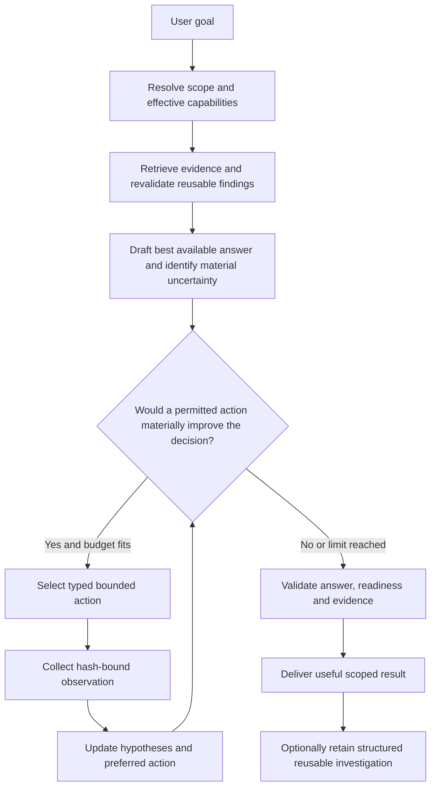

# Lore autonomous assistance and user empowerment

**Status:** Proposed, not implemented. **Design revision:** 3 — shared adaptive assistance for human and agent experiences. **Date:** 2026-10-09. **Implementation baseline:** Lore 0.6 at `51b62ebe6d44ca4ff5162ff7758408c3e85ec548`.

**Companions:** [Developer Onboarding](DEVELOPER_ONBOARDING_DESIGN.md) (**human learning flagship**), [Coding-Agent Intelligence](CODING_AGENT_INTELLIGENCE_DESIGN.md) (**agent flagship**), [Knowledge Experience](KNOWLEDGE_EXPERIENCE_DESIGN.md), and [implementation roadmap](KNOWLEDGE_EXPERIENCE_ROADMAP.md). This document specifies the operating policy, user experience, investigation loop, reusable investigation records and acceptance tests for that architecture. It is not a new runtime contract already accepted by Lore 0.6.

> **Maximum useful autonomy. Minimum user burden.**
>
> Lore owns the work of understanding the request, investigating consequential uncertainty, evaluating alternatives and delivering the strongest defensible help it can provide within its permissions. The user should leave with greater ability to act or understand, not a new research assignment.

## 1. Product commitment

**The controller serves everyone:** a newcomer learning an unfamiliar project; an experienced developer or maintainer making a decision; and a coding agent implementing a change. It operates over **one project evidence, permission and revision model**. Autonomous investigation is the shared *intelligence engine*, not a learning-only feature. The newcomer exercises judgment through purposeful practice; a coding agent receives concise implementation-ready JSON and owns the code change. Neither presentation becomes compulsory for the other.

The ordinary task experience should remain one request:

```bash
lore context "Refactor payment retries without changing their behavior"
```

In the proposed future default, Lore chooses whether it needs additional retrieval, static inspection, available history, or a pre-authorized verification capability. The user does not need to discover `--inspect`, `--investigate`, choose a reasoning effort, classify a problem, navigate a graph, or answer a questionnaire to receive useful help.

**Initiative is automatic; permission is not.** Automatic investigation applies only within a disclosed, operator-authorized capability envelope. An inability to access something is a constraint Lore works around, not an excuse to repeatedly ask for wider access.

Lore remains an intelligence system, not an unrestricted coding agent. `context` produces advice and bounded observations; it does not edit code, commit changes, modify policy, publish private information, or operate production. The calling developer or coding agent owns implementation. Lore should complete the investigative work it is capable and authorized to do before handing over the implementation task.

### 1.1 What empowerment means

A successful interaction leaves the user able to state the recommended approach, its important boundary and the next concrete action. A reader seeking understanding leaves with a usable mental model. A learner can apply the lesson to another case. The system should make its judgment understandable and overrideable, rather than demand blind trust.

Useful autonomy must reduce **total user effort**, including reading, corrections, repeated investigation, permission prompts, waiting and recovery from wrong advice. A confident answer with a hidden blocker is not empowering. An exhaustive answer that leaves the user to choose among ten unranked options is not empowering either.

### 1.2 Non-negotiable behavioral requirements

| ID | Requirement |
| --- | --- |
| UA-01 | Take initiative over relevant, permitted information gathering; do not require per-query investigation flags in the future default. |
| UA-02 | Do not delegate a relevant investigation to a person or calling agent when Lore has a suitable permitted capability and budget to perform it. |
| UA-03 | Investigate only uncertainty that could materially change the requested answer, its applicability, its risk, or the next action. |
| UA-04 | Lead with the answer or preferred approach, readiness for the scoped action, and the next useful step. |
| UA-05 | Distinguish incomplete knowledge, an unavailable capability and a genuine decision/authority blocker. |
| UA-06 | Before declaring a blocker, consider permitted decision-relevant evidence and safe ways to separate independent work from the blocked part. |
| UA-07 | Stop when the recommendation is sufficiently supported for the scoped task, more investigation has low expected value, or a hard limit is reached. |
| UA-08 | Ask a human only for a materially necessary non-inferable requirement, authority decision or capability grant; never as a routine troubleshooting step. |
| UA-09 | Keep unresolved non-blocking matters brief, conditional and attached to their consequences; do not bury the answer under warnings. |
| UA-10 | Reuse previous investigations only after checking their evidence, scope, freshness, policy and relevant new counterevidence. |
| UA-11 | Preserve user control: cancel, narrow scope, correct assumptions, inspect evidence and choose a more limited mode without losing completed useful work. |
| UA-12 | Never imply that inspection, verification, tool execution, approval or implementation occurred unless recorded evidence shows it did. |

These are product contracts, not a promise that every task is solvable. The required behavior is the best truthful useful result, not guaranteed success or invented certainty.

### 1.3 The difference between autonomy and teaching

**Routine investigation is Lore's responsibility for every audience; deliberate practice is the learner's opportunity when learning was requested.** For example, if Lore can inspect the existing retry handler, it should do so before recommending a refactor. In an explicitly requested tutorial, asking the learner to predict the retry behavior is a valuable exercise, not an avoidable handoff. During a first real contribution, Lore may prepare source context, explain constraints and offer hints, but normal onboarding must not count an agent-authored patch as evidence of human competence.

Unknown learner experience should trigger a helpful overview with optional skip-to-task, not a profiling questionnaire. A direct reference question should stay direct, even in an onboarding session. An exercise can be skipped or revisited without blocking real project work. See [onboarding design](DEVELOPER_ONBOARDING_DESIGN.md) for learning-path, tour, hint, transfer and consent contracts, and [agent design](CODING_AGENT_INTELLIGENCE_DESIGN.md) for the compact machine contract and independently measured coding-task outcomes.

## 2. Outcome-first answer contract

### 2.1 Default human presentation

Present a short coherent answer before detailed evidence. The default order is:

1. **Recommended action or direct answer.** One preferred approach, stated plainly.
2. **What can proceed now.** The scoped readiness and next concrete step; separate independent work from any genuinely blocked portion.
3. **Why this is sensible.** The few decisive observations, rationale and main trade-off, with links.
4. **What Lore established.** A concise summary of checks actually completed and their results, only when useful to understand the recommendation.
5. **What remains.** Only consequential assumptions, unavailable checks or actual decisions. Non-blocking uncertainty must be explicitly identified as non-blocking.
6. **Details on demand.** Exact evidence, alternatives, investigation record, budget/coverage diagnostics and history.

This is an information priority, not six compulsory headings in every answer. An exact-reference question may need a single value, its scope and source. A simple explanation should not acquire an artificial action plan. Stable critical qualifications stay visible even when details are collapsed.

### 2.2 Illustrative answer after actual inspection

The following is fictional product output, not a claim that these checks have been performed:

> **Keep the existing five-retry behavior while refactoring the handler.**
>
> You can proceed with a behavior-preserving change: retain the retry limit, the same idempotency key and the existing terminal-error behavior. Start by extracting the retry loop without altering those conditions.
>
> The inspected implementation uses five retries, and the test declarations expect the same behavior. The older ADR specifies three. Available incident history suggests the increase may have been intentional, but does not establish an approved policy replacement.
>
> That unresolved policy history does not prevent this refactor; changing the retry limit would be a separate decision. Tests were inspected, not executed. Run the existing behavioral tests on the changed code as part of implementation.

The final test instruction is legitimate future implementation work because the modified code does not yet exist. Asking the user to inspect the existing retry implementation would be an avoidable delegation if Lore can do that itself. Where the documentation mandates immediate correction of a non-compliant implementation, a preserving refactor cannot silently waive that requirement; the recommendation must address it.

### 2.3 Partial progress without disguising the blocker

For a requested policy change with genuinely missing authority:

> **The retry mechanism can be prepared, but increasing the permitted limit requires a policy decision.**
>
> Implement the configurable boundary and tests while retaining the current limit. The accepted policy does not authorize the requested increase, and the available approval records do not resolve that conflict. The remaining decision is whether the policy owner permits the increase for this environment. No code or policy has been changed by Lore.

`partial_progress` must name a useful independent subtask and what remains blocked. It must never label the full requested outcome `proceed` merely because some preparatory work is possible. Trivial busywork does not count as meaningful safe progress.

## 3. Decision-relevant uncertainty

Maintain explicit uncertainty items, not a vague global confidence score. Each item identifies a proposition or missing condition, why it might change the recommendation, competing explanations, evidence needed to distinguish them, available capabilities, and the consequence of leaving it unresolved.

Classify uncertainty on two independent axes:

| Axis | Values | Purpose |
| --- | --- | --- |
| Action impact | non_blocking, changes_approach, changes_scope, changes_permission, changes_safety | Is this worth investigating for the requested outcome? |
| Resolvability | available_evidence, permitted_tool, caller_only_capability, missing_requirement, authority_decision, currently_unavailable | Who or what could resolve it? |

Ordinary ambiguity should be handled through a declared reasonable assumption, a robust recommendation, or a small conditional branch. Do not ask which reading the user intended when one interpretation is low-risk, strongly indicated, and easy to revise. For materially different irreversible outcomes with no defensible default, explain the needed choice rather than guess.

### 3.1 Uncertainty is not permission

No amount of confidence, source agreement or model repetition grants authority to change an adopted policy. Conversely, high-risk domain labels alone do not justify blocking a reversible, compliant action. Apply the actual documented constraint to the scoped change.

A code/document disagreement may require investigation without requiring human adjudication. The task could be to document the disagreement, preserve behavior, correct a policy violation, or change policy. Those are different actions with different readiness conditions.

### 3.2 Uncertainty debt versus user's work

Non-blocking gaps can remain as optional maintenance records without appearing in every response. They should not create an obligatory review queue. A gap is worth surfacing when its resolution affects the current task, or the user explicitly asks to improve project knowledge. An optional maintainer-capture workflow is separate from ordinary task assistance.

## 4. Capability envelope and permission ergonomics

A deterministic policy resolver computes effective permissions before planning. It intersects installation/operator grants, project-root boundaries, the current caller's identity/access where applicable, per-request restrictions and provider/egress rules. Model output cannot enlarge this intersection.

### 4.1 Proposed capabilities

| Capability | Typical use | Permission and limit |
| --- | --- | --- |
| registry_read | Search retained knowledge and exact snapshots | Existing project access; current or explicitly historical snapshot. |
| source_snapshot_read | Read configured documentary material and relationships | Existing configured roots; no arbitrary URL fetching. |
| checkout_read | Static source and test inspection | Disclosed trusted project root and accepted local-read grant; byte/path/time/secret restrictions. |
| history_read | Read pinned available change/decision history | Local snapshot or approved adapter with bounded scope; no arbitrary model-authored Git commands. |
| connector_read | Query an installed live source | Only a configured read capability with explicit account/repository scope and egress semantics; not promised by 0.6. |
| verification_run | Run a known test or example | Separately approved isolated runner and capability ID, exact input scope, resource/network policy and output limits. |
| document_egress | Send retained source context to hosted inference | Existing explicit hosted opt-in; no implicit provider fallback. |
| checkout_egress | Send source-derived content, paths or observations to a model | Existing separate checkout-egress permission; summaries are also checkout-derived. |
| artifact_egress | Send execution outputs or mixed-origin findings | Explicit grant for the destination and data classes; inherit all contributing restrictions. |
| authored_note_write | Create a user-owned knowledge note | Explicit authoring operation with attributable approval, not a side effect of `context`. |

Retained local investigation caches are data writes, but not project-policy changes. They follow explicit cache policy and are never written in `--fast`, `--no-cache`, read-only configuration, or forbidden filesystem locations. This distinction must be visible in command help and diagnostics.

### 4.2 Comfortable defaults without surprise access

**New trusted project initialization:** show one understandable capability summary, such as configured documents, proposed local inspection root, local/hosted inference destinations, cache retention, and disabled execution. Let the operator accept a standing read-only envelope. Do not turn `init --configure-only` into an implicit access grant. Noninteractive initialization grants nothing not already specified through explicit operator configuration.

**Existing 0.6 projects:** preserve existing permissions. An upgrade must not interpret `inspection.enabled: false` or missing checkout-egress permission as consent. Registry-based adaptive investigation can operate within existing grants. Expanding access is a separate project-setup choice, not a repeated question on ordinary task requests.

**Ordinary requests after a grant:** Lore automatically chooses useful actions inside the envelope. No confirmation before every local read or every use of an already approved verification capability. Optional controls can reduce scope, disable inspection, cap resources or use deterministic fast mode. The model cannot opt the user into more access.

**Untrusted projects:** do not trust a newly cloned repository's own configuration to grant execution, network access, home-directory reads or credential access. Host/operator policy and project-local preferences are distinct. Capability grants bind the intended project/root identity and expire or require revalidation after a relevant identity, runner or policy change.

### 4.3 Graceful constrained operation

An unavailable or denied capability is recorded once for the request. Lore chooses another permissible route, adjusts the recommendation or limits its scope. It does not repeatedly ask for the same permission, invoke an unconnected service, or tell the user to install infrastructure just to obtain a useful partial result.

A specific capability handoff to the calling agent is acceptable only when that caller has access Lore lacks, the observation is material, and no adequate alternative exists. It must include the completed findings and exact remaining observable, not transfer the entire investigation. Label it as a remaining dependency; do not count such a task as completed without assistance in evaluation.

## 5. Adaptive investigation controller

The controller wraps existing retrieval, schema-4 reasoning and static inspection rather than building a general autonomous agent. Separate the controller's deterministic state transitions and budgets from model-proposed candidate actions.

### 5.1 State machine



Draft the best available answer early so the controller has something to improve and a safe fallback. The early draft is an internal candidate, not a published conclusion. New counterevidence must be allowed to replace it. Do not anchor on a first recommendation just because prior computation was expensive.

### 5.2 Required request state

The controller maintains: request ID; interpreted outcome and change kind; scope and known unknowns; registry publication/revision; checkout identity including dirty-file hashes where inspected; effective policy digest; resource ledger; provisional recommendation; cited constraints; uncertainty items; candidate typed actions; completed observations; action applicability; alternatives; counterevidence; validation state; stop reason; and unresolved external dependencies.

No private model chain of thought is required or retained. An investigation record contains concise decisions, public rationale, hypotheses, observed evidence and outcomes, not hidden reasoning tokens or unrestricted raw conversation logs.

### 5.3 Typed actions

Initial read-only actions should include `retrieve_original_units`, `expand_recorded_relations`, `read_retained_evidence`, `inspect_allowlisted_file`, and `read_available_history_snapshot`. Later adapters may expose `query_registered_connector` or `run_approved_check`, once their permission contracts exist.

Each candidate specifies a capability ID, allowed target ID, input digest, uncertainty ID, expected distinguishing observation, expected decision impact and resource estimate. The orchestrator resolves IDs against an allowlist. Do not execute an arbitrary path, URL, query language, shell command, SQL statement or Git invocation invented by a model.

Two actions returning derived copies of the same original evidence are not independent corroboration. Tool errors, empty results and model refusals remain distinct from negative evidence.

### 5.4 Selecting effort

Use qualitative decision value before attempting calibrated probabilities. Prefer actions likely to change the recommended action or expose a severe hidden condition, with low latency/cost and a narrow scope. Risk, reversibility, evidence quality, material conflicts and uncertainty about authority inform selection.

A conceptual ranking is:

`expected reduction in decision error + expected task benefit - latency cost - inference cost - user effort - execution risk`.

This is an objective to operationalize, not a claimed calibrated numerical estimator. Provider confidence is not a probability of correctness. Start with explicit categories and bounded heuristics; use held-out outcomes to justify learned or probabilistic routing later.

Cheap independent reads may run concurrently under the same aggregate budget. Dependent checks must run in order. Concurrency cannot duplicate permissions, exceed the deadline, overwhelm a local provider or let one branch publish before required evidence is reconciled.

### 5.5 Prevent performative investigation

Every investigative step must name what different outcome would change the advice. Do not explore history merely to produce a more impressive narrative. Do not reread identical bytes without a freshness reason. Do not ask another model to repeat the same judgment and call that verification.

A simple task may stop after ordinary retrieval. A preservation task may need only current behavior and constraints. A policy-changing task needs authority-aware evidence. A learner may need a carefully chosen example rather than a repository-wide search.

## 6. Stopping, budgets and cancellation

**Investigate to decision sufficiency, not omniscience.** Exhausting every possible action is neither required nor desirable. Before a genuine blocker is returned, all relevant, affordable, permitted actions likely to change that conclusion must either be completed or have an explicit disposition. An immediate clear authority boundary does not require pointless repository exploration.

### 6.1 Stop reasons

| Reason | Meaning | Required final behavior |
| --- | --- | --- |
| decision_sufficient | Evidence supports the scoped recommendation; required constraints addressed | Give answer and next action; no invented residual checklist. |
| low_expected_value | Further accessible investigation is unlikely to change the decision materially | State any consequential assumption and proceed within it. |
| no_permitted_action | Remaining relevant evidence requires unavailable capability or permission | Deliver the best constrained answer and safe independent work; identify the actual dependency only if necessary. |
| authority_required | A scoped action requires a decision that evidence cannot authorize | Separate blocked action, authority decision and safe progress. |
| requirement_unavailable | A material requirement has no reliable source or safe default | Give conditional options or safe partial work; isolate one needed input. |
| budget_exhausted | Call, byte, time, context or cost ceiling reached | Best validated bounded result; do not convert resource exhaustion into a policy blocker. |
| no_information_gain | Repeated actions add no distinguishing information | Stop the loop, report limitations briefly and preserve useful findings. |
| evidence_changed | Required inputs changed or could not be safely revalidated | Withdraw affected claims; bounded re-evaluation only if remaining budget permits. |
| cancelled | User interrupted or cancelled | Stop outstanding work; return coherent verified partial findings when possible. |
| provider_unavailable | Inference or adapter unavailable | Use valid current findings and deterministic fallback; no hidden cloud/model substitution. |

### 6.2 Resource accounting

Track model attempts, retries, token usage when supplied, total read bytes including revalidation, unique files, directory entries, wall-clock deadline, I/O time, available test/connector actions, output bytes and persistence budget. Invalid and refused attempts consume budget. Share the ledger across planning, retrieval, verification, execution and repair. Reserve enough capacity for final evidence/readiness validation before starting another action.

Use a separate deterministic `--fast` path. The proposed adaptive mode has a bounded default envelope initialized from measured 0.6 behavior, not an unbounded interpretation of "maximum autonomy". Exact numeric limits and any expansion beyond 0.6 must be selected before a release benchmark, documented and configurable by the operator. Unknown billing remains unknown; token-based estimates, provider-reported usage and actual charges must be labeled separately.

### 6.3 Latency, progress and interaction

Do not expose a scrolling list of internal tool calls as the primary interface. For longer synchronous requests, emit occasional meaningful progress such as "The current implementation preserves idempotency; I am checking whether the policy discrepancy affects this change." Progress assertions need evidence too. Never imply completion before a check returns.

Provide a single cancellation path for the controller and all running adapters. Cancellation revokes further scheduling and attempts to stop permitted child work. It cannot retroactively cancel a provider charge; disclose unfinished remote work where relevant. No background continuation without an explicitly configured separate workflow. Complete, revalidated observations can be retained only under cache policy; aborted drafts cannot become reusable validated guidance.

## 7. Readiness and escalation semantics

Preserve current schema-4 readiness meanings for clients using that contract. The richer proposed response separates `overall_readiness`, `scoped_actions`, `safe_progress`, `remaining_dependencies` and `investigation_stop_reason`. Do not overload one status to mean both task completion and resource exhaustion.

### 7.1 Action states

- **Proceed:** the named action can begin with the stated boundary; no hidden required precondition.
- **Proceed after check:** one or two material observations are still required and could not be obtained through Lore's permitted capabilities within the request. Name the unavailable observable and exactly how it changes the decision. Routine checks Lore already completed cannot remain listed as required.
- **Blocked action:** this action cannot responsibly or legitimately proceed because of a specific unresolved authority, requirement or safety condition.
- **Safe independent action:** useful work that does not assume the blocked condition; it is scoped separately, not a waiver for the full task.

A budget-limited response can be partially useful without asserting that the task is safe to proceed. An unresolved destructive-operation precondition remains a blocker to that operation. The system must not force `proceed` to satisfy an autonomy metric.

### 7.2 Escalation decision record

Before asking or blocking, record: precise missing condition; material impact; completed evidence search; permitted candidate actions and their dispositions; why no safe assumption or robust alternative suffices; useful independent work; requested decision/permission/input; and consequence of each reasonable choice.

In an interactive interface, one focused request may be shown only after the useful answer or partial result. In noninteractive CLI/agent workflows, never wait indefinitely for stdin. Return the structured dependency and best scoped action. A model refusal or tool outage is not itself a question for the user.

### 7.3 Legitimate versus avoidable handoff

| Handoff | Judgment |
| --- | --- |
| "Read the retry code" while local inspection is permitted and affordable | Avoidable delegation; controller should do it. |
| "Verify which source is right" after seeing a discrepancy | Insufficient; investigate its impact and recommend a scoped approach. |
| "Run behavioral tests after implementing this refactor" | Legitimate future implementation verification; the changed code does not yet exist. |
| "Observe this metric from production" when only the caller has approved production access and it changes the decision | Explicit capability dependency; return all completed work and precise expected observable. |
| "Approve a new retention policy" without authoritative approval in evidence | Genuine authority decision; do not infer consent. |
| "Review these eight low-confidence facts" on every request | Maintenance burden, not useful assistance; attempt resolution or omit non-material gaps. |
| "Try the exercise and predict the output" in an explicitly requested tutorial | Deliberate learning activity, not delegated investigation. |

## 8. Structured reusable investigations

An investigation should improve future assistance without becoming a new source of invented authority. Persist reusable work separately from accepted source knowledge and disposable answer-rendering caches.

### 8.1 Record content

A proposed `InvestigationRecord` contains:

- Stable record ID and immutable revision; parent/derived-from references and model/prompt/controller versions.
- Task family, original request scope, environment, change kind and applicability conditions.
- Registry snapshot and knowledge/evidence references with exact revisions and support roles.
- Checkout identity, dirty-file state where observed, complete-file hashes, inspected ranges, candidate-index/inventory digest and declared completeness.
- Effective capability/egress policy digest and data-class/visibility labels.
- Hypotheses, alternatives, distinguishing checks, counterevidence and decisions changed by those observations.
- Typed action results with adapter identity, errors/refusals/no-match distinctions, scope, artifacts and actual verification state.
- Final recommendation, safe-progress boundaries and unresolved dependencies.
- Stop reason, resource consumption, coverage/omissions and validation status.
- Retention policy, invalidation dependencies and a concise externally understandable rationale.

Do not store hidden chain of thought, credentials, unrestricted shell logs, unrelated personal data or unnecessary full files. A source excerpt supporting an inferred conclusion remains a source excerpt, not proof of that conclusion.

### 8.2 Lifecycle

`candidate -> validated_reusable -> stale -> revalidated_or_revised`, with `rejected`, `withdrawn` and `purged` terminal/disposition events as appropriate. `validated_reusable` means the record passed defined consistency/support checks for its scope. It does not mean accepted policy, independent runtime truth or future universal applicability.

Records are reusable automatically under cache policy; they do not require a maintainer to approve every investigation. Explicit approval is required only to author a new primary project note or change authoritative policy. The existing review queue must not accumulate mandatory approvals for ordinary derived insights.

### 8.3 Reuse protocol

1. Retrieve candidate investigations as hints using task similarity, exact subject/path and applicability metadata.
2. Resolve effective permissions first. A previously authorized record cannot expose information to a less-authorized caller or another project.
3. Compare source, knowledge, relationship, policy and environment revisions. Revalidate inspected files including deeper follow-up reads, not just initially selected files.
4. Check for new relevant evidence and counterevidence. Matching old support hashes alone is insufficient: a new ADR or new test may invalidate the earlier conclusion. Use changed-since indexes/inventories with explicit coverage bounds.
5. If the new-source scan/index is incomplete, do not treat the record as a fully validated current answer. Use it as a labeled historical lead or recompute within budget.
6. Reuse findings only for the actions whose applicability still holds. A preserving-refactor result cannot silently authorize a policy change.
7. Recompose the current answer and validate required conditions; record reused versus newly performed actions.
8. Revise or invalidate dependencies and downstream views when counterevidence changes the recommendation.

Source-derived content retains its original restrictions through summaries, embeddings, case outputs and investigation records. Multiple reused records descended from one source do not create independent corroboration. Do not train on private project investigations or transfer them across projects by default.

### 8.4 Negative results and capability failures

A prior search with no match can be reused only within its declared corpus, query, index completeness and revision; it is not proof of absence in the project. A prior permission denial, timeout or disconnected connector is not a domain fact and must not become a permanent suppression rule. Capability changes and new evidence require reconsideration.

### 8.5 Persistence and publication

Propose a separate versioned `investigations.sqlite3` or equivalent derived store, with immutable revisions and dependency indexes; exact storage layout is finalized during implementation. No writes to accepted registry records from `context`. Context answers can use complete self-contained observation manifests. Publication of a persistent view referencing an investigation must durably retain required observation artifacts in the same publication transaction/journal or copy their immutable manifests into the view snapshot; evicting a cache cannot leave a published citation dangling.

Eviction removes disposable renderings and unreferenced derived records before evidence retained by published artifacts. Historical retention, explicit deletion and privacy purge must cover observations, derived indexes, authored-answer caches, staging and manifests. Reusing a record must work without repeatedly polling a human, but never override `--no-cache`, project read-only mode or privacy restrictions.

## 9. Answer schema and command compatibility

### 9.1 Proposed response shape

The following fictional example illustrates internal fields, not a currently accepted API or final numbered schema:

```json
{
  "contract": "lore.assistance.proposal.v1",
  "status": "partial",
  "goal": "Increase the retry policy and prepare its implementation",
  "recommended_approach": "Prepare the configurable boundary while preserving the current limit.",
  "overall_readiness": "blocked",
  "scoped_actions": [
    {
      "action": "Prepare behavior-preserving configuration and tests",
      "readiness": "proceed",
      "completion_criteria": ["Existing retry behavior is unchanged"]
    },
    {
      "action": "Raise the allowed retry limit",
      "readiness": "blocked",
      "dependency_ids": ["dep_policy"]
    }
  ],
  "safe_progress": ["Prepare the change without enabling the new limit"],
  "remaining_dependencies": [
    {
      "id": "dep_policy",
      "kind": "authority_decision",
      "needed": "An authorized policy decision permitting the increase",
      "why_material": "The requested behavior exceeds the adopted limit",
      "non_interactive": true
    }
  ],
  "investigation": {
    "stop_reason": "authority_required",
    "completed_action_ids": ["act_source", "act_policy"],
    "reused_record_ids": [],
    "observation_ids": ["obs_source"],
    "test_execution": "not_performed"
  },
  "evidence_manifest": {
    "fixture_only": true,
    "snapshot_id": "fixture_snapshot",
    "evidence_ids": ["fixture_policy"]
  },
  "permissions": {"checkout_read": true, "verification_run": false},
  "generation_basis": "illustrative_not_executed"
}
```

Implementation schemas must fully resolve IDs and define nullability, budgets, errors and field ownership. This example intentionally uses fixture labels; they are not real evidence IDs.

### 9.2 Preserve existing contracts

Lore 0.6 currently defaults to schema 4, supports schema 3 compatibility, and offers schema 2 through `--fast`. The proposed controller and richer response need an explicit future contract/version. Do not silently add observation semantics or change readiness rules behind a fixed old schema. Explicit legacy requests keep legacy behavior, including no surprise inspection/egress.

The future ordinary command should select adaptive assistance once the new version, migration notice, permissions and evaluation gates are ready. Existing `--inspect`, `--investigate` and budget flags remain advanced/testing controls or documented compatibility aliases; they are not prerequisites for the new everyday experience. `--no-inspect` and `--fast` remain predictable restrictive overrides. New options, invalid combinations and default changes must be documented and regression-tested.

The policy resolver may use proposed modes `auto` and `registry_only` internally. Do not require users to select a tier for each query. Strict `--fast` remains zero-inference, zero-inspection, zero-cache-write; adaptive registry-only reasoning is not identical to fast mode.

## 10. How this changes Knowledge Zoom and Diátaxis

**For explicit newcomer onboarding, Tutorial is the primary learning experience.** Explanation builds a mental model, Reference provides exact technical details, and How-to guides a genuine first contribution. **For agents and experienced developers, a direct, constrained task recommendation is the primary experience**, not a tutorial; maintainers also receive scoped decision intelligence. The user can skip, zoom or ask directly without changing source authority. Knowledge Zoom becomes progressive disclosure of a useful answer, not a tree the user must climb before receiving help. One request should choose a sensible starting view. A reader can expand rationale, conditions, details, examples or sources without configuring four dimensions manually.

**Explanation:** explain the decisive concepts and resolve important ambiguity automatically. Do not convert every conceptual question into an implementation investigation.

**How-to:** perform available prerequisite checks now, resolve relevant conflicts, then give a plan whose remaining actions belong to implementation. Clearly separate completed checks from future validation.

**Tutorial:** prepare and validate the environment/example as far as allowed. Guide a newcomer through one meaningful source-backed workflow, an optional prediction or safe activity, constructive feedback and a different transfer task. **Scaffold less only when understanding is demonstrated**, never from pages opened. Learner exercises are deliberate pedagogy when learning was requested, not mandatory questions in ordinary assistance. Failed replay should produce a useful corrected or clearly non-executed example, not a fabricated result.

**Reference:** use direct exact lookup and preserve identifiers/values. Do not delay a precise answer with unnecessary exploratory history. Broader evidence searches are useful only when a version/scope ambiguity affects the value.

**Decision lenses:** investigate changed assumptions before recommending reconsideration. A condition candidate can inform advice without requiring human approval to be useful; only authoritative policy changes require it.

**Knowledge gaps:** try to resolve a gap with available sources, tools and reusable investigations before proposing a maintainer question. Keep remaining non-blocking gaps quiet by default.

**Guardian:** inspect the relevant patch/evidence and complete available checks before presenting an actionable warning. Surface the likely consequence and remedy; do not send an untriaged suspicion queue.

**Change briefing:** show what the user should do or understand differently since an explicit baseline. Hide immaterial churn. Do not infer the user's beliefs from activity logs.

## 11. Fallback without abandonment

A failed check, verifier disagreement or unavailable model must not automatically discard all useful work. Validate components separately and repair or remove the offending component within remaining budget. Retain supported findings, correctly scoped advice and meaningful independent actions. If the missing component qualifies a recommendation materially, narrow or withhold that recommendation rather than detach its warning.

Fallback order:

1. A revalidated current answer with applicable source support and authorized observations.
2. Revalidated findings composed into a bounded answer with explicit incomplete coverage.
3. Deterministic retained facts/constraints and safe actions that follow from known contracts, without pretending they were freshly assessed by a model.
4. Exact evidence navigation plus a precise limitation when nothing more is defensible.

An old answer with changed inputs is not a valid current fallback. A partial answer must not be labeled complete. Source/evidence integrity failures fail closed for the affected claim or action; they need not erase unrelated valid information. Empty `safe_progress` is allowed when no meaningful independent action exists; inventing busywork to fill a field is forbidden.

## 12. Evaluation: optimize enabled progress, not apparent confidence

Reuse the existing [decision evaluator](../evaluation/DECISION_INTELLIGENCE.md) for task assistance, and extend it with the [newcomer evaluation contract](DEVELOPER_ONBOARDING_DESIGN.md): first-task correctness, verified understanding and **independent transfer on a distinct second task**. Separate code authored by a coding agent from a developer's demonstrated competence. Extend evaluation to capture the entire assistance interaction and downstream task/correction process. Score real outcomes, user effort and cost together. Fixture integrity alone cannot demonstrate usefulness.

### 12.1 Primary and secondary measures

| Measure | Operational definition |
| --- | --- |
| Newcomer first contribution | Time to a bounded correct, understood change, validated externally; PR submission or AI-generated code alone does not suffice. |
| Learning transfer | Accuracy on a new related task at reduced/predeclared assistance; distinguish developer-authored steps, independently tested outcomes and fallible model assessment. |
| Mentor dependence | Human/agent interventions that Lore could have avoided, separate from deliberate student practice. |
| Unassisted correct progress | Fraction of tasks completed correctly and within constraints without avoidable user/caller investigation or clarification; count genuine external dependencies separately. |
| Time to correct progress | End-to-end time including Lore work, reading, external handoffs, code changes, tests and correction loops; not merely first answer latency. |
| Avoidable delegation | Human/agent investigative requests that an independent reviewer judges Lore could have completed with the actual available permitted capabilities and budget. |
| False blocking | Tasks labeled blocked despite a supported safe path for the scoped action. |
| Unsafe proceeding | Advice to proceed despite a material unresolved condition, adopted constraint or missing authority; hard guard against gaming low blocker rates. |
| Resolution value | Decision-relevant uncertainty items resolved and corresponding action changes, not number of files read. |
| Unnecessary investigation | Checks with no credible path to improving the task outcome, repeated unchanged reads, low-yield loops. |
| User comprehension and control | Ability to identify recommended action, material assumptions and next step; successful cancellation/correction/override; independent learning-transfer score where relevant. |
| Reuse benefit | Avoided repeated investigation and cost at equal correctness, including changed-input/counterevidence detection and privacy compliance. |
| Handoff quality | Exact material dependency, completed work preserved, no vague research request; handoff frequency reported separately from unassisted completion. |
| Latency and expense | Cold/warm p50 and p95, attempted calls, observed tokens, actual charges where known, byte/index/runner use and storage growth. |

Do not optimize for zero questions, low latency or high `proceed` rate alone. Pre-register quality/non-inferiority and burden/latency targets with sample size after measuring the baseline; no fabricated performance promises. Use correctness and authority violations as constraints on convenience.

### 12.2 Controlled arms

Compare original sources, current 0.6 default, 0.6 with its documented inspection/investigation options, proposed adaptive assistance without reusable investigations, adaptive assistance with revalidated reuse, and later an optional approved-verification arm. Hold task, source snapshot, model/settings, caller permissions, execution rights and total budgets comparable. Report cost of any extra capabilities instead of attributing it solely to the controller.

Separate trials that test routing from trials that test larger budgets. Include a naive always-investigate arm to show whether adaptive stopping actually saves work. Prevent solved-task leakage into reuse tests by separating training/prior-task records from held-out tasks and testing source mutations. Keep cold and warm states independent and record actual capability availability, refusals, interruptions and denied grants.

Use independently selected projects, including document-only knowledge bases, and at least two reviewers for consequential qualitative judgments. UI preference alone does not establish task benefit. Synthetic payment examples must not be used to claim general utility.

### 12.3 Release scenarios and acceptance fixtures

| ID | Scenario | Required behavior |
| --- | --- | --- |
| AT-01 | Simple exact lookup with sufficient retained evidence | Answer without needless inspection or clarification. |
| AT-02 | Behavior-preserving refactor with three-versus-five discrepancy | Inspect permitted relevant files; distinguish observed behavior from policy; recommend scoped preservation only when it does not waive an explicit obligation. |
| AT-03 | Requested policy increase with no authoritative approval | No invented consent; separate preparation from blocked policy-changing action. |
| AT-04 | A relevant test declaration exists | Read it automatically when useful; label static inspection, never test execution. |
| AT-05 | Approved isolated verification capability is available and material | Select it automatically within its standing grant; no routine delegation or new permission prompt. |
| AT-06 | No execution capability | Do available static work; give an honest conditional result without setup nagging. |
| AT-07 | New counterevidence contradicts initial recommendation | Revise the action, not merely add a caveat to an unchanged bad recommendation. |
| AT-08 | No further decision-relevant information gain | Stop with best scoped result; no exhaustive search requirement. |
| AT-09 | Deadline or model-call budget expires | Useful validated partial result; stop reason distinct from authority blocker; reserve final validation. |
| AT-10 | Hosted documents allowed, checkout egress denied | No code/paths/derived-code summaries sent to hosted inference; use only authorized evidence for model guidance. |
| AT-11 | New ADR appears while old supporting files remain unchanged | Invalidate or re-evaluate affected reusable findings and views. |
| AT-12 | Same-sized edit or deleted file used in a deeper round | Rehash and invalidate the relevant record; no shallow cache hit. |
| AT-13 | Permission scope reduced or caller/project changed | Do not leak or reuse unauthorized findings. |
| AT-14 | User cancels or changes scope | Stop scheduling; preserve coherent permitted partial result; restart narrowed planning only on the new request. |
| AT-15 | Provider unavailable or one draft clause fails validation | No hidden provider fallback; preserve independent supported findings and label generation basis. |
| AT-16 | Noninteractive missing authority or requirement | Return exact dependency; do not block on a prompt. |
| AT-17 | A tutorial is requested | User exercise is purposeful learning; no fake environment preparation or replay result. |
| AT-18 | Maintenance gap does not affect current task | No question or obligatory review work in the default answer. |
| AT-19 | Negative search or refused tool in a previous run | Preserve scope/error semantics; do not infer project-wide absence. |
| AT-20 | Prompt injection in source, history or tool output | No permission escalation, arbitrary command execution or authority mutation. |
| AT-21 | Source changes during reasoning | Discard affected assertions, bounded revalidation or scoped fallback; never publish mismatched snapshot as current. |
| AT-22 | Cached record depends on incomplete candidate inventory | Use as historical lead only or re-evaluate; no false current completeness. |
| AT-23 | Verification is needed only after future code changes | Return a concrete implementation completion check, not pretend it has already passed. |
| AT-24 | `--fast`, explicit legacy schema or `--no-cache` | Preserve the selected behavioral and persistence contract without silent escalation. |
| AT-25 | Repository-local config tries to enable execution or external egress | Host policy blocks the untrusted grant; assistance continues within remaining capability. |
| AT-26 | No useful safe independent work exists | Say so precisely; do not invent progress or promise action. |

Hard gates include exact source/observation binding, zero unintended egress/execution/authority mutation, no secret retention, correct current/historical reuse and preserved legacy/no-op behavior. The semantic gates must evaluate both unnecessary caution and unsupported certainty.

## 13. Implementation seams and rollout

Implement as small additions around existing modules, not an autonomous-agent framework rewrite. Revalidate the module inventory against the implementation branch before coding.

- Existing `context` retrieval, semantic search, evidence assembly and 0.6 inspection provide capabilities.
- A new controller owns request state, typed next-action proposals, aggregate budgets, cancellation, progress events and stop decisions.
- A deterministic policy resolver owns permission intersection, project trust and capability availability.
- A new derived investigation store owns reusable records, provenance/data-class labels, invalidation and retention.
- The answer composer owns action-first human output and the future versioned machine contract; existing explicit schemas remain stable.
- Existing engine/publication code gains dependency links from durable views to retained investigation observations, never a write from advice into accepted knowledge.
- The evaluator gains full-interaction traces, handoff classification and unassisted-correct-progress checks.

Suggested first **technical** vertical slice: retained knowledge plus automatically selected permitted static reads, one useful scoped answer, adaptive stopping, counterevidence revision and a typed noninteractive dependency only when necessary. The **first complete product** vertical slice applies this engine to an unfamiliar project: an immediate overview, a source-grounded guided tour, one small tutorial, help with a real bounded contribution and a different related task to test transfer. Neither slice requires a full hierarchy, GUI, new connector or execution runner.

The [roadmap](KNOWLEDGE_EXPERIENCE_ROADMAP.md) sequences a minimal A1/A2 alongside O1–O3 newcomer milestones after R0; A3 investigation reuse can develop in parallel. Capability expansion stays gated; the **learning journey** is the reason to build the intelligence engine, not a late-stage optional garnish. A new default ships only after migration, privacy, outcome and latency evidence are reviewed. Until then, the proposed controller can be exercised behind an experimental switch without making per-query flags the intended product experience.

## 14. Design decisions and boundaries

**Decided for this proposal:** newcomer learning and coding-agent task intelligence are coequal flagship experiences over one core; deliberate practice is different from delegated research; human transfer and agent implementation correctness are independently measured. Adaptive useful autonomy is foundational; source authority remains separate; humans are not the default investigators; no exhaustive-search requirement; no repeated permission prompts inside a standing grant; scoped safe progress precedes escalation; budget failure is not authority failure; reusable investigations are revision-bound derived data; details are progressively disclosed; old contracts and user controls remain meaningful.

**Implementation decisions still requiring measurement:** numerical budgets and stopping thresholds, graph/index scale, exact final schema number, storage normalization, cancellation guarantees of each provider, capable isolated runner implementation and performance targets. These should not reopen the product commitment or create a configuration maze. Resolve them in small implementation changes with named tests and clear migration notes.

**Not promised:** unrestricted autonomy, production access, zero remaining uncertainty, automatic authoritative policy changes, always-correct recommendations, silent long-running agents, hidden chain-of-thought capture, or superiority over another tool without a controlled evaluation.

**Acceptance question:** Did Lore investigate the material evidence it was permitted and able to inspect, then deliver the right help for the audience—deeper independent competence for newcomers, better decisions for experienced users, and more correct implementations with less wasted work for coding agents?
