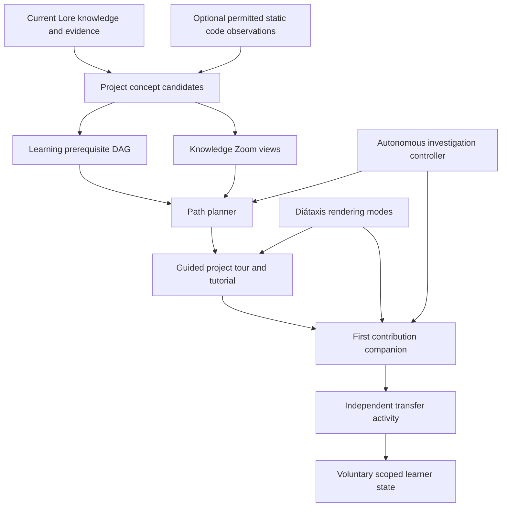

# Lore Developer Onboarding — product and technical design

**Status:** Proposed; not implemented in Lore 0.6. **Design revision:** 2 — flagship human learning experience over a shared intelligence core. **Date:** 2026-10-09.
**Primary audience:** Developers new to an existing software project, including experienced developers unfamiliar with this codebase.
**Related proposals:** [Knowledge Experience](KNOWLEDGE_EXPERIENCE_DESIGN.md), [Coding-Agent Intelligence](CODING_AGENT_INTELLIGENCE_DESIGN.md) (coequal agent experience), [Autonomous Assistance](AUTONOMOUS_ASSISTANCE_DESIGN.md), [roadmap](KNOWLEDGE_EXPERIENCE_ROADMAP.md), [vision](../VISION.md).

> **Get up to speed on an unfamiliar project, make your first correct contribution, and become increasingly independent.**

The onboarding experience is Lore's **flagship human learning journey**, not a secondary tutorial buried in a wiki and **not the scope of the entire Lore product**. Lore should build a usable mental model, reveal real workflows and decisions, support meaningful changes, and gradually withdraw scaffolding as demonstrated competence grows. Experienced developers, maintainers and coding agents have equally important **direct decision-intelligence experiences** over the same knowledge core—without a mandatory onboarding flow.

## 1. Product outcomes and design philosophy

The main challenge is not the absence of documentation. It is reconstructing the relationships between purpose, architecture, code, workflows, decisions, conventions, failure modes and current behavior. A newcomer does not know which question to ask, which document matters, or how to turn familiarity into a safe change.

**Primary outcome:** time to a *correct and understood* first contribution, **plus** independent success on a different but related follow-up task. Fast first-task completion alone can be a false positive if an assistant performed all the work while the learner understood nothing.

Success requires four observable properties:

1. **Orientation:** the developer can accurately explain the project's purpose, central subsystems, boundaries and the location of their first task.
2. **Prediction:** the developer can reason about a workflow, including a failure or exception, before looking up its exact outcome.
3. **Application:** the developer makes or meaningfully directs a correct constrained change in a representative project task.
4. **Transfer:** the developer performs a fresh related task with less guidance and can justify the approach.

These are goals, not claims that Lore presently measures or achieves them.

### 1.1 Product rules

- **Teach the project, not the documentation tree.** Organize by concepts, critical workflows and learning dependencies, not repository folders or generated page order.
- **One welcoming entry.** Start with a useful orientation before asking about learning goals, preferences or setup details. Provide an easy start, not a long configuration form.
- **Investigate for the learner.** Lore obtains permitted facts and resolves avoidable ambiguity. Do not assign log-diving, code searching or provenance reconciliation as homework unless the search itself is the deliberate skill being taught.
- **Leave agency with the learner.** During explicitly requested practice, the learner should predict, choose, write or explain. Lore provides appropriately calibrated hints rather than automatically completing every exercise.
- **One project, multiple ways to learn.** Tutorials anchor the path; explanations, reference and how-tos appear at the moment they're useful, from one evidence-backed store.
- **Make progress real.** Page views, elapsed time, generated quizzes and model compliments are not proof of competence. Only appropriately scoped demonstrated behavior supports a mastery claim.
- **No unsupported certainty.** A static code trace is not a runtime observation; a historical ADR is not proof of the current implementation; a generated task is not a verified real issue.
- **Progressive independence.** Give strong scaffolding when needed and fade it when demonstrated understanding supports it. The user can always request more help without penalty.
- **Every branch can be abandoned.** Experienced newcomers can jump to a task; a learner can explore freely; no artificial gates block useful real work.

### 1.2 Users and non-goals

| Person | Best default | Do not force |
| --- | --- | --- |
| New engineer, unfamiliar language | Orientation, vocabulary, guided workflow, low-risk practice | Advanced design trade-offs in the first minute |
| Experienced engineer, new repository | Architecture/decision tour, important conventions, first task | Elementary programming lessons |
| New maintainer, familiar with component | Changes since prior knowledge, exceptions, decision rationale | Completing the entire learning path |
| Mentor/team lead | Reproducible learning goals and reviewable evidence | Private learner analytics or misleading scores |
| Coding agent supporting onboarding | Explain, investigate, provide scoped hints and checks | Silently implementing the learner's task |
| Document-only collection | Concept tour, worked examples, exact sources | Fake code paths or executable checks |

No mandatory sign-in, hosted service, graph database, IDE extension, MCP, agent runtime, code execution, production access, analytics or learner profile is needed for the first useful slice.

## 2. North-star newcomer journey

**Proposed** entry point (not a Lore 0.6 command):

```
lore onboard
```

A simple first-run experience:

1. **Welcome / one-minute essence.** Explain in plain language what the project exists to do, the three-to-five most important concepts, what makes it unusual, and one supported end-to-end workflow. If evidence is partial, show what is actually known.
2. **Show me around.** A guided conceptual tour follows a meaningful request or data flow, pointing to a small number of actual files or precise source passages, documented decisions and a failure edge.
3. **Teach me one workflow.** Provide a bounded tutorial: the learner predicts an outcome, follows the actual flow and sees feedback based on inspectable evidence or an approved example.
4. **Help with my first contribution.** Use a user-supplied task or a demonstrably existing low-risk work item; explain requirements, preconditions, relevant code and acceptance checks. Lore performs relevant available investigation, but the learner authors/directs the change.
5. **Reflect and transfer.** Ask for a brief explanation of what changed/why, then offer a fresh related task with fewer hints. Prefer actual correctness checks when permitted and available.
6. **Resume when useful.** If the developer explicitly saved progress, continue from the current project revision and show material changes to previously learned concepts. Never infer comprehension simply from past page opens.

The four main entry actions can be **Explore**, **Learn by doing**, **Work on my first task**, and **Ask a question**. The experience should offer a useful starting point without forcing a choice. A CLI can display the orientation immediately and show optional next commands; a later local reader may show these as lightweight navigation.

### 2.1 Example (illustrative fictional payments project)

**Orientation:** “The service accepts payment requests, records ledger entries, and reconciles outcomes. The key invariant is preventing repeated requests from duplicating financial effects.”

**Guided tour:** “Follow this payment request from the API to the handler, retry logic and ledger boundary.” Each step identifies an actual grounded symbol or document when available; unknowns remain explicit.

**Exercise:** “A payment provider times out after the request is sent. What does the system do if the request is retried? Identify the condition that prevents duplicate effects.” Lore reveals a relevant existing test and expected behavior; test execution is not implied.

**First task:** “Refactor the retry handler without changing behavior.” Lore investigates the three-versus-five discrepancy, identifies the safe scoped approach and suggests the next code seam. It does not silently choose new policy.

**Transfer task:** “Change a separate error-path diagnostic without altering retry semantics.” Compare the new task's correctness and the learner's explanation, not whether they remember the earlier example wording.

## 3. Learning model: teach mental models, not just facts

An effective first tour teaches relationships:

- **Purpose:** what outcome the system provides.
- **Responsibilities:** which subsystems own which work.
- **Flow:** how an ordinary request or artifact moves through the system.
- **Boundaries:** interfaces, invariants, failure conditions and side effects.
- **Rationale:** why important decisions were made, only when evidenced; otherwise a labeled plausible explanation.
- **History:** which assumptions and approaches changed, with documentary versus observed status.
- **Practice:** a scoped example requiring an actual choice/prediction.
- **Judgment:** when to use an approach and how to notice that it no longer applies.

If a concept lacks a verified example, Lore can explain it and prepare a clearly marked hypothetical exercise; it must not fabricate a passing test or historical incident.

### 3.1 "Explain it back" is optional and purposeful

A good checkpoint asks a useful question, e.g., “What is the consequence if this operation is retried without the same idempotency token?” The learner may skip, request a hint, or inspect evidence. The generated answer rubric must be grounded in exact project rules and reviewed for ambiguity before treating an answer as correct.

Do not interrogate users during ordinary task assistance. Exercises and checks belong to an **explicit onboarding/learning session**. A user who asks for an explanation receives an explanation, not an unsolicited exam.

### 3.2 Scaffolding ladder

| Stage | Lore provides | Learner does | Evidence of progress |
| --- | --- | --- | --- |
| Observe | Guided tour, example, annotated path | Identify actors and expected output | Can name responsibilities accurately |
| Predict | Scenario, constraints, limited hints | Predict branch/failure outcome | Prediction matches scoped evidence |
| Complete together | Task plan, relevant seams and check suggestions | Propose/edit a bounded change | Change passes applicable checks and preserves constraints |
| Complete with hints | Goal, constraints, increasingly optional leads | Choose where/how to change | Correct work with fewer hints |
| Independent transfer | New related goal, available reference on demand | Plan and execute with self-directed lookup | Correct second task and explanation |

Support can increase again whenever needed. Do not infer that time spent, number of clicks, or fewer questions proves mastery. Hint use is context, not a punitive learner grade. Preserve voluntary control over assistance level: “show me a hint,” “show the reasoning,” “show an example,” “show a possible solution” (after deliberate learner choice).

## 4. Concept graph and adaptive learning paths

**Do not confuse three structures:**

1. **Evidence graph:** Lore's source assertions, knowledge units, revisions and relationships; establishes attribution.
2. **Knowledge Zoom DAG:** multiple abstractions and cross-cutting concepts for exploration; adaptive depth, no fixed four-level hierarchy.
3. **Learning prerequisite graph:** a directed graph of educational dependencies such as “understand idempotency before modifying retries.” It is a *curriculum proposal*, not an authoritative description of the code.

### 4.1 Proposed learning graph schema

Each concept has:

- Stable concept ID/title, human-readable summary and optional domain glossary.
- Scope: project/revision, environment, version and audience assumptions.
- Evidence-backed descriptions and exact supporting units/references.
- Typed relations: `prerequisite_for`, `applies_to`, `part_of`, `flows_to`, `illustrated_by`, `often_confused_with`, `related_to`.
- Dependency rationale and basis: `documented`, `inferred`, `checked`, plus optional review state.
- Source/observation freshness, alternative traversal paths and missing evidence.
- Consequential constraints/exceptions and cases needed to avoid oversimplification.

Educational `prerequisite_for` edges are fallible. The planner may use them for sequencing but must not manufacture a mandatory skill gate from an unverified LLM claim. Strongly connected prerequisite loops should be detected and presented as a co-learned module or resolved with reviewable evidence, not topologically sorted arbitrarily.

### 4.2 Selecting what to learn

Prioritize nodes by **learning value**, not code size or mention frequency:

- Centrality to one meaningful end-to-end workflow.
- Dependency for the selected first task.
- Consequences if misunderstood (security, correctness, destructive side effects).
- Explanatory power across several components.
- Availability of stable, grounded examples and tests.
- Ability to build a short exercise or observable checkpoint.
- Reader's *explicit* selected goals and demonstrated results.
- Cost and cognitive load, including how many new terms are introduced at once.

A rare negative case can be pedagogically essential. Keep it in the lesson's main material if omitting it would cause a learner to form a dangerous mental model.

### 4.3 Constructing a path

1. Resolve a stable source snapshot and permitted inspection capabilities.
2. Discover candidate entry workflows, concepts, decisions and code landmarks from original knowledge and available observations.
3. Choose one coherent workflow and build the smallest prerequisite closure that supports understanding it; keep alternatives navigable.
4. Propose a short ordered path through the closure. Assess/resolve cycles, unsupported dependencies and overwide prerequisite sets.
5. Attach one objective, source references, expected learner activity, feedback and a transferable next use to every step.
6. Prefer optional “learn now” branches for details not needed by the first task.
7. Compile a working tour and one safe exercise before producing an enormous curriculum.
8. Recheck against changed source/decisions and the user’s stated goal; avoid resetting completed work for immaterial edits.

Allow some branches to be three levels deep and others twelve; implementation limits are resource safeguards, not an ontology. The user can zoom straight to the exact code or reference and return to the lesson. Hierarchical distillation selects appropriate abstractions, but a learner is not forced to traverse the hierarchy.

## 5. Intelligent project tours

A tour is **a narrative path through meaningful project behavior**, not a sorted list of directories.

### 5.1 Tour composition

- **Opening:** problem solved, why the workflow matters, input and observable outcome.
- **Stops:** small set of important files/symbols/functions or documentary concepts, why each participates, and the next transition.
- **Decisions:** a consequential design choice or accepted invariant affecting the flow.
- **Failure stop:** one notable error/rollback/retry/security condition; not a fabricated production incident.
- **Reflection:** one prediction or “what would happen if” question.
- **Source drill-down:** actual location, exact excerpt/revision and evidence/status.
- **Next:** an optional exercise or real task with shared concepts.

Each edge is labeled with the basis of the relationship: source-declared, statically inferred, validated through a pre-authorized check, or hypothetical. An AST/static call graph may help establish candidate flows, but dynamic dispatch, message queues, reflection, generated code, database triggers and external systems can defeat static certainty. No fabricated end-to-end runtime trace.

### 5.2 Deriving tours from existing Lore and other tools

Use existing Markdown/knowledge units and OpenWiki imports for high-level intent. Where available and permitted, 0.6 static checkout inspection can anchor files, test declarations, imports or symbol excerpts. Later optional code-index and history adapters must be typed, bounded and separately authorized; never imply that current Lore already parses full call graphs or runs builds.

If there is no code checkout, tour source concepts and documented workflows instead of printing imaginary source paths. If source content conflicts with documentation, investigate what matters for the lesson and present the scoped discrepancy; do not force a confident merged story.

### 5.3 Testable tour quality

Every claimed file exists at the captured revision; displayed line excerpts match its hash; references resolve; flow order is not inferred merely from paragraph order; a documented decision is not presented as observed runtime behavior; the tour includes a success path and at least one relevant boundary when grounded. A short coherent tour beats a mechanically comprehensive but disorienting repository walk.

## 6. Diátaxis as onboarding pedagogy

Use Diátaxis as a **purpose contract**, not four folders people must navigate.

| Mode | Role in newcomer journey | Requirement |
| --- | --- | --- |
| **Tutorial (primary path)** | Learn by completing a safe, guided activity | Achievable objective, steps, expected observations and feedback |
| Explanation | Form a mental model and understand reasons | Concepts, relationships, scoped rationale and alternatives |
| Reference | Find exact names, types, values and source facts | Precise applicable details and evidence |
| How-to | Complete an actual engineering task | Goal, branches, constraints, completion checks and rollback where relevant |

**The transition from tutorial to how-to is the product moment.** A tutorial is managed learning; a real contribution may involve surprising requirements and an imperfect environment. Lore should investigate those surprises, apply learned concepts, and assist without requiring the developer to finish a curriculum first.

Diátaxis selects how to **teach or help**; Knowledge Zoom selects how much **detail**; the autonomy controller decides what evidence to **investigate**. These axes are independent, but share the same evidence graph and permissions.

## 7. First-contribution companion

### 7.1 Task sourcing

A user-supplied issue/task is the default trustworthy source of intent. Lore may suggest existing candidate tasks only from actually available issue imports (e.g., Beads snapshots), supported documentation or an explicitly configured tracker adapter. A generated idea is labeled a **practice task**, not a real issue, assigned backlog item or guaranteed acceptable change.

Rank candidate first contributions using:

- Clear success conditions and accepted policy constraints.
- Small, inspectable scope with bounded change surface.
- Observable tests or a safe review procedure.
- Low risk of production incidents, migrations, secrets and permission changes.
- Connection to concepts already introduced.
- Dependency on neither unknown business authorization nor a large unreviewed design.
- Available and suitable project revision.

Do not promise automatic issue discovery without a connected source. On repositories with no suitable tasks, propose a reversible practice exercise or guide a user-supplied task instead.

### 7.2 Guided real-task loop

Lore takes responsibility for finding requirements, relevant source/test declarations, existing decision constraints, similar cases and specific known risks. It produces a concise task brief:

1. Goal and expected externally visible behavior.
2. Relevant mental model and code landmarks.
3. Implementation strategy and important scope boundary.
4. Acceptance criteria, applicable tests/checks and rollback/recovery.
5. Available completed investigation and unresolved genuine external dependencies.
6. Optional hints, examples and source links.

The developer retains authorship/control over the change. An outside coding agent may help under its own permissions, but evaluation must separate **agent execution success** from **human learning**. No source modification is performed by Lore's proposed normal onboard/context command. A genuine unresolved policy decision cannot be waived because the task appears beginner-friendly.

### 7.3 Checkpoints after contribution

- Did the change satisfy independent correctness checks?
- Was an accepted constraint or negative case preserved?
- Can the learner explain the affected workflow and why their approach applies?
- Can they identify one situation in which the same approach would be wrong?
- Does a fresh task show less reliance on hints?

If no test runner is authorized, distinguish a reviewed diff/explanation from a passing test. Do not claim “first correct contribution” merely because an assistant generated plausible code or a PR opened.

## 8. Contract sketches (not current APIs)

### 8.1 Learning path and step

This schema sketch uses illustrative IDs, not actual Lore units:

```json
{
  "schema_version": 1,
  "path_id": "lp_example",
  "project_publication": "publication_example",
  "goal": "Understand payment retries and make a safe first change",
  "audience": "project_newcomer",
  "prerequisites": [],
  "steps": [
    {
      "id": "ls_01",
      "kind": "guided_tour",
      "title": "Trace a payment",
      "objective": "Identify the components and transaction boundary",
      "concept_ids": ["concept_payment", "concept_ledger"],
      "prerequisite_step_ids": [],
      "evidence_ids": ["ev_example"],
      "observation_ids": [],
      "basis": "documentary",
      "learner_activity": "Predict the next component after authorization",
      "assessment_kind": "optional_prediction",
      "fallback": "documentary_walkthrough"
    }
  ],
  "unavailable_capabilities": ["runtime_trace"],
  "coverage": {"selected": 2, "eligible": 5, "omitted": 3},
  "status": "illustrative_not_generated"
}
```

Implementations require exact enum sets, complete manifest resolution, budgets, ownership and immutable version binding. A `learning_path` is derived from source evidence; it does not establish project policy. A link to an unretained code observation must not survive publication cache eviction.

### 8.2 Learning activity and assessment

Proposed `LearningActivity` fields: stable ID/revision, activity type (`explain`, `predict`, `locate`, `trace`, `change`), concept prerequisites, starting evidence, task text, expected observation or objectively checkable outcome, allowed hints, feedback strategy, optional execution manifest, independent verifier, completion/cleanup, provenance and scope.

Proposed `AssessmentResult` fields: task ID/attempt, evidence source (`independent_test`, `human_review`, `grounded_rubric`, `self_report`), outcome, rubric version, confidence limitations, hints used, model/provider identity where applicable, exact project revision and consented retention. A model-graded explanation is a **fallible judgment**; it is not identical to independent correctness or mastery.

For a task that changes code, verify against a checkout/snapshot and tests **after** the learner edits. The existing 0.6 read-only inspector never pretends to run those checks.

### 8.3 Proposed CLI and JSON

```bash
# Illustrative proposed commands. They do not exist in Lore 0.6.
lore onboard                           # Immediate project orientation and one suggested tour
lore onboard --topic payments          # Begin at a concept, not a directory
lore onboard --task "Refactor retries"  # Make learning relevant to a real goal
lore onboard next                      # Advance an explicitly started learning path
lore onboard status                    # State actual activity, evidence and opt-in progress
lore onboard --json                     # Scriptable versioned current view
lore onboard reset                     # Remove optional learner-state locally
```

Do not require `lore onboard` to use `lore context`; existing command contracts and agent workflows remain supported. The CLI must work without a web reader. A later reader may add tours, adjustable zoom, explanations, hint reveal and progress navigation while consuming the **same JSON contract**, not a duplicate knowledge store. Explicit learning controls cannot grant filesystem, execution or egress permissions.

### 8.4 Learner state and privacy

No account or learner profile is required. Default can be stateless with optional save/resume, or a minimal local state after an understandable consent decision, subject to implementation review.

If saving progress, store only voluntarily completed activities, selected goals, checkpoint outcome categories, source revision and desired assistance mode. Keep it per-learner rather than project-authoritative; support inspect/export/reset and retention limits. No inference that page reading equals understanding, no global ranking or permanent competence score, no hidden usage analytics, no data sharing with mentors/employers by default. A user can disagree with or discard feedback.

## 9. Architecture and generation pipeline



**Deterministic Rust responsibilities:** project/source identities, capability grants, file/hash checks, concept/lesson IDs, graph cycles, dependency closure, budgets, provenance manifests, JSON validation, exercise applicability, cache invalidation and publication. **Model responsibilities:** suggest concepts, select an intelligible workflow, propose prerequisites, draft tour explanations/exercises, generate useful hints and concise feedback. Model proposals are validated and can be rejected without losing usable source material.

**Optional decision/System-One models:** bounded intent/classification, task suitability, likely concept relevance or hint selection. They do not veto a critical constraint or determine whether a human has mastered a skill from a raw probability.

**No generic agent framework prerequisite:** reuse 0.6 retrieval and investigation, plus the new autonomy controller. Code-index/history/runner adapters remain optional independently authorized capability additions.

### 9.1 Dependency closure and reuse

Store lesson and curriculum views in a derived versioned store, separate from accepted project knowledge. A lesson references knowledge/decision revisions, original evidence, optional hash-bound code observations, applicable cases, prerequisite edges and its rendering/rubric versions.

When a source, decision or code revision changes:

- Invalidate affected concepts and downstream lessons, tour steps, examples, expected behaviors, first-task recommendations and learned-scope claims.
- Search for *newly relevant* source evidence even if prior supporting files are unchanged, including new ADRs, tests or incidents.
- Preserve completed learner history as “completed on snapshot X,” not “currently mastered on snapshot Y.”
- Rebuild only affected derived lessons, keeping stable step IDs where their actual educational meaning remains the same.
- Show consequential differences to a returning learner, not a noisy changed-file dump.
- No model calls or generated page rewrites on an actually unchanged `lore update`.

A renamed path whose exact semantic identity cannot be established should not silently carry completion/verification forward. An imported OpenWiki-derived statement does not independently prove the code claim it summarizes.

### 9.2 Bounded lesson generation and graceful fallback

Choose small initial paths, not a whole learning catalog. Constrain concept fan-out, path length, tour steps, source bytes, model calls, verification, output tokens and cost. Base numerical defaults on measured project samples and ensure the user can stop or jump ahead.

Failure behavior:

| Failure | Useful onboarding result |
| --- | --- |
| No code checkout | Documentary concept tour and clearly marked worked exercise |
| No trusted test runner | Explain expected behavior; give implementation check, no fake pass |
| Inadequate flow evidence | Scoped concept tour with uncertainty label, not invented runtime path |
| No suitable existing starter issue | User-supplied task or explicit practice exercise |
| Model unavailable | Deterministic grounded index with few source landmarks |
| Conflicting ADR and code | Investigate applicability; teach the conflict honestly |
| Insufficient detail budget | Preserve decisive precondition and link to exact evidence |
| User skips or answers incorrectly | More context or optional hint; never lock them out |
| Unknown learner level | Give useful overview; optional skip-to-task without a profile quiz |
| Changed project revision | Mark prior case/lesson snapshot stale and revalidate |
| Source injection, egress denial | Preserve grants/limits; offer safe local source guidance |

## 10. Security and safe learning

Learning exercises can include untrusted snippets, dependencies, intentionally failing code or security-sensitive examples. They remain **data**, never commands to run.

Normal `onboard` and `context` inherit the existing permission envelope and do not execute code, modify source or change project policy. Optional exercise replay or external verification requires an approved isolated runner, a trusted operator-selected command capability, pinned inputs, no default network/credentials/host mutation, output quotas and actual recorded results. An instruction inside a Markdown tutorial cannot grant sandbox access.

Avoid teaching a newcomer to perform dangerous real-world operations “for practice.” Use reversible, local/synthetic scenarios. In production-sensitive domains, a guided inspection or hypothetical case may be safer than execution. Always distinguish documentary constraints from independently observed behavior.

Do not retain personal learner answers, free-text reflections or repository secrets in ordinary inference logs. If an optional learner state or run artifact is stored, it inherits project access and data-class restrictions; allow deletion/export. No external metrics/telemetry by default. A developer may ask for help without consenting to long-term profiling.

## 11. Evaluation: test learning transfer, not satisfaction alone

### 11.1 Primary outcomes

- **Time to first correct contribution:** elapsed time from initial contact to a bounded change satisfying an independent project-specific correctness/constraint rubric. A PR opening is insufficient.
- **Understanding of the contribution:** an independently reviewed explanation of behavior, relevant constraints and why the change is appropriate.
- **Independent transfer:** performance on a separate but related held-out task with the same available source access and a reduced/predeclared assistance budget.
- **Mentor dependence:** avoidable mentor/coding-agent intervention and requests for information Lore could have found.
- **Correctness/retention:** independently scored explanation/prediction at a later defined point, if the study can validly measure it.
- **Total effort and cost:** developer time, agent/tool calls, setup burden, reading and correction loops, latency, costs, resource use and accessibility problems.

Measure confidence or subjective satisfaction only alongside correctness; seeming confident after incorrect teaching is a failure. The first task must not be solved entirely by a coding agent while counted as human competence.

### 11.2 Study design

Use multiple independently selected unfamiliar projects of varying languages/size, including document-rich, code-heavy and sparse-doc cases. Balance participants by relevant prior experience and programming language familiarity. Fix source snapshots and allowed tools; retain original sources for all arms.

Candidate arms:

1. Original repository docs/README and normal developer tools.
2. Current OpenWiki or a comparable wiki, if available, with the same allowed coding agent/tool budget.
3. Current Lore 0.6 documentation/context, without the future learning path.
4. Autonomous Lore project tour + guided tutorial.
5. Newcomer path + task companion + optional faded scaffolding.

Where sample size permits, ablate hierarchy, path planning, tutorials and investigations separately. A direct coding agent may improve task completion without improving human knowledge; keep that comparison explicit. Use independently verified hidden checks outside the agent's input, grounded human review, held-out tasks and appropriately randomized order. Do not leak gold answers through the generated curriculum, cached investigations or example tests.

Run a **second-task transfer evaluation** without reusing the exact first task's solution and capture requested hints. A delayed assessment is useful if feasible, but should not be promised as mandatory without a study protocol. Compare actual time/accuracy/effort, not merely which interface people prefer.

Set and preregister numeric success and non-inferiority thresholds only after the baseline study design. No 2026 result or claimed improvement is established by this document.

### 11.3 Hard release gates

- All material explanations, tours, prerequisites and reference facts have source/observation provenance and accurately scoped authority; no false runtime trace.
- Rare but material constraints, counterexamples and decision endpoints survive zoom and lesson simplification.
- No unauthorized execution/egress, policy edits, secret leakage or synthetic output presented as an observed pass.
- All lesson/checkpoint references bind to the correct source/knowledge revision; mutations invalidate as specified.
- No required learner profiling, long onboarding questionnaire, hosted account, reader UI or noninteractive stdin prompt.
- Deterministic/legacy `lore context --fast` and schema-2/3/4 remain unchanged; true no-op compilation remains zero-model.
- Empirical claims of improved onboarding require externally assessed first-task correctness **and** transfer outcomes without increased material error/unsafe behavior.
- A prototype that fails a learning-transfer study can remain experimental; attractive generated tours alone do not satisfy the primary goal.

### 11.4 Named acceptance scenarios

| ID | Case | Required behavior |
| --- | --- | --- |
| ON-01 | First launch with a normal project | Useful immediate orientation, no preference questionnaire |
| ON-02 | Expert new to the repository | Can jump to workflow/first task without elementary lessons |
| ON-03 | Beginner unfamiliar with vocabulary | Accessible definitions and gradual introduction, without false simplification |
| ON-04 | Code-rich repository with few docs | Honest permitted static exploration; unsupported motivations labeled inferred |
| ON-05 | Document-only collection | Useful learning path without fabricated code/test references |
| ON-06 | Dynamic or partially untraceable flow | Scope/inference label, no claim of verified runtime sequence |
| ON-07 | Table, procedure, exception | Context preserved in explanation and exercise |
| ON-08 | Proposed prerequisite cycle | Detect, resolve as co-learned concept or remove with explanation |
| ON-09 | Deep and cross-cutting concepts | Adaptive Zoom with multiple memberships; direct exact jump |
| ON-10 | User requests a tutorial | Real learner activity and feedback, not merely a how-to |
| ON-11 | User asks for exact API details | Direct precise reference without tutorial detour |
| ON-12 | Newcomer enters with real task | Task-based entry; no mandatory curriculum |
| ON-13 | No suitable starter issues | No invented issue; offer explicit practice task or accept supplied issue |
| ON-14 | Exercise requires code execution but runner denied | Honest worked example; never fake result or demand broad permission |
| ON-15 | First task touches an adopted constraint | Relevant rule/exception and safe scoped recommendation |
| ON-16 | Accepted ADR conflicts with implementation | Investigate as allowed, teach/document applicability without invented policy waiver |
| ON-17 | Learner requests hints | Reveal progressively; do not automatically overwrite their solution |
| ON-18 | Incorrect answer or skipped checkpoint | Offer useful feedback/continuation without forced grade or lock |
| ON-19 | Page viewed without exercise | No mastery or verified completion claim |
| ON-20 | Learner state not consented | Stateless, no hidden tracking/retention |
| ON-21 | Source or tested example changes | Mark old learning/check outcome scoped to old snapshot; regenerate affected content |
| ON-22 | First task solved entirely by agent | Do not count as developer competence; assess separately |
| ON-23 | New distinct transfer task | Score correctly with less/predeclared assistance; no solved-task leakage |
| ON-24 | Cancellation, reset or offline session | Safe stop, clear state ownership and meaningful fallback |

## 12. Prioritized implementation slices

This is the **front door for learning**, not a mandatory gate to using Lore. The [roadmap](KNOWLEDGE_EXPERIENCE_ROADMAP.md) sequences the initial shared M0 milestone (small human orientation **and** agent task package) and separately tracks the richer O-series onboarding packages (planning identifiers, not GitHub PR numbers):

- **O01** — Newcomer evaluation corpus, first/second task rubrics, benchmark protocol.
- **O02** — Stateless immediate orientation from existing Lore evidence.
- **O03** — Guided workflow tour with source landmark resolution and explicit observation basis.
- **O04** — Concept/prerequisite graph and short learning-path planner, no hard curriculum gates.
- **O05** — Tutorial/worked exercise with hints, expected outcomes and graceful no-runner fallback.
- **O06** — Task-based first-contribution companion reusing permitted adaptive investigation.
- **O07** — Optional locally stored learner checkpoint/resume, opt-in privacy/delete/export.
- **O08** — Independent transfer exercise, reduced-scaffolding mode and outcomes evaluator.
- **O09** — Adaptive Knowledge Zoom integration and cross-cutting concept navigation.
- **O10** — Accessibility, usability, mutation, privacy and default-on release evaluation.

The **M0 shared engineering slice** uses a small subset of O01/O02/O03/O05 (orientation, short grounded tour and one optional learning activity), the minimal A1/A2 intelligence core and a G1 agent task example. It does **not** claim complete learning transfer or agent productivity improvement. A **complete onboarding product** later requires an actual correct first contribution and independent transfer study. The agent path has its **own** implementation-quality release gate. No fully materialized hierarchy, bespoke web app or sandbox runner is required for M0.

## 13. Decisions and open questions

**Proposed decisions:** newcomer onboarding is the flagship **human learning** experience and benchmark, while coding agents have a coequal decision-intelligence experience; tutorial is the learning-path anchor; first real contribution is the transition to a how-to; autonomy does homework but doesn't confiscate practice; concept prerequisites are separate from source evidence; Knowledge Zoom remains adaptive with resource guardrails rather than fixed ontology depth; progress is voluntary and evidence-based; previous Lore 0.6 contracts remain untouched.

**Still to decide through tests:** first-run CLI ergonomics on different platforms; how to select one valuable entry workflow; the reliable threshold for an educational prerequisite; lesson-cache lifetime with frequently changing code; evidence-backed feedback quality for unexecuted tasks; optional state consent UX; genuine low-risk starter-task sourcing; appropriate first-task/transfer sampling and cohort balance; and when a standalone reader offers measurable learning benefit beyond CLI/Markdown.

**Boundary:** These are implementation-ready design targets, not a claim that `lore onboard`, interactive activities, full call tracing, grading, hint adaptation or persistence already work.

## 14. References

- [Knowledge Experience architecture](KNOWLEDGE_EXPERIENCE_DESIGN.md)
- [Autonomous Assistance design](AUTONOMOUS_ASSISTANCE_DESIGN.md)
- [Coding-Agent Intelligence design](CODING_AGENT_INTELLIGENCE_DESIGN.md)
- [Phased implementation roadmap](KNOWLEDGE_EXPERIENCE_ROADMAP.md)
- [Lore 0.6 behavior](V06.md)
- [Existing evaluation](../evaluation/DECISION_INTELLIGENCE.md)
- [Diátaxis](https://diataxis.fr/)
- [Diátaxis tutorials versus how-to](https://diataxis.fr/tutorials-how-to/)
- [Cognitive apprenticeship](https://www.aft.org/ae/winter1991/collins_brown_holum)
- [RAPTOR multi-level retrieval](https://arxiv.org/abs/2401.18059)
- [OpenWiki](https://github.com/langchain-ai/openwiki)

**Acceptance question:** Did a newcomer form an accurate mental model, make a correct first contribution with appropriate help, and approach a genuinely new task more independently—without unsupported certainty or unnecessary effort?
