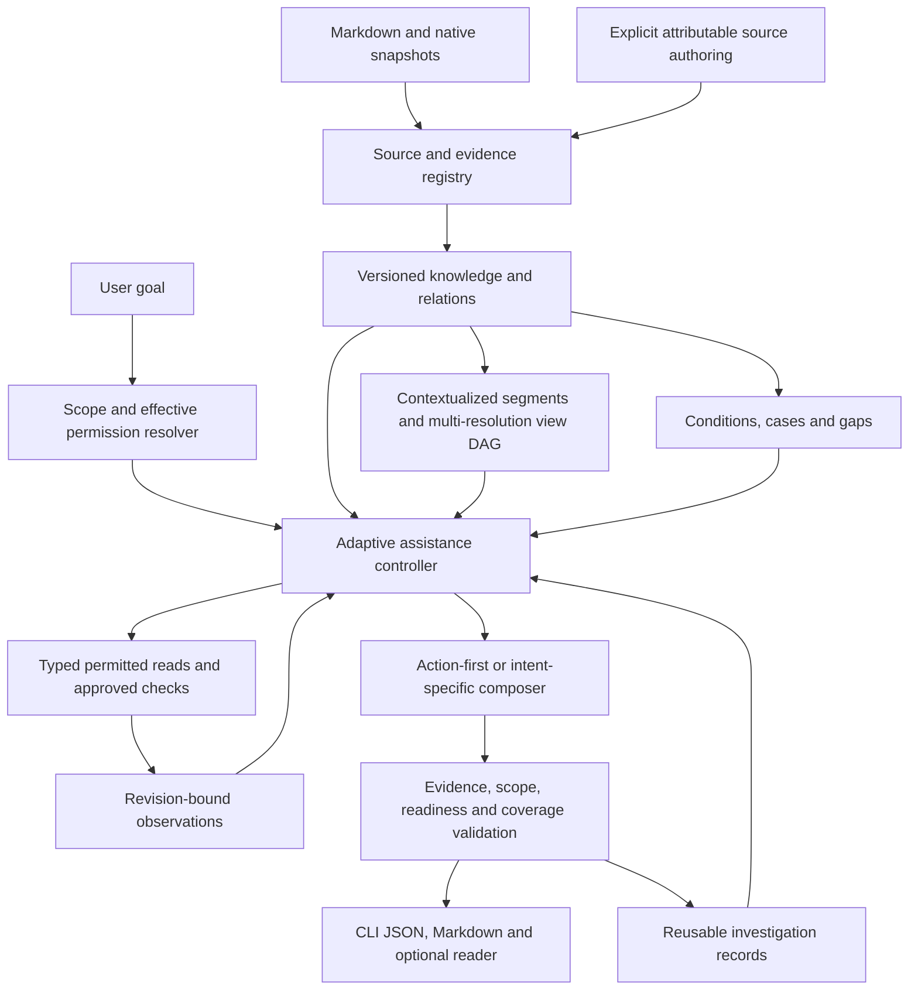

# Lore Knowledge Experience — design proposal

**Status:** Proposed, not implemented. **Design revision:** 3 — newcomer-first learning, grounded practice and adaptive autonomy. **Date:** 2026-10-09. **Baseline:** Lore 0.6 on `main` at `51b62ebe6d44ca4ff5162ff7758408c3e85ec548`.

**Companions:** [Developer Onboarding product and technical design](DEVELOPER_ONBOARDING_DESIGN.md) (**primary user journey**), [autonomous assistance](AUTONOMOUS_ASSISTANCE_DESIGN.md) and [phased roadmap](KNOWLEDGE_EXPERIENCE_ROADMAP.md).

> **Get up to speed on any project. Make your first correct contribution. Grow independent.**
>
> **Maximum useful autonomy. Minimum user burden.** Lore does the investigative homework so newcomers can focus on building a mental model, practicing and understanding the changes they make.

This document proposes Lore's future knowledge-experience architecture. It does not assert that proposed commands, configuration fields, persistence tables, execution mechanisms or interfaces exist today. Implemented contracts remain in [README](../README.md), [DESIGN](../DESIGN.md), [0.6 guide](V06.md) and [implementation guide](IMPLEMENTATION.md). Examples are illustrative unless identified as existing behavior.

Revision 3 makes **new developers learning an unfamiliar project the primary product audience**, including experienced engineers new to this repository. The central experience is a short project orientation, a grounded workflow tour, a purposeful tutorial, support for a first real contribution, and a more independent second task. **First-task success without demonstrated learning is insufficient.** Adaptive investigation remains the engine, and guided practice remains the learner's work. Diátaxis makes tutorial the onboarding anchor (with explanation/reference/how-to on demand), while Knowledge Zoom allows variable semantic depth—not an arbitrary four-level tree. The [onboarding design](DEVELOPER_ONBOARDING_DESIGN.md) specifies the learning path, typed contracts, exercises and evaluation. The [autonomy design](AUTONOMOUS_ASSISTANCE_DESIGN.md) specifies permitted investigation and user burden. All are future proposals.

## 1. Executive decision

Build a **newcomer-first project learning companion** over Lore's source assertions, consolidated knowledge and decision-ready context. The primary outcome is that someone unfamiliar with a project can understand its purpose and workflows, make a **correct and understood first contribution**, and tackle another related task **with less guidance**. This requires both teaching and action: Lore investigates consequential uncertainty within permissions and recommends a defensible approach, but does not replace the developer's own learning with an agent-produced patch. Developers already familiar with the project retain direct, efficient task context.

The user should not need to choose `--inspect`, `--investigate`, a reasoning effort or a documentation mode to obtain useful help. Those remain advanced controls and compatibility options. Default initiative must not mean default unrestricted access: automatic actions operate only inside a disclosed, accepted capability envelope, with easy restrictive overrides.

Present the same knowledge through different intents (Diátaxis), levels of detail (semantic zoom), scopes (project, topic, task, environment and revision), and epistemic states (documented, observed, inferred). Add decision assumptions and reconsideration triggers; first-class failures, exceptions and examples; reusable investigation records; worked and replayable learning cases; advisory change-risk checks; and revision-aware briefings.

**First delivery:** one coherent, low-friction newcomer journey using existing Lore 0.6 evidence, minimal adaptive read-only assistance and concise explanations: project essence → a grounded workflow tour → one safe practical lesson → a supported small real change → independent transfer. Develop A1/A2 as the investigation/answer foundation; A3 reuse and the full R1/R2/R3 machinery can follow or grow alongside where measured useful. No mandatory new UI, extensive source-indexing rewrite, fully materialized hierarchy, project-specific plugin or code-execution framework. The [roadmap](KNOWLEDGE_EXPERIENCE_ROADMAP.md) includes O1–O3 newcomer milestones alongside A1–A3 and R0–R7.

**Primary success measure:** a first *correct and understood* contribution plus correct work on a **different, related task with less scaffolding**, measured with independent checks and reviewer rubrics. Also measure orientation, mentor burden, user effort, false blocking, unsafe proceeding, reading/correction loops, privacy and cost. An AI-written patch, a pleasant tour, a passed generated quiz or a high confidence score alone is not a success.

### 1.1 Experience principles

- **Make a newcomer feel oriented immediately:** lead with the project essence, one real workflow and a sensible next step—not a taxonomy quiz or wall of documents.
- **Own the investigation:** do not hand a user or calling agent work Lore can usefully perform within its actual capabilities and budget.
- **Answer first:** recommend one sensible approach or answer the question directly, with the next useful action and decisive boundary.
- **Separate uncertainty from inability to act:** preserve non-blocking uncertainty without turning it into a prerequisite.
- **Preserve agency:** let the user inspect evidence, correct assumptions, narrow scope, cancel or choose a different approach without restarting routine discovery.
- **Use progressive disclosure:** concise useful result first; detail, alternatives, history and evidence remain easy to reach.
- **Teach by doing:** a learner can predict, trace, make a change and explain its consequences; hints fade as understanding is demonstrated, not inferred from page visits.
- **Allow task-first entry:** onboarding is optional for other users; newcomers can skip a path, request more help or begin a real issue immediately.
- **Reuse experience without inventing authority:** revision-bound investigation findings inform new tasks but never silently become accepted policy.
- **Fail usefully and honestly:** retain independently valid findings, narrow affected advice and explain specific unavailable dependencies rather than abandoning the whole task.

## 2. Why this is not simply a new wiki

OpenWiki is a source of repository understanding and grounded claims for Lore, not a straw-man competitor. The comparison informing this proposal includes its incremental generation, source maintenance, agent access and graph-oriented reading. RAPTOR already explores recursive clustered summaries; GraphRAG explores communities and multi-level retrieval; Diátaxis defines distinct documentation needs. Those ingredients are prior art, not claims of invention or measured advantage for Lore.

Lore's proposed differentiation is **developer competence**: connect documentary authority/history to project mental models; investigate relevant uncertainty; teach real workflows and failure cases; assist an authentic first change; and build independent judgment for the second. Knowledge Zoom and Diátaxis help present that experience; their underlying techniques are not a proprietary moat. The system can consume OpenWiki knowledge without asking users to abandon it. Compare real newcomer outcomes before making superiority claims.

Keep OpenWiki, Engram and Beads in their existing roles. Consume supported snapshots and optional approved adapters; avoid duplicating their storage, agent runtime or work-management systems. Unsupported upstream formats retain the existing Markdown/import fallback rather than a guessed schema.

### 2.1 Existing Lore 0.6 that must be reused

| Existing capability | Baseline contract | Proposed extension |
| --- | --- | --- |
| Markdown roots and optional OpenWiki/Engram/Beads snapshots | Source identity, primary/derived origin, exact retained evidence | Context-aware segments and attributable new knowledge notes |
| Source assertions to consolidated units to topic wiki | Lifecycle, scope, support, contradiction, explicit supersession/reaffirmation | Multi-resolution derived views and typed cases |
| `lore context` schema 4 | Preferred approach, readiness, facts, hypotheses, heuristics, blockers, checks and risks | Adaptive controller and richer scoped assistance contract in a future version |
| `--inspect` / `--investigate` | Opt-in bounded read-only static checkout observations; no shell or test execution | Automatically selected useful reads within accepted grants; separate approved verification adapter later |
| Lexical and optional semantic retrieval | Bounded candidates and relation expansion | Direct-plus-cross-level retrieval with exception preservation |
| Incremental updates and staged publication | True no-op means no model calls; retained history; recoverable publication | Derived-view and investigation dependency invalidation |
| Review workflow | Auditable dispositions of reconciliation questions | Separate optional authored answers/decision interpretations, never mandatory approval of all derived advice |

Static test inspection is not test execution. Reading history through a proposed adapter is not an existing general Git/connector capability. Schema 4 readiness already exists and should be reused, not relabeled as a new feature. Consult [V06](V06.md) for actual privacy and resource limits.

### 2.2 Design invariants

These apply to all phases:

- Generated views, exercises, probabilities and investigation conclusions do not become accepted project knowledge merely through repetition or reuse.
- Material source-dependent claims retain valid evidence, scope, basis, lifecycle and temporal qualification. General heuristics have no invented project citations; inferences remain distinguishable.
- An excerpt establishes what a source says; static observation establishes inspected bytes; a passed check establishes a bounded result on recorded inputs. None alone proves production behavior.
- Material accepted constraints, exceptions, conflicts, supersession and historical qualifications cannot disappear silently during compression or answer shortening.
- Every derived claim can resolve to original evidence. `summarizes`, `derived_from`, `supports` and `contradicts` are different relationships.
- Changed, withdrawn or new counterevidence invalidates dependent current guidance even when the old supporting file or generated wording is unchanged.
- Documents, imported memories, tool results and model outputs are untrusted data, not authorization for paths, network access, code execution or policy changes.
- Effective permissions come from operator grants and request restrictions. No silent expansion on upgrade; no repeated confirmations within an unchanged standing grant.
- Existing explicit schema-2/3/4, `--fast`, `--no-inspect` and no-cache behavior remain meaningful. A new default requires explicit version/migration handling, not hidden semantic changes to an old contract.
- True no-op compilation has no inference or output churn. Request-time assistance and explicitly approved experiments have separately reported budgets and effects.
- No production mutation, unrestricted agent framework, automatic policy change, hidden background monitoring, telemetry or personalization by default.
- Learning objectives, concept prerequisites and feedback are derived suggestions, not source-authoritative facts or mandatory gates. Learner practice must be purposeful and skippable.
- Reading a page is not competence; code authored by an outside agent is not evidence that the human learner understands it. Checkpoints are optional and assessed with appropriately scoped evidence.
- Source-derived tours and starter tasks must be real and revision-bound; hypothetical paths and generated practice tasks must be labeled as such.
- Coverage and omissions are reported accurately. Missing retrieved evidence does not establish project-wide absence.
- Lack of certainty or resource exhaustion is not automatically a blocker. A genuine unresolved action condition cannot be hidden to force a `proceed` result.
- Human review is not required for every reusable derived finding. Explicit source authoring and authoritative decisions remain separately controlled.

## 3. User needs and workflows

| Reader | Entry question | Desired experience | Evidence of success |
| --- | --- | --- | --- |
| **New developer** | **Where do I begin with this unfamiliar project?** | Immediate project essence, meaningful workflow tour, one guided exercise, first real change | **Correct understood first contribution and more independent second task** |
| Experienced newcomer | How do I get productive quickly? | Architecture/decision tour with skip-to-task controls | Can find relevant code and tackle a new task efficiently |
| New contributor | What does this subsystem do? | Clear model, decisive caveats, examples on demand | Can explain/predict related behavior |
| Engineer changing code | How should I alter retries? | Lore inspects what matters and supplies an applicable action | Correct change, fewer avoidable handoffs |
| Incident responder | What failed before; what differs now? | Relevant cases and already-completed permitted checks | Faster correct diagnosis |
| Maintainer | Which assumptions should we reconsider? | Investigated candidates, not an untriaged suspicion queue | Meaningful issue found without excessive review burden |
| Coding agent | What matters before modifying this path? | Small actionable package, completed findings, exact remaining dependencies | Correct progress without duplicating Lore's work |
| Domain expert | What knowledge should we add? | Optional focused gap capture after available investigation | Useful attributable answer per human minute |
| Returning contributor | What do I need to relearn? | Consequential changes since a named baseline | Resumes without rereading everything |
| Document-only reader | Explain this collection | Sensible default view and exact navigation, no code requirement | Accurate understanding without configuration burden |

### 3.1 Primary newcomer journey (proposed)

A newcomer invokes a proposed `lore onboard`. Without a questionnaire or mandatory new UI, Lore immediately presents a short, source-grounded account of the project's purpose, three-to-five central concepts and one representative workflow. The developer can follow a coherent guided tour through actual source or code landmarks. Lore introduces only the prerequisite concepts necessary to understand a small failure/exception and offers one meaningful prediction or trace exercise.

Next the newcomer can supply an actual issue or select an available source-backed low-risk task. Lore automatically gathers permitted context, explains the constraints, identifies implementation seams and gives adjustable hints—but **does not silently implement the learner's change**. The learner's result is evaluated by independent checks or clearly scoped external review. A **different related task** with less default scaffolding tests transfer; model-generated praise or a page view does not count as mastery. The full interface, assessment and privacy contract is in [Developer Onboarding](DEVELOPER_ONBOARDING_DESIGN.md).

This is a *primary but opt-in learning journey*. Existing `lore context` remains a direct task tool for developers and agents who want an answer rather than an exercise.

### 3.2 Example journey: payment retries (hypothetical)

The user asks to refactor retries without changing behavior. Lore retrieves policy and architecture, inspects relevant current source/test declarations if permitted, checks available history when it could change the recommendation, and compares plausible explanations. It recommends preserving the existing behavior while making the requested refactor, if that is compatible with applicable obligations. It names the main constraints and future implementation checks and labels what was actually inspected versus executed.

When the accepted policy differs from the implementation, Lore does not merely say to investigate. It investigates the decision relevance of the discrepancy itself. A behavior-preserving refactor can often proceed with the unresolved policy history stated as non-blocking; an explicitly required policy correction or proposed policy change must not be silently waived.

The same answer can expand into a working model, rationale, reference details or a tutorial. Original evidence remains directly accessible. A learner can choose a timeout case without forcing ordinary users through an exercise. If replay is unavailable, show an honestly labeled worked example. The user is never required to traverse a summary tree before receiving the answer.

### 3.3 Example journey: a purely documentary knowledge base

Lore can investigate across configured sources, relationships and revalidated findings without code, Git, a runner or a browser. Explanation/reference remain useful. It synthesizes a supported procedure where possible and clearly distinguishes recommendations from documented steps. Missing code capabilities should not trigger infrastructure setup questions. For a materially absent requirement, provide a robust conditional answer or useful partial work; only isolate a human decision when no defensible alternative resolves it.

### 3.4 Effort and interaction

The [autonomy contract](AUTONOMOUS_ASSISTANCE_DESIGN.md) defines graduated effort, stop reasons, cancellation, noninteractive dependencies and user control. Easy tasks should remain easy. A requested exact value should not start a repository tour. A complex task may justify deeper reading, but total human/agent effort, latency and cost remain part of the objective. No repeated questions merely to increase a confidence score.

## 4. Orthogonal dimensions of a knowledge view

The engine represents these dimensions explicitly; the user does not have to configure them:

1. **Intent:** `explain`, `howto`, `tutorial`, `reference`, or inferred `auto` routing.
2. **Depth:** orientation, working model, decision context, operational detail or evidence.
3. **Scope:** project, topic, task/path, roots, environment and source/publication/as-of identity.
4. **Epistemic basis:** documentary decision, report, static observation, experimental observation, hypothesis, heuristic or unknown.

Intent is not depth. A short tutorial still teaches through purposeful practice; a deep explanation is not an operational procedure. Depth is not authority. Source publication, claimed event/effective time, Lore capture time and checkout revision have different meanings. A current documented choice need not be verified runtime behavior.

Infer sensible defaults from the request and available context; explicit user choices override routing. Audience preferences can change vocabulary and selection, not truth. Ambiguity can be handled by a declared low-risk assumption or concise conditional branch; do not ask for all dimensions before helping. Users may change a view without invalidating the shared evidence or reenacting completed investigation.

## 5. Conceptual architecture



The adaptive loop selects useful actions, gathers evidence and revises advice. A reusable investigation is derived data, not a second truth registry. Models propose content and typed actions; deterministic components own capability checks, IDs, hashes, scheduling, budgets, validation and publication. No generic shell or autonomous policy mutation is introduced.

### 5.1 Reuse the existing knowledge layer

Preserve the four layers: immutable exact evidence, versioned source assertions, reconciled knowledge units and regenerable views. New objects reference stable unit/revision IDs and evidence. Do not create a parallel accepted-facts store.

Keep documented design separate from future plans and verification; accepted choices separate from deployment; proposals/plans/issues separate from approval; reported outcomes separate from independent observations; static tests separate from executed checks; hypotheses separate from documentary reasons; and heuristics separate from project authority. An authored answer is attributable documentary evidence, not automatic universal proof.

Evidence freshness/support (`active`, `historical_only`, `withdrawn`, `missing`) remains separate from lifecycle (`accepted`, `proposed`, etc.), scope and verification. Derived support lineage must preserve correlated origins so a summary of OpenWiki does not become an independent corroborating source.

### 5.2 Investigative memory

Add structured, versioned records for task scope, hypotheses, original evidence, completed typed checks, observed results, counterevidence, recommendation changes, applicability, unresolved dependencies and stopping reason. Store concise externally understandable rationale, not hidden chain of thought.

Reuse requires current permission, relevant scope, rehashed observed files, current knowledge/relationship revisions and a bounded check for newly relevant evidence. Matching old support alone is insufficient. Candidate selection/index completeness matters; incomplete inventories prevent claims of complete current revalidation. Full fields, lifecycle, privacy and eviction rules are in [the autonomy specification](AUTONOMOUS_ASSISTANCE_DESIGN.md).

## 6. Context-aware segmentation

### 6.1 Starting point

Current `src/sources.rs` already parses headings, retains heading paths/preamble, splits oversized sections and fingerprints extraction inputs. Preserve exact quote resolution and assertion identity. Add an independently versioned derived segmentation profile; only migrate extraction lineage when a specific demonstrated defect requires it. Better segmentation is an experiment, not a prerequisite for initial adaptive assistance.

### 6.2 Segment types

| Type | Context that must travel with it |
| --- | --- |
| Paragraph/proposition | Heading ancestry, subject, definitions and qualifiers |
| Table/row group | Column headers, units, version, footnotes and exceptions |
| Code fence | Language, purpose, example/production scope; never implicit execution |
| Procedure/ordered list | Preconditions, ordering, branches, success criteria, cleanup/rollback |
| ADR decision | Document identity/status, scope and separately sourced rationale |
| Example/counterexample | Conditions, illustrated rule and expected versus observed result |
| Figure/link/reference | Caption and relevant explanation; do not assume external content |
| Conversation/issue export | Actor, reported time, source identity, modality; closed is not shipped |

Prefer semantic completeness over target token size. Use overlapping context metadata rather than duplicate independent assertions. Oversized structures subdivide with inherited context and explicit partial coverage; no silent truncation of procedure warnings, table headers or quotes.

### 6.3 Identity, context and normalization

Retain exact source/revision/section identity, byte spans, heading path and captured excerpt. Derived IDs can incorporate source ID, section lineage, span/content digest and profile version. Reuse lineage across a move only with unique supported matching; repeated headings/text cannot be silently conflated.

A short deterministic or generated retrieval context header is separately labeled derived metadata, never quoteable as original evidence. Preserve the source's modality when a header refers to a proposal or report. Changes to inherited context invalidate dependent retrieval text.

### 6.4 Coverage and grouping

Propose concept groups from topics, typed relations, lexical links and optional embeddings. Preserve incompatible environments/versions/modalities and conflicts rather than merging them into unqualified consensus. Cross-cutting concepts can belong to several groups.

Benchmark topic/relationship grouping, binary, four-way and adaptive structures. A complete 256-leaf binary tree has 255 internal nodes; a four-way tree has 85. These are structural counts, not proportional cost or accuracy claims. Wider aggregation needs more input per call. Choose coherent group sizes, evidence coverage and measured utility, not a fixed `1,2,4,...,256` ontology.

## 7. Multi-resolution view DAG (Knowledge Zoom)

### 7.1 Model

A view node is a derived presentation over original knowledge and optionally child views. Containment is acyclic; concepts and units may have multiple memberships. Mode-specific renderings have their own fingerprints. Relationship graphs can contain non-containment cycles where meaningful; do not confuse them with the acyclic view dependency rule.

| Presentation level | Reader question | Emphasis |
| --- | --- | --- |
| Orientation | What matters here? | Purpose, main concepts, costly surprises |
| Working model | How does it fit together? | Relationships, responsibilities and boundaries |
| Decision context | Why this approach? | Reasons, alternatives, assumptions and history |
| Operational detail | What do I do or expect? | Procedures, contracts, cases and conditions |
| Evidence | How do we know? | Original excerpts, scoped observations and status |

These are presentation levels, not mandated database depth. Direct reference retrieval bypasses the hierarchy for exact values, identifiers, paths and errors. The highest-level summary cannot be the only route to a rare decisive exception. Start at the level that best answers the request, then let the reader expand in place.

### 7.2 Candidate node contract

Illustrative, not currently accepted JSON:

```json
{
  "view_schema_version": 1,
  "id": "kv_<stable_id>",
  "revision": "<digest>",
  "kind": "concept_overview",
  "intent": "explain",
  "level": "working_model",
  "topic": "payment-retries",
  "scope": {"environment": "production", "as_of": "<publication_id>"},
  "title": "Why retries require idempotency",
  "text": "<derived explanation>",
  "child_view_ids": ["kv_<child>"],
  "knowledge_refs": [{"id": "ku_<id>", "revision_id": "kr_<id>"}],
  "evidence_ids": ["ev_<id>"],
  "investigation_refs": [{"id": "ir_<id>", "revision": "<digest>"}],
  "mandatory_qualifiers": ["Policy and observed implementation differ."],
  "coverage": {"selected_units": 4, "eligible_units": 7, "omitted_units": 3,
               "omission_reasons": ["output_budget"]},
  "generation": {"prompt_version": "<version>", "model_identity": "<identity>",
                 "verification_state": "validated_partial"}
}
```

Finalize exact shapes and enums in implementation schemas, including complete observation manifests. IDs are bound to the requested snapshot; an arbitrary client ID is not trusted evidence. A persistent view cannot cite an evictable response-local observation without durably retaining its source-bound manifest.

### 7.3 Compression preservation contract

Every level preserves or explicitly discloses the relevant accepted decisions/constraints, environment/version, material exception or contraindication, conflict or competing explanation that changes the answer, historical supersession/reaffirmation endpoints, source basis, and coverage/omissions. A source mentioned once may matter more than repeated general background.

A critical qualification must remain attached to its recommendation, not hidden in a collapsed detail panel. Compact linked disclosures can preserve non-critical detail, but cannot remove the condition that makes an action safe. If the required boundary cannot fit, narrow the answer or return a structured budget limitation; never hide it to appear helpful.

View depth and output-token budget are independent. Completeness metadata records eligible versus included units; the system cannot infer corpus-wide absence from a representative overview. UI disclosure and machine manifests must describe the same scope.

### 7.4 Generation algorithm

1. Resolve the knowledge publication, permission scope and relevant investigation identities.
2. Prepare contextualized leaves from eligible assertions and units, with original evidence and critical relation endpoints.
3. Propose coherent groups; enforce identity, scope, lineage and dependency constraints deterministically.
4. Build child views from original knowledge/evidence. Existing summaries may guide navigation, not stand in for support.
5. Aggregate parents using structured conditions, exceptions, conflict and coverage manifests; carry source restrictions through derived content.
6. Validate citations, unit/observation revisions, DAG, scope/modality, timing, relationship endpoints and mandatory coverage.
7. Use fallible semantic support/completeness checks, especially for causal claims and consequential actions. Record which checks actually ran.
8. Repair or remove only invalid independent components where possible. If a qualifier is essential, narrow/withhold its attached action, not the qualifier. Preserve useful valid components with accurate partial status.
9. Stage and publish a coherent snapshot, using existing recoverable publication principles; bind all durable citations to retained manifests.
10. Cache by dependency closure, grouping/segmentation/schema/prompt/model/settings, permissions and budget rules.

No summary-of-summary evidentiary laundering. Passing another model's review is not independent execution proof. A rejected narrative may fall back to validated findings and usable next actions; an evidence-only index is the last defensible fallback, not the default response to every difficulty.

### 7.5 Retrieval across levels

Infer query intent, precision needs, subject/scope and desired depth. Query original units through existing lexical/path/semantic/relation signals, while using view candidates and reusable investigations as additional recall/navigation signals. Union/rerank, then include relevant accepted constraints, exceptions, conflicts and transitions. Direct-reference queries anchor on exact original evidence.

The adaptive controller may retrieve more when a material uncertainty remains. An unrelated open question should not expand a narrow lookup. Cheap model classification cannot veto critical records. Cosine similarity and classifier confidence indicate relevance, not truth. Begin with SQLite FTS5 and existing vector caching rather than requiring a graph database or new service.

## 8. Diátaxis: four rendering contracts

Four modes are outputs from one evidence snapshot, not four independently maintained truths. They should make help appropriate to the user's goal, not force a taxonomy choice before an answer.

### 8.1 Explain

Provide purpose, decisive concepts/relationships, rationale where documented, clearly marked plausible explanations where helpful, and relevant alternatives/history. Resolve important ambiguity using permitted evidence first. Avoid causal bridges inferred solely from document order. Source diagrams must distinguish observed, documented and inferred relationships. Success means the reader can explain or predict behavior, not merely recognize generated headings.

### 8.2 How-to

Provide goal, scope, prerequisites, ordered steps, branch conditions, warnings, implementation seams, observable completion criteria and rollback/recovery where relevant. Complete prerequisite inspections or checks Lore can perform now. Separate those completed observations from future tests on code yet to be changed. Do not invent commands/paths/defaults or pretend execution; suggested general actions can be labeled recommendations.

Integrate scoped readiness: preserve useful independent work when an actual policy decision blocks only part of a task. Do not turn routine document disagreement into an instruction to the user to research it. Conversely, do not invent permission to deviate from an accepted obligation. Success means a correctly completed task with less avoidable investigative effort.

### 8.3 Tutorial

Define the learner objective/prerequisites, a bounded safe scenario, prepared inputs, steps, expected observations, feedback, cleanup and transfer exercise. Lore prepares and validates the setup as far as its grants permit. User prediction/practice is appropriate because the user requested learning; it is not an excuse to offload troubleshooting in ordinary assistance.

A tutorial must be distinguishable from a how-to with introductory prose. Without actual execution, label it a worked example and expected output. Never fake a passing exercise. Use sandbox/fictional data, not production credentials. Success is unassisted performance on a different related task, not completion of the exact rehearsed script.

### 8.4 Reference

Prefer literal/structured extraction for exact identifiers, signatures, allowed values, inputs/outputs, version conditions, policy wording, defaults and error codes. Keep table headers and numeric units. Investigate material version ambiguity, but do not delay a precise known answer with unnecessary history. Report what the selected/captured sources establish and what they do not; never invent precision.

### 8.5 Mode validation and graceful substitution

| Check | Explain | How-to | Tutorial | Reference |
| --- | --- | --- | --- | --- |
| Source support, lifecycle and scope | Required | Required | Required | Required |
| Causal/temporal scrutiny | High | Where actions depend on it | Expected outcomes | Limit free inference |
| Preconditions/exceptions | Material ones | Mandatory | Mandatory | Mandatory |
| Current checks Lore can complete | When decision-relevant | Complete before handoff | Prepare/validate setup | Only when precision requires |
| Execution evidence | Optional | Claim only if actually performed | Required to call it replayed | Not implicit |
| Product measure | Accurate mental model | Correct completion | Skill transfer | Applicable exact lookup |

When a requested form cannot be fully supported, investigate within permission, then provide the nearest useful clearly labeled alternative. A partial procedure can include grounded steps and unresolved conditions; a unsupported tutorial can become a worked explanation. Do not fabricate a mode merely to satisfy a template, or refuse all help because one field is absent.

## 9. Decision lenses: assumptions, triggers and alternatives

A decision lens is a reusable representation of a decision's applicability, distinct from request-scoped schema-4 advice. It references the decision/revision; documented problem, rationale, alternatives and assumptions; inferred condition candidates; environment; reconsideration conditions; counterevidence; source refs; review state and impact targets.

Each field carries its own basis (`documented`, `inferred`, `human_confirmed`) and evidence. Do not reverse-engineer a historical motive as fact. A derived lens can inform useful advice without a mandatory approval workflow. A human disposition of an interpretation is not approval of a new architecture decision.

### 9.1 Reconsideration workflow

When new information challenges a condition behind a prior decision, Lore should first assess applicability and investigate permitted evidence likely to resolve the issue. Then provide a provisional interpretation, likely practical consequence, recommended approach and material residual uncertainty. Only consequential unresolved authority/requirements need human attention.

A remaining reconsideration candidate names the decision/scope, original assumption and its basis, new evidence, alternatives, action impact, completed investigation and the exact remaining decision. It does not silently mark the original policy superseded, rejected or waived. Actual authoritative change still enters through appropriate source evidence and existing reconciliation.

### 9.2 Counterfactual interaction

“What changes if we move to multiple regions?” should yield affected assumptions/constraints, practical options, important unknowns and the strongest supported recommendation. Complete available distinguishing checks when useful. This is conditional dependency analysis, not proof that a design will work. Demonstrated execution may narrow a claim only within its observed environment and inputs.

## 10. Tacit knowledge capture and consequential gaps

Tacit knowledge is not a hidden fact a model may safely declare from repetition. Distinguish explicit but scattered evidence, implicit patterns worth investigating, and genuinely unrecorded expert intent.

Revised pipeline:

1. Detect a gap from missing rationale, ambiguous preconditions, recurring failures, patterns or contradictory sources.
2. Determine whether it could change the current recommendation. Leave non-blocking gaps out of the normal answer unless their conditions matter.
3. Search sources and reusable investigations, inspect available implementation/tests/history and perform approved checks as useful. Record exact scope and results.
4. Make the best supported inference or robust recommendation, labeling alternatives/applicability. Stop when more evidence has low decision value.
5. Only if a material non-inferable requirement, authority decision or unavailable capability remains, expose one precise dependency after useful partial work. Never issue a generic research assignment.
6. For an explicitly requested maintenance session, rank optional unanswered questions by decision impact, evidence quality and human effort. Deduplicate, support decline/unknown, and avoid repeated prompts.
7. Capture volunteered answers with actor/date/scope/consent; explicit authoring creates a normal user-owned source note through a separately authorized write. Never directly mutate accepted registry facts from the question generator.

Statuses may include unresolved, resolved_by_investigation, inferred_nonblocking, answered_unreviewed, confirmed_as_source, declined, obsolete and needs_revisit. Preserve original observations and rejected hypotheses. Human testimony remains documentary evidence; it does not prove runtime behavior. An automatic investigation record needs no source-authoring approval and must not fill the human review queue.

## 11. Cases, failures and executable knowledge

Cases represent positive examples, counterexamples, incidents, investigations and procedures. Each retains stable ID/title/purpose/type; prerequisites; starting conditions/environment; source/decision revisions; inputs; expected versus observed outcomes; steps/branches; success/failure/cleanup; documented resolution versus inferred lesson; optional replay manifest; attempts/artifact hashes; tool/runtime identity; and verification/freshness status.

Possible statuses include unverified_example, static_checked, replay_passed, replay_failed and stale. Do not use a generic production_verified label. A negative case may be valuable even when replay fails; explain the scoped result instead of hiding it. A historical failure is not a timeless prohibition when its underlying conditions have changed.

The same case may teach a newcomer, illustrate a how-to branch, document a reference boundary or explain a decision. Retrieval should include a rare counterexample when omitting it would change action. Reports from one incident and summaries of that report share an origin; they are not separate independent verification.

### 11.1 Separate execution boundary

Lore 0.6 `context` never runs code/tests. Future executable knowledge requires a separate approved runner contract and independently demonstrated isolation. This is not a prerequisite for automatic read-only initiative.

- The operator grants a specific bounded verification capability with approved command IDs/manifests, project scope, inputs and network/resource policy. Lore may select that capability automatically when material; no repeat confirmation inside an unchanged grant.
- Models and source documents cannot create arbitrary executable commands. Prepare a disposable pinned workspace with restrictive mounts and CPU/memory/disk/process/output/time limits.
- No credentials, production data, host mutation or network access by default. Document/checkouts/artifacts have distinct egress permissions; one grant never implies another.
- Prevent traversal, symlink/reparse-point escapes, unsafe output files and child-process leakage. If isolation is unavailable, disable execution and complete useful static work.
- Record actual command argv, image/runtime identity, input/test hashes, policy, exit status, observed assertions, artifacts and redaction status. A generated expected result is never an observed pass.
- Results apply to the recorded inputs/environment. Revalidate after changes; do not retain a passed label for changed code or tests.
- Persist derived observations automatically only under cache/retention policy. Authoring new primary source knowledge remains explicit; routine reuse does not require approval.

Begin with non-executing cases and externally maintained checks. Model-proposed examples can be drafted for a sandbox, but must pass the same capability/security boundary; don't introduce an unsafe shell because a tutorial would be engaging.

## 12. Change guardian and knowledge evolution

### 12.1 Advisory guardian

For a task or explicitly supplied/authorized diff, relate changed behavior/paths to applicable constraints, decision conditions, regressions, exceptions and available checks. Lore should investigate/triage a suspicion and perform relevant permitted checks before surfacing it. Emit a likely consequence, evidence, applicability, recommended remedy and the exact remaining dependency if one exists.

Do not claim inspection of an unsupplied diff. Advice is advisory unless a separately reviewed integration establishes an enforcement policy. No automatic source writes, hooks, merge blocking or production action. Measure interruption burden and both false warnings and missed material risks. Repeated unchanged warnings should be deduplicated rather than shown on every query.

### 12.2 What changed for this reader?

Compare explicit immutable baselines: publication ID, source digest or voluntarily acknowledged view revision. Explain consequential changes to decisions, assumptions, procedures, examples and open questions, selected for the current topic/task. Investigate important apparent changes rather than reporting every edited sentence as meaningful.

Do not infer memory or understanding from a page view. Optional acknowledgment state is local, explicit, exportable and deletable. Without it, use a named prior snapshot. No hidden tracking, notification daemon or periodic investigation. A separate user-configured workflow can request repeated checks later; ordinary commands do not promise background work.

### 12.3 Cross-project research

Preserve project namespaces, authority, environment, chronology, confidentiality and source correlation. Similar words do not make policies equivalent. A lesson transferred from another project is a candidate analogy with explicit applicability and reasons it may not transfer, not a merged accepted decision. Reuse must respect access controls and data-class labels through summaries, vectors and investigations. Keep this research-phase until reliable scope separation and actual value are demonstrated.

## 13. Request planning and two-speed model use

The [autonomous assistance specification](AUTONOMOUS_ASSISTANCE_DESIGN.md) defines the request state machine, typed capabilities, action/value selection, stop reasons, budgets, cancellation and reuse protocol. That controller is part of the core architecture, not an optional late-stage agent feature.

A conceptual internal request (not a 0.6 configuration/API) is:

```json
{
  "request_schema_version": 1,
  "query": "Explain retries and the best way to refactor them",
  "intent": "auto",
  "depth": "auto",
  "scope": {"as_of": "latest_successful_lore_publication"},
  "assistance_policy": "adaptive",
  "effective_capability_manifest_id": "operator_resolved_manifest",
  "max_output_tokens": 2500
}
```

The manifest is produced by trusted deterministic policy resolution, not accepted as a model's claim of permission. New project setup can establish a standing local-read envelope; existing 0.6 denials/missing grants remain denials. `init --configure-only` and untrusted repository configuration do not silently grant access. No graph/mode form or per-request effort selection is required.

### 13.1 Responsibilities

| Component | Job |
| --- | --- |
| Deterministic engine | Identity, exact evidence, policy intersection, paths, hashes, schema, budgets, stop/cancel enforcement and publication |
| Decision/System-One model | Typed intent/relevance/scope/next-action hints with unknown/refusal handling |
| Generative model | Evidence-grounded extraction, alternatives, investigation hypotheses, synthesis and provisional recommendations |
| Typed inspector/adapter | Actual scoped reads, bounded history/connector retrieval and later approved verification |
| Human | Unavailable requirements, authority choices, explicit access grants and optional source authoring |

Exact user choices, identifiers and restrictions override routing hints. A low-cost classifier cannot discard a relevant critical condition. Uncertain routing can expand retrieval without escalating access. Model confidence is not truth. Failed attempts consume a shared budget; reserve final validation before another action. There is no silent provider/model substitution or default cloud escalation.

### 13.2 Decision sufficiency and safe progress

Stop when enough evidence supports the scoped answer or further work is unlikely to change it, rather than requiring exhaustive investigation. Distinguish budget exhaustion, provider failure, unavailable capability and genuine authority/requirement blockers. `proceed_after_check` should not contain a check Lore could already have completed in this request. Future tests on code yet to be modified are legitimate implementation steps.

Before blocking, assess relevant permitted options and meaningful independent work. A partial result can be useful without implying the full task can proceed. Noninteractive responses return structured dependencies instead of waiting for human input. The evaluation must penalize both avoidable handoffs and reckless proceeding.

## 14. Rendering and interaction surfaces

**First delivery:** outcome-first CLI, versioned JSON and portable Markdown. A dedicated viewer, MCP server, hosted account or new connector is not required. A later local reader uses the same contracts.

The future everyday request remains `lore context "TASK"`; a reader can ask through a proposed simple `lore view "SUBJECT OR QUESTION"` without mode/depth flags. Advanced illustrative controls include:

```bash
# Proposed view/changes/cases commands; not implemented in Lore 0.6.
lore view payment-retries --mode explain --depth orientation
lore --json view payment-retries --mode reference --depth operational_detail
lore view payment-retries --mode howto --task "Preserve behavior while refactoring"
lore view payment-retries --mode tutorial --example timeout-case
lore view payment-retries --as-of <publication-id>
lore changes --since <publication-id> --topic payment-retries
lore gaps --topic payment-retries
lore cases payment-retries
```

`context` stays task guidance; `evidence`, `read`, `search` and `review` retain their meanings. Explicit legacy contracts remain available. New commands need stable JSON/version negotiation, capability/status fields, output budgets, clear exit behavior and help before release. Learning questions require a learning intent; ordinary assistance is not an interview.

### 14.1 Portable output

Potential generated `lore/views/`, `lore/cases/` and `lore/decisions/` artifacts have manifest ownership. Do not overwrite manual/unmanaged files except through an explicit existing rebuild policy. Evidence IDs plus source locators provide durable paths outside a UI. Static/CLI access exposes actual content, not only a dynamic visualization. Source/observation restrictions apply to published prose as well as raw snippets.

### 14.2 Optional reader

Provide answer-first content, meaningful breadcrumbs and optional intent/depth switching. Contextual actions include why, source, what changed, alternatives and what could go wrong. Material conditions remain visible, while verbose evidence manifests and investigative details expand on demand. Support keyboard, screen readers, responsive typography and non-color status labels.

Users can narrow scope, correct assumptions, cancel, see completed work and select alternatives without redoing unrelated retrieval. Do not expose raw tool churn, gamified confidence meters, hidden analytics or speculative personalization. For long synchronous work, show occasional useful evidence-backed progress; never claim checks succeeded before results return.

## 15. Storage, identity, invalidation and publication

### 15.1 Proposed storage

Prefer separately versioned derived stores (for example `views.sqlite3` and `investigations.sqlite3`) rather than changing accepted knowledge semantics. Exact normalization is an implementation decision. Future source notes still enter normal configured roots only through explicit authoring.

| Entity | Key information |
| --- | --- |
| view_nodes | Stable ID/revision, type, topic, scope, intent/depth, text, input fingerprint, validation |
| view_edges | Parent/child, relation and order; acyclic containment |
| view_support | Original unit/revision, evidence/observation reference, support/derivation role |
| view_coverage | Eligible/included/mandatory IDs, omissions/reasons, completeness |
| investigation_records | Task applicability, immutable revision, findings/recommendation, stop reason, policy/data class |
| investigation_actions | Typed actions, actual results/errors, source/artifact hashes, resource ledger |
| investigation_dependencies | Original sources, knowledge/relations, observed files, candidate inventory, new-evidence cursor |
| derived_conditions | Decision/revision, documented versus inferred assumptions, evidence, review state |
| case_records / case_runs | Scenario, constraints, expected result, actual attempt, tool/policy/input hashes and qualification |
| gap_questions | Material gap, completed investigation, optional question/disposition, attributable source answer |
| view_publications | Coherent snapshot, generation versions, manifests and journal state |
| reader_checkpoints | Optional local acknowledged baselines, export/deletion; never implied beliefs |

Enforce foreign keys and unique identities; index source/unit/observation to view and investigation, group to parents, publication to artifacts. Keep volatile preferences outside authoritative project knowledge. Observation content needed by a published view must survive eviction of disposable answer caches or be copied into the durable publication manifest.

### 15.2 Cache identity

At minimum include relevant corpus/knowledge/relationship revisions; conflict and applicable review state; group membership and segmentation/salience versions; task/intent/depth/audience/scope/as-of identity; provider/model/endpoint/prompt/schema/reasoning/verification settings; effective permissions and data visibility; inspected checkout/file/inventory hashes; experiment input/test/runtime identity where relevant; budgeting/selection rules; and coverage/completeness.

Reuse searches for newly relevant evidence as well as rechecking old dependencies. An additional ADR can invalidate the recommendation without editing its former supporting source. Incomplete indexes cannot certify current complete reuse. Negative retrieval results remain bounded by their exact scope, revision and query. Permission failures/timeouts are not domain evidence.

Respect `--no-cache`, read-only configuration, explicit legacy requests and `--fast`. Repeated results need accurate reused/new action counts; do not report revalidation as a new execution. Unknown resolved model identity or billing remains unknown; mutable aliases may require an explicit refresh.

### 15.3 Invalidation

- Edited/deleted source invalidates assertions, units, investigations and dependent view parents.
- New source triggers bounded semantic/relationship comparison and current-findings re-evaluation even for untouched older topics.
- Decision supersession/reaffirmation updates lenses, procedures, cases and relevant summaries, retaining historical endpoints.
- Withdrawn support makes it ineligible for current assertions; historical snapshots remain historical.
- Changed inspected file, ignore rule, permission, candidate inventory or deeper-round dependency invalidates applicable advice.
- Changed case inputs/test/runtime invalidates a replay's current applicability; passing history remains scoped to original inputs.
- Permission reduction invalidates access to derived content from restricted sources, including vectors and summaries.
- User acknowledgment changes only that optional comparison, not project truth.
- Purge removes all relevant Lore-managed evidence/observations, derived caches, artifacts, staging and optional reader data within the documented scope; no promise about physical secure erase/external backups.

On source mutation during reasoning, discard affected claims and perform bounded revalidation if budget remains. Never publish a current answer spanning mismatched snapshots. Separate valid independent components can survive with precise partial status. Persistent publication uses staging and journaled recovery; stale previous output cannot be silently relabeled current.

### 15.4 Resource limits and fallback

Bound nodes, depth, group membership, context/output tokens, candidate inventory, model attempts/retries, file/byte I/O, verification calls, total update time/cost, case execution, storage growth and request deadlines. Start with sparse/on-demand views rather than generating every mode at every tree node. Any concurrency shares aggregate limits and respects cancellation.

| Failure | Useful truthful response |
| --- | --- |
| Insufficient support for one claim | Remove/qualify that claim; preserve valid independent help |
| Critical condition cannot fit | Narrow answer or structured budget limit, never detach warning |
| Conflicting source and implementation | Investigate material effect and recommend within evidence/authority |
| Model/adapter offline | Current revalidated findings or deterministic scoped fallback; no secret cloud substitution |
| Prior view invalidated | Mark stale/historical; provide current eligible evidence or narrower result |
| Procedure/tutorial not fully supportable | Investigate, then useful partial/worked alternative with status |
| Execution/egress unavailable | Continue permitted static/documentary work without setup nagging |
| Current task genuinely requires authority | Exact remaining decision plus meaningful independent progress |
| Repeated low-value investigations | Stop; do not equate more work with more helpfulness |
| User cancels | Stop scheduling, preserve coherent permitted partial findings |
| As-of history inadequate | State temporal limit rather than inventing an earlier world state |

## 16. Security, privacy and trust

Threats include malicious source instructions, code blocks, poisoned memories, tool output, unsafe paths, credential-bearing repositories, uncontrolled processes, egress via derived text, stale citations, cross-project leakage and convincing unsupported authority narratives.

Required defenses:

- Intersect host/operator grants, trusted project scope and request restrictions; untrusted project configuration cannot grant itself access.
- Keep documentary, checkout and artifact egress separate. Derived summaries inherit all restrictions of contributing observations.
- No arbitrary URL fetching, shell/Git/SQL commands or writes selected from a document or model response. Typed allowlisted capability/target IDs are the boundary.
- Enforce root containment, no-follow file access, exact byte hashes, bounded discovery/read/revalidation, output size limits and secret filtering. Reuse existing 0.6 safeguards rather than replacing them with prompt instructions.
- Require separately tested isolation before executable cases; network, host writes, credentials and production access stay denied unless separately authorized.
- Record only necessary snippets/results; no private chain-of-thought retention, unrestricted logs, training on project findings or private telemetry by default.
- Separate derived persistence from authoritative source writing. Human approval of an interpretation does not enact policy; a new source still has scope and provenance.
- Keep read-only assistance available under restrictive permissions. Approval fatigue is itself a UX/security risk: show one understandable setup envelope and reuse valid grants rather than asking before every harmless operation.
- Consequential recommendations address applicable constraints and actual uncertainty. Neither blanket high-risk blocking nor unqualified confident action is acceptable.

The autonomy contract specifies policy migration, untrusted-project behavior, cancellation and structured escalation. Security constraints limit permissible actions, not the duty to provide the best remaining useful help.

## 17. Evaluation strategy and release evidence

### 17.1 Independent hypotheses

- **H0 Autonomy:** adaptive permitted investigation improves correct progress and reduces avoidable handoffs compared with 0.6 at comparable resources.
- **H0R Reuse:** revalidated investigative findings reduce repeated work without stale conclusions, scope/authority drift or privacy leakage.
- **H1 Segmentation:** self-contained contextual units improve retrieval without false merges or higher burden.
- **H2 Hierarchy:** multiple levels improve comprehension/retrieval beyond existing Lore and simpler contextual retrieval.
- **H3 Diátaxis:** goal-appropriate output improves task completion, exact lookup and skill transfer over generic prose.
- **H4 Decisions/cases:** sourced conditions and negative cases reduce decision mistakes and unnecessary blockers.
- **H5 Replay:** scoped reviewed/replayed examples improve unfamiliar-task performance enough to justify execution cost/risk.
- **H6 Gap capture:** investigate-first optional questions improve missing knowledge with lower human burden.
- **H7 Impact/guardian:** relevant changes/warnings help without excessive false alarms or interruptions.

A combined feature arm cannot establish which component caused a gain. Distinguish improved capabilities, changed budgets, routing and presentation.

### 17.2 Measurements and arms

Reuse [0.5 coding evaluation](../evaluation/INTELLIGENCE.md) and [0.6 decision evaluation](../evaluation/DECISION_INTELLIGENCE.md). Compare baseline sources, current 0.6 default, 0.6 explicitly inspected/investigated, adaptive controller without/with reuse, contextualized retrieval, hierarchical views, intent-specific presentation, and later approved verification as separate relevant experiments.

Measure unassisted correct progress, full time to correct completion, material errors/constraints, avoidable delegation, false blocking, unsafe proceeding, unnecessary investigation, reading/correction burden, clarity/agency, task-specific comprehension/transfer, source coverage and update cost. Record cold/warm latency including p50/p95, resource attempts, cancellations, actual usage and billing where available. Do not convert calls or tree node counts into dollar/speed claims.

Use held-out independent projects, a document-only collection and adversarial mutations. Pin source/config/build/model identities where possible; record unknowns. Randomize comparable arms, isolate warm caches and prevent prior solved-task records/test answers from leaking into a held-out task. Review content with independent humans and meaningful external correctness checks, not only model preference. Two independent reviewers are a minimum for consequential qualitative judgments; sample size and power remain study-design requirements.

### 17.3 Gates

Hard integrity gates require all published citations to resolve for their claimed snapshot, zero unauthorized egress/execution/policy promotion, secret-safe retention, correct current/historical labels and zero-inference true no-op. Curated adversarial fixtures require no silently erased seeded critical constraints/exceptions. Record every fallback rather than counting it as new intelligent success.

Empirical gates must constrain semantic correctness and unsafe proceeding while improving user burden or outcome. Pre-register numeric improvement/non-inferiority thresholds and sample size after baseline measurement, before seeing candidate results. Do not mandate a fabricated positive result or hide a case where direct retrieval is better. High-severity unsupported claims in a reviewed release sample prevent a quality claim; minor errors and uncertainty remain visible in reports.

Operational gates set measured scaling, rebuild amplification, warm/cold latency, storage and cost budgets. Portability/accessibility require meaningful Markdown/JSON without a mandatory reader. Optional inspection becomes automatic only inside accepted permission and rollout contracts, not through an unsupported performance assertion.

### 17.4 Mutation and behavioral corpus

Preserve the original cases: accepted ADR versus proposal; supersession/reaffirmation; closed issue without deployment proof; production/staging mismatch; deleted/moved source and duplicate heading; table context; rare exception; rollback warning; negation; static code contradicting docs; changed test after replay; primary alongside derived material; injection; denied egress; no-op and publication crash; new source invalidating untouched topic.

Add autonomy scenarios AT-01–AT-26 in [the companion specification](AUTONOMOUS_ASSISTANCE_DESIGN.md): no needless search for simple tasks; automatic available checks; counterevidence changes advice; unavailable permission without nagging; budgets not becoming policy blockers; safe partial progress; noninteractive dependency; stale/deeper-round reuse; cancellation; fail-useful output; and maintenance gaps remaining quiet. Score false causal links and overgeneralized applicability, not just unsupported individual sentences.

## 18. Proposed interfaces and compatibility

Candidate interfaces:

- `AssistanceRequest`: goal, scope, explicit constraints, resolved permissions, resource policy, snapshot and caller restrictions.
- `InvestigationState` / `InvestigationAction`: provisional answer, material uncertainties, typed action/target IDs, distinguishing outcome, actual observations and stop/cancel state.
- `AssistanceResult`: preferred answer/action, scoped readiness, safe progress, completed findings, future implementation checks, exact remaining dependencies, basis/coverage and budget.
- `InvestigationRecord`: immutable derived revision, applicability, original evidence, observations, counterevidence, action revisions, policy/data class and reuse dependencies.
- `ViewRequest` / `ViewPlan` / `ViewNode` / `ViewPublication`: inferred/selected intent and depth, evidence/condition closure, composed content, original support, omissions and coherent publication identity.
- `DecisionLens`, `CaseRecord`, `CaseRun`, `GapQuestion`, `AuthoredAnswer`, `ChangeImpact`: the corresponding source-bound objects described above.

These are not final signatures. New response schemas version independently and preserve explicit schema-2/3/4 contracts. Authorization-bearing requests reject unknown/untrusted fields. Read clients use explicit version negotiation. Default command changes need migration notes and tests; no command silently changes its snapshot mid-request.

### 18.1 Future configuration sketch — not accepted by 0.6

```yaml
# Proposal only. Lore 0.6 rejects these unknown fields.
assistance:
  policy: adaptive
  # Uses existing grants; this is not a checkout/egress/execution grant.
  interaction: answer_first
  investigation_cache: true
knowledge_experience:
  views:
    build: on_demand
    max_levels: 4
    grouping: adaptive
    require_critical_coverage: true
    verify_semantics: true
  modes:
    default: auto
  questions:
    maintenance_capture: false
  cases:
    # A separately approved capability is required for actual execution.
    enable_runner: false
  reader:
    track_acknowledged_revision: false
```

This is an advanced configuration sketch, not the intended onboarding form. Ordinary users describe their goal. Operator grants, retention, budget defaults/maxima and privileged capabilities are configured once through understandable setup or explicit policy. Choose numeric defaults from measurement; avoid proliferating model/provider/tier knobs.

## 19. Open implementation questions

The core commitment to useful autonomy is settled for this proposal. Remaining implementation choices must not turn ordinary queries into manual investigations or weaken existing evidence/privacy invariants.

1. Which numerical effort/stopping thresholds optimize actual correctness, latency and burden? Start with bounded categories, not uncalibrated probabilities.
2. Which typed history/verification adapters are available on each platform, and what are their tested cancellation and trust boundaries?
3. How should reusable investigations store dependency/coverage metadata and new-evidence cursors efficiently without treating partial indexes as complete?
4. Which view nodes should be eager versus lazy? Start sparse; measure repeat-use savings and invalidation cost.
5. Does contextual segmentation outperform current sections/units sufficiently to justify extraction changes? Keep it optional until measured.
6. Which grouping strategy and stable identity policy work for overlapping concepts, moves and reclassification?
7. Which qualifiers are mandatory for a scoped answer, and how are severe exceptions selected without amplifying every caveat?
8. Which parts of a draft can be safely retained after one support check fails? Require dependency-aware partial validation.
9. What authoring action turns optional testimony into a durable source, while ordinary derived finding reuse remains automatic?
10. What independently tested sandbox supports the future runner? Until resolved, provide read-only/static help and worked cases.
11. Which optional reader/personalization features demonstrably reduce user effort without tracking inferred beliefs?
12. How can multi-project permissions and applicability support conditional transfer without authority merging or leakage?

Resolve these through small RFCs and implementation slices with named tests. Runtime/library choices and thresholds are not a reason to defer the first adaptive, read-only, useful user experience.

## 20. Related research and project references

Project contracts: [autonomous assistance](AUTONOMOUS_ASSISTANCE_DESIGN.md), [roadmap](KNOWLEDGE_EXPERIENCE_ROADMAP.md), [DESIGN](../DESIGN.md), [VISION](../VISION.md), [Lore 0.6](V06.md), [citation contract](CITATION_CONTRACT.md), [intelligence evaluation](../evaluation/INTELLIGENCE.md), [decision evaluation](../evaluation/DECISION_INTELLIGENCE.md).

Knowledge experience: [Diátaxis](https://diataxis.fr/), [compass](https://diataxis.fr/compass/), [RAPTOR](https://arxiv.org/abs/2401.18059), [GraphRAG](https://arxiv.org/abs/2404.16130), [OpenWiki](https://github.com/langchain-ai/openwiki), [STORM](https://aclanthology.org/2024.naacl-long.347/), [VeriTrail](https://www.microsoft.com/en-us/research/blog/veritrail-detecting-hallucination-and-tracing-provenance-in-multi-step-ai-workflows/).

Procedures, memory and trust: [Architectural Decision Records](https://cognitect.com/blog/2011/11/15/documenting-architecture-decisions), [ACE](https://arxiv.org/abs/2510.04618), [MemTree](https://arxiv.org/abs/2410.14052), [FActScore](https://arxiv.org/abs/2305.14251), [Cognitive apprenticeship](https://www.aft.org/ae/winter1991/collins_brown_holum), [doctest](https://docs.python.org/3/library/doctest.html).

These references motivate experiments; results in other systems do not establish a Lore benefit. The proposed autonomy and UX policies are design choices, not research findings or shipped functionality. The aim is practical: do the useful work, preserve evidence and agency, and leave the user better able to proceed.
