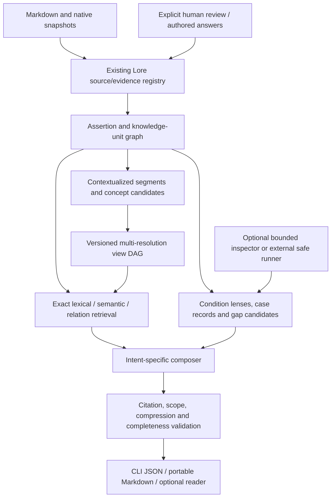

# Lore Knowledge Experience — design proposal

**Status:** Proposed, not implemented. **Date:** 2026-10-09. **Baseline:** Lore 0.6 on `main` at `51b62ebe6d44ca4ff5162ff7758408c3e85ec548`. **Companion:** [phased roadmap](KNOWLEDGE_EXPERIENCE_ROADMAP.md).

> **Product proposition:** Give people and coding agents the relevant understanding and practical judgment of a contributor who knows the project deeply—not just another generated wiki.

This document is a future design for Lore's *knowledge experience* layer. It is not an assertion that any proposed commands, configuration fields, persistence tables, execution mechanisms, or user interfaces currently exist. Implementation and release contracts remain in [README](../README.md), [DESIGN](../DESIGN.md), [0.6 guide](V06.md), and [implementation guide](IMPLEMENTATION.md). Every example below is illustrative unless identified as an existing behavior.

## 1. Executive decision

Build a **multi-resolution, evidence-preserving knowledge experience** on top of Lore's existing source assertions, consolidated knowledge, and decision-ready task context. Present one knowledge core through different user intents (Diátaxis), levels of detail (semantic zoom), scopes (project, topic, task, environment and revision), and epistemic states (what a source says versus what is observed or inferred).

Add carefully bounded extensions: **decision assumptions and reconsideration triggers; first-class failures, exceptions, and examples; focused knowledge-gap questions; replayable, independently verified learning cases; proactive change-risk checks; and change-aware briefings**. Each capability is optional, independently evaluable, and subordinate to Lore's evidence model.

**Sequence:** first improve segmentation, retrieval and zoomable explanations; then produce four Diátaxis experiences; then introduce reviewed decision lenses, cases and gap questions. Agent execution, personalization and cross-project transfer follow only after explicit safety and usefulness gates. See the [roadmap](KNOWLEDGE_EXPERIENCE_ROADMAP.md).

**Primary success measure:** time to a correct, well-informed engineering decision or task completion, with *fewer* missed constraints and unsupported claims. Word count, tree depth, model call count, generated page count and apparent confidence are not success measures.

## 2. Why this is not simply a new wiki

OpenWiki already offers grounded claims, incremental generation, source-change maintenance, agent access, and graph-oriented reading. RAPTOR already explores recursively clustered summaries, and GraphRAG explores concept communities and multi-level retrieval. Diátaxis is an established framework for four kinds of documentation. None is an unclaimed basic invention.

Lore's promising combination is different:

1. Preserve **documentary authority, lifecycle, revision and disagreement** through every level of abstraction.
2. Transform shared project knowledge into **explanation, how-to, tutorial or reference** according to the reader's purpose.
3. Attach **applicability conditions, negative cases and decision rationale** to answers, rather than present a timeless consensus.
4. Let optional tools **demonstrate** behavior or expose a concrete gap, without silently elevating generated interpretations to facts.
5. Measure **actual changes in task outcomes and learning**, not merely answer preference.

Potential novel product behavior is the *integrated, version-aware path from source evidence to understanding to verified next action*, not hierarchical summarization by itself.

### 2.1 Existing Lore 0.6 that must be reused

| Existing capability | Baseline contract | Extension, not replacement |
| --- | --- | --- |
| Markdown roots, optional OpenWiki/Engram/Beads snapshots | Source identity, primary/derived origin, exact evidence | More context-aware segments and optional authored knowledge sources |
| Source assertions → consolidated units → topic wiki | Lifecycle, scope, support, contradiction, explicit supersession and reaffirmation | Derived, purpose-specific views and typed case objects |
| `lore context` schema 4 | Preferred approach, readiness, facts, hypotheses, heuristics, blockers, checks, risks | Reader intent, knowledge zoom and reusable condition lenses |
| `--inspect` / `--investigate` | Opt-in bounded **read-only** checkout observation; no shell or tests | Optional **separate** tool-runner for executable cases after a new authorization boundary |
| Lexical + optional semantic retrieval | Bounded candidate selection and relation expansion | Cross-level retrieval with preservation of critical exceptions |
| Incremental updates, staged publication | No model calls on true no-op, source/evidence history retained, safe publish | Derived-view dependency invalidation and independent view cache |
| Review workflow | Auditable disposition of documentary reconciliation questions | Distinct approvals for captured tacit knowledge, cases and derived decision lenses |

In particular, do **not** relabel 0.6 inspection as "new agent execution": it reads static files only. Do not duplicate schema-4 readiness or the existing review history.

### 2.2 Design invariants

These are required for *all* milestones:

- A generated view, summary, exercise, rule candidate, or model probability **is not accepted project knowledge** simply because it was generated. It never replaces the original source.
- No material documentary claim is displayed without valid knowledge/evidence references and proper scope, basis, lifecycle and temporal qualification. Unsupported explanation must be labeled inference or removed.
- An excerpt establishes what a source says; a static code observation establishes what bytes were inspected; passing a test establishes a bounded test outcome. None independently proves production behavior.
- An accepted constraint, relevant exception, unresolved conflict, explicit supersession and critical historical qualifier **cannot disappear silently during compression**.
- Every high-level view can reach original evidence directly. Parent summaries cannot substitute for underlying evidence; "summarizes" and "supports" are different edge types.
- Changed or withdrawn evidence makes dependent **current** views stale even when their text is unchanged. Historical views remain inspectable with their snapshot identity.
- Source text, memory, imported material and model output are untrusted instructions. No document can grant egress, tool use, execution, filesystem writes or authority.
- Existing `lore context --fast` and schema-3/schema-4 compatibility remain intact. New features use explicitly versioned contracts and opt-in settings.
- No hidden network calls, background monitoring, file execution or model calls on a genuinely unchanged compile. Request-time generation and optional experiments are separately reported.
- No production mutation, accepted-policy change, uncontrolled autonomous agent, telemetry collection or personalization by default.
- Results state known coverage and omissions. Absence from selected evidence must never be expressed as absence from the whole project.

## 3. User needs and workflows

| Reader | Entry question | Useful outcome | Evidence of success |
| --- | --- | --- | --- |
| New contributor | "What does this subsystem do?" | Accurate mental model, then a safe guided exercise | Can explain and predict related behavior |
| Engineer making a change | "How should I alter retries?" | Applicable procedure, affected constraints, concrete tests | Correct change, no policy violation |
| Incident responder | "What failed before and what is different now?" | Relevant failures, boundary conditions and revision-aware checks | Faster correct diagnosis |
| Maintainer | "Which assumptions should we reconsider?" | Sourced decision rationale and focused review candidates | Real issue surfaced, no false supersession |
| Coding agent | "What do I need before modifying this path?" | Small, machine-readable, applicability-aware context | Fewer missed constraints and retries |
| Domain expert | "What isn't recorded?" | A small, consequential question with exact context | Reviewed answer becomes attributable new evidence |
| Returning contributor | "What do I need to relearn?" | Changes since a named baseline with their task impact | Can resume without rereading everything |
| General document reader | "Explain this collection" | Conceptual entry and exact source navigation | Accurate understanding without software assumptions |

### 3.1 Example journey: payment retries (hypothetical)

A user opens the project with a 30-second overview. They select "payments" and see concepts: authorization, retries, idempotency and reconciliation. Selecting "Why?" reveals the accepted retry policy, rationale when documented, any later proposals and an unresolved implementation discrepancy. Switching to "Do" produces a goal-specific procedure for preserving the current behavior while changing implementation, with a decision-ready check. Switching to "Learn" offers a pinned, sandboxed timeout case with expected and observed outcomes. Selecting "Source" jumps to a verbatim excerpt and its revision.

If the current checkout differs from the accepted policy, Lore reports **a discrepancy** and recommends a specific investigation; it does not invent an approved new policy. If the tutorial cannot be executed safely, it remains a clearly labeled non-executable worked example or is unavailable.

### 3.2 Example journey: a purely documentary knowledge base

The same engine ingests design papers, operating manuals and decisions without a code checkout. Explanation and reference remain available. How-to is generated only if suitable procedures are grounded. Tutorial can use a non-executable thought exercise. Static inspection, code-execution cases and change-risk checks are marked unavailable rather than fabricated. Thus the knowledge-experience layer does not require Git, code, tests or a browser.

## 4. Orthogonal dimensions of a knowledge view

Every view request must make four dimensions explicit:

1. **Intent:** `explain`, `howto`, `tutorial` or `reference`, with `auto` as a *routing hint*.
2. **Depth:** e.g. `orientation`, `working_model`, `decision_context`, `operational_detail` or `evidence`. This is not a measure of authority.
3. **Scope:** project, topic, path/task, source roots, revision/as-of baseline, environment and declared role where known.
4. **Epistemic basis:** documentary fact/decision, reported observation, static checkout observation, experimental observation, derived hypothesis, general heuristic or unresolved question.

Intent is **not** depth: a short tutorial must still teach through a worked activity; a deep explanation remains explanation. As-of context is **not** the most recent document: distinguish source publication, claimed effective time, Lore capture and verified checkout revision. A request for "current" without a verified system may yield "current documented choice; implementation unverified."

An optional audience preference (`newcomer`, `maintainer`, `agent`) may change vocabulary, selection and interaction, **never** what is considered true.

## 5. Conceptual architecture



**Authority flow is one-way.** Models and experiments may propose view nodes, condition lenses and questions; only existing source extraction or an explicit reviewed/attributable authoring workflow can introduce documentary evidence into the registry. Generated Markdown and derived views are never re-ingested as primary support.

### 5.1 Reuse the existing knowledge layer

Keep the current four-layer model: immutable exact snapshots, versioned source assertions, reconciled knowledge units and regenerable topic projections. New presentation components reference stable unit/revision IDs and evidence IDs. New objects should not create a parallel "truth graph" that can silently disagree with `state.db`.

Distinguish at least:

- `documented_design`: selected design described in a source, **not** runtime verification;
- `accepted_decision` and `accepted_constraint`: documentary authority in relevant scope and time, not proof of deployment;
- `proposal` / `plan` / `issue_state`: future intent or work history;
- `reported_outcome`: attributed report, not independently validated behavior;
- `static_checkout_observation`: hash-bound source/test excerpt from 0.6;
- `experiment_result`: outcome from an explicitly authorized, separately isolated run;
- `hypothesis`: interpretation with alternatives and applicability;
- `heuristic`: general principle, labeled not project-specific authority;
- `human_authored_evidence`: a new source with author, scope, time and approval metadata, not universal proof.

Keep evidence status (`active`, `historical_only`, `withdrawn`, `missing`) separate from lifecycle (`accepted`, `proposed`, etc.) and from verification.

## 6. Context-aware segmentation

### 6.1 Starting point

The current `sources.rs` already splits Markdown by headings, preserves heading paths and preamble, chunks oversize sections and fingerprints their inputs. Preserve this pipeline and its exact quote resolver. Add a **derived segmentation profile** whose changes do not alter current assertion identities by default.

### 6.2 Segment types

Recognize bounded and independently meaningful structures where possible:

| Type | Minimum context to keep |
| --- | --- |
| Paragraph/proposition | Heading ancestry, subject and any defined terms |
| Table or row group | Column headings, units, version and qualifiers |
| Code fence | Language, purpose, surrounding conditions; never execute during ingestion |
| Procedure/ordered list | Preconditions, ordered steps, success/rollback criteria |
| ADR decision subsection | Document status/identity, scope, decision rationale where separately sourced |
| Example/counterexample | The rule it illustrates, input conditions and expected outcome |
| Figure/link/reference | Caption and cited/adjacent explanation; unavailable external content is not assumed |
| Conversation/issue export | Author, reported time, modality and source identity; no closed-issue-as-shipped promotion |

Boundaries should follow semantic completeness before target token size. Use overlapping context *metadata*, not duplicated source assertions masquerading as independent evidence. If a table, procedure or quotation exceeds limits, subdivide with inherited context and a visible `partial` flag. Truncation is never silent.

### 6.3 Identity, context and normalization

Retain byte offsets, heading paths, source/revision/section identity and the exact captured excerpt. Derived segment IDs may use `source_id + section_lineage + normalized span/content digest + segmentation_profile_version`. A moved but semantically identical segment may keep lineage only when the existing resolver establishes a unique match. Duplicate headings and repeated text must not be silently conflated.

A separate short "context header" may be generated for retrieval (e.g. "Payment policy > Retry limits > production"). It must be stored as **derived context**, never quoted as source evidence. Preserve source-specific modality when context comes from a proposal or report.

### 6.4 Coverage and candidate grouping

Build concept-group candidates from topic membership, typed relations, lexical links and optional embeddings. Reject groupings that join incompatible environments, opposite modalities, unrelated versions or contradictory claims as a single unqualified proposition. Allow multiple group membership for cross-cutting concepts. Keep explicit conflict/counterexample edges.

Do not use the fixed `1,2,4,...,256` tree as an ontology. Instead benchmark binary, 4-way and adaptive grouping: fan-out determines navigation and synthesis cost, not truth. An example of 256 leaves needs 255 binary internal nodes versus 85 four-way internal nodes in complete trees, but wider group synthesis may cost more tokens. Cluster sizes, token budgets and evidence coverage—not geometric regularity—decide production behavior.

## 7. Multi-resolution view DAG ("Knowledge Zoom")

### 7.1 Model

A **view node** is a derived presentation over knowledge units, optionally other view nodes. The overall representation is a directed acyclic graph: a knowledge unit can appear under several concepts, but parent/child cycles are forbidden. The same node can have several mode-specific renderings; each rendering has its own fingerprint.

Five suggested *presentation levels*, not mandatory database depths:

| Level | Reader question | Content emphasis |
| --- | --- | --- |
| Orientation | "What is this about?" | Purpose, important subsystems, costly surprises |
| Working model | "How does it fit together?" | Concepts, dependencies and boundaries |
| Decision context | "Why this design?" | Accepted choices, rationale, alternatives and assumptions |
| Operational detail | "How does it behave / what do I do?" | Procedures, cases, conditions, contracts |
| Evidence | "Where does that come from?" | Original exact snippets, versions, conflicts, status |

An evidence leaf is not necessarily a small summary. **Direct lookup must bypass the hierarchy** for exact values, names, paths and error strings. Zooming changes representation; it does not merely concatenate or hide paragraphs.

### 7.2 Candidate node contract

This proposed JSON example is a **design sketch**, not a currently accepted API:

```json
{
  "view_schema_version": 1,
  "id": "kv_<stable_opaque_id>",
  "revision": "<digest>",
  "kind": "concept_overview",
  "intent": "explain",
  "level": "working_model",
  "topic": "payment-retries",
  "scope": {"environment": "production", "as_of": "<snapshot_id>"},
  "title": "Why retries require idempotency",
  "text": "<derived explanation>",
  "child_view_ids": ["kv_<child>"],
  "knowledge_refs": [{"id": "ku_<id>", "revision_id": "kr_<id>"}],
  "evidence_ids": ["ev_<id>"],
  "mandatory_qualifiers": ["The accepted policy differs from a reported implementation."],
  "uncertainty_ids": ["gap_<id>"],
  "coverage": {"selected_units": 4, "eligible_units": 7, "omitted_units": 3,
               "omission_reasons": ["output_budget"]},
  "generation": {"prompt_version": "<version>", "model_identity": "<identity>",
                 "verification_state": "passed_or_fallback"}
}
```

IDs and shapes must be finalized through an API/schema RFC. All referenced IDs are bound to the same knowledge snapshot. Client input cannot supply arbitrary trusted IDs without authorization.

### 7.3 Compression preservation contract

Every level must preserve, or provide an explicit linked disclosure of:

1. Current accepted decisions and constraints materially related to the subject.
2. Relevant environment/version qualifiers.
3. Material exceptions, contraindications and failure conditions.
4. Conflicts, uncertain status and competing explanations when they change the answer.
5. Supersession/reaffirmation endpoints when a historical decision is mentioned.
6. Source/basis distinctions: document, report, inspected checkout, hypothesis, test.
7. Coverage/omissions and a direct path to exact original evidence.

High-level text cannot assert "nothing else applies" on the basis of a sample. A claim supported by only one source can be *more* important than one repeated in many files. Select for decision impact, not mention frequency alone.

If a mandatory element cannot fit, prefer a compact condition flag and evidence link. If *that* cannot fit, return a structured `insufficient_budget` or clearly degraded answer rather than a misleading confident overview. Display depth and **output token budget** are independent controls.

### 7.4 Generation algorithm

1. Resolve a stable source/knowledge snapshot; collect explicit relation endpoints and typed warnings.
2. Prepare contextualized leaves from eligible source assertions and knowledge units. Never summarize raw documents into new authority.
3. Propose topical groups using recorded relations and semantic hints; apply deterministic source/scope/lineage rules.
4. Generate child descriptions from **knowledge plus original evidence manifests**, optionally using existing summaries only as navigation hints.
5. Aggregate each parent with required-qualifier/exception manifests and full child coverage metadata; use constrained output fields.
6. Validate IDs, leaf coverage, modality, scope, temporal wording, decision pairs, citations and dependency DAG.
7. Perform fallible semantic entailment/completeness review, escalating high-consequence claims. Record verifier model, inputs and failures.
8. Publish a consistent derived snapshot or retain the previous valid one marked stale/degraded as policy permits.
9. Cache based on source-revision closures, model/prompt/segmentation/grouping/schema versions and privacy settings.

Never let multi-step generation create an evidentiary chain like "summary A supports summary B." Every substantive paragraph must ultimately resolve to original knowledge/evidence (and to an experiment artifact only if clearly marked).

### 7.5 Retrieval across levels

For an incoming question:

- Parse intent, subject, scope, requested depth and precision markers (identifiers, version numbers, paths).
- Retrieve from original knowledge units using existing lexical, paths, optional semantic and relations.
- Retrieve summary/view candidates in parallel only as *navigation and recall signals*.
- Union and rerank candidates; add critical accepted constraints, related exceptions, conflicting endpoints and relevant historical transitions even when absent from summary candidates.
- Choose rendering level by question and budget; direct-reference queries anchor on low-level exact source.
- Compose with cited/source-bound text; expose omissions.
- Never interpret classifier confidence or embedding cosine as truth or evidence.

Start with existing SQLite FTS5 and vectors rather than requiring another search engine or graph database. Track false negatives caused by higher-level routing separately.

## 8. Diátaxis: four rendering contracts

The four modes are **outputs from the same evidence snapshot**, not four competing authoritative document collections. A source section may support several modes.

### 8.1 Explain: build a mental model

Required: purpose; main concepts and how they relate; important causal/rationale claims with documented versus inferred labeling; competing interpretations where material; why decisions were made *when actually recorded*; scope, version and evidence navigation. Prefer concept diagrams only when relationships can be substantiated. Do not turn adjacent facts into invented causation. Success = reader can accurately explain or predict relevant behavior.

### 8.2 How-to: achieve a specific goal

Required: goal/outcome; prerequisites and applicability; ordered actionable steps; branches, warnings and safeguards; tests or observable completion checks; rollback/recovery where relevant; exact named paths/commands only if evidenced or verified; unsupported steps explicitly labeled suggestions. If material policy is unresolved, surface 0.6 `blocked` / `proceed_after_check` readiness rather than invent permission. Success = task completed correctly without hiding a constraint.

### 8.3 Tutorial: acquire a skill by doing

Required: defined learner prerequisites and objective; bounded achievable scenario; prepared inputs; safe steps; expected observations and feedback; opportunity to try/predict; optional comparison to a reviewed example; cleanup; next exercise. Prefer fictional/sandbox data over real credentials. A tutorial isn't merely a how-to with introductory prose. If execution unavailable, label it "worked example" with no pretend result. Success = transfer to a similar task with less help.

### 8.4 Reference: retrieve precise details

Required: exact identifiers, inputs, outputs, types, allowed values, conditions, versions, source locations and exceptions in a consistent structure. Favor literal extraction over generative paraphrase for tables, APIs, constants, commands, error codes and normative policy. Never "round" numbers, invent defaults or hide incompatible variants. May answer "not established in the captured sources." Success = user can find the applicable exact detail.

### 8.5 Automated checks per mode

| Check | Explain | How-to | Tutorial | Reference |
| --- | --- | --- | --- | --- |
| Source support and status | Required | Required | Required | Required |
| Cross-claim causal scrutiny | High priority | Where it affects actions | For expected outcomes | Limit free inference |
| Prerequisite and exception preservation | Relevant ones | Mandatory | Mandatory | Mandatory |
| Executable validation | Optional | For proposed commands when possible | Required to call it executable | Not by default |
| Source-completeness warning | Yes | Yes | Yes | Yes |
| Human outcome evaluation | Prediction/explanation | Correct task | Skill transfer | Lookup accuracy |

An `auto` intent router is advisory. When ambiguous, use a neutral explanation plus concise alternatives rather than silently committing the user to an unsafe how-to.

## 9. Decision lenses: assumptions, triggers and alternatives

The existing 0.6 schema-4 task recommendation is **request-scoped advice**. The proposed *decision lens* is a reusable, reviewed or explicitly derived representation of a particular decision's applicability.

Proposed fields: `decision_unit_id`, `decision_revision`, `documented_problem`, `documented_rationale`, `rejected_alternatives`, `documented_assumptions`, `inferred_assumption_candidates`, `environment_scope`, `reconsideration_conditions`, `counterevidence`, `sources`, `review_state` and `impact_targets`.

Each assertion-like field carries its own source/evidence references and one of `documented`, `inferred` or `human_confirmed`. An absent rationale must remain "not recorded in selected sources", never be reverse-engineered as a proven motive.

### 9.1 Detect possible reconsideration

If a new source changes a condition on which a past decision *appears* to depend, emit a **reconsideration candidate**:

- Name the old decision and its original scope.
- Quote the documented assumption if available; otherwise label a conditional hypothesis.
- Link the new contrary requirement/observation with its own provenance.
- Explain possible implications and alternative explanations.
- Offer a focused low-cost review or verification step.
- Do **not** mark the decision superseded, waived or rejected.

Existing `lore review` concerns reconciliation; a distinct review type or linked subtype must make clear that accepting an *assumption interpretation* does not enact a new ADR. Authoritative change still needs an explicit appropriately scoped source and the existing reconciliation rules.

### 9.2 Counterfactual interaction

Question: "What if we moved to multiple regions?" Reply with assumption matching, affected constraints, plausible options and evidence gaps. This is **conditional analysis**, not proof of a causal effect. Executable tests or independent human decisions can narrow the uncertainty, but a model explanation alone cannot establish that a design would work.

## 10. Tacit knowledge capture and consequential gaps

"Tacit" means knowledge not adequately recorded, not a hidden fact Lore may safely declare from statistical regularity.

Pipeline:

1. Identify a consequential gap from repeated task failures, missing rationale, unclear preconditions, recurring patterns or conflicting sources.
2. Ground the observation: exact docs or opt-in, hash-bound code observations. Never use a model's memory of the project as evidence.
3. Generate one small answerable question identifying why it matters and which choices remain possible.
4. Prioritize by likelihood of changing a near-term decision, impact of error, current evidence quality, maintainer burden and recency.
5. Let a human answer, decline, mark "unknown", or add a source. Capture author, date, scope, consent and relationship to the observed source.
6. On explicit approval, materialize a normal user-owned Markdown knowledge note *through a separate authorized authoring command*, then ingest it through Lore's existing source process. No direct mutation of accepted registry records by the question generator.
7. Keep the question history, rejected candidate and original observations inspectable; deduplicate repeated prompts.

Candidate statuses: `unanswered`, `answered_unreviewed`, `confirmed_as_source`, `declined`, `obsolete`, `needs_revisit`. A suggestion made by an agent never becomes an invariant merely because it appears consistently in source code. A human-authored answer remains documentary evidence, not runtime verification.

Examples: "Is the production-only condition in these three procedures a mandatory rule or a historical workaround?" and "What event would justify revisiting ADR-017?" Avoid asking broad, low-value questions that a single source lookup could answer.

## 11. Cases, failures and executable knowledge

Introduce **case records** for positive examples, counterexamples, incidents, procedures and investigations. Case information includes:

- Stable ID, title, purpose, type and required experience level.
- Starting conditions, environment, source revision, relevant decision constraints.
- Input artifacts, expected outcome, negative or boundary case.
- Steps and branch conditions, success/failure criteria, cleanup/rollback.
- Documented resolution and separately labeled interpretation.
- Optional replay manifest, pinning and hash of runner inputs.
- Actual attempts, results, timestamps, stdout/stderr redaction status, tool identity and provenance.
- Verification status (`unverified_example`, `static_checked`, `replay_passed`, `replay_failed`, `stale`), never generic `production_verified`.

A case can render as a tutorial, a how-to example, a reference edge case or an explanation of why a decision arose.

### 11.1 Separate execution boundary (later phase only)

Lore 0.6 **does not execute source code or tests** during `context`. An external, optional runner must be separately designed and authorized:

- Explicit opt-in per invocation; exact operator-approved command or sandbox manifest, **never a command inferred from a document or model output**.
- Disposable isolated workspace with a pinned checkout or supplied snapshot; restrictive filesystem mounts, resource quotas and short timeout.
- No credentials, production data, network access or host mutation by default. Hosted execution/egress require separate explicit authorization and destination disclosure.
- Allowlist input/output files; prevent path traversal, symlinks, reparse points and untrusted writes escaping the workspace.
- Limit CPU/memory/disk/output size/child processes; terminate tree on timeout; fail closed if sandbox assurances are unavailable.
- Record tool image/version, command argv, environment policy, input hashes, exit status, observed assertions and artifact hashes.
- Never count a generated expected output as a successful run. Tests can fail and still teach; label the failure.
- Treat outputs as observations bound to exact inputs, not accepted project facts or proof about an unrelated deployment.
- Do not import execution artifacts into accepted knowledge automatically; explicit reviewed capture is required.

A simpler first milestone is **non-executing worked examples** and tests authored outside Lore. Prefer that over embedding an unsafe shell executor.

## 12. Change guardian and knowledge evolution

### 12.1 Advisory guardian (not an autonomous gate)

Given a task or proposed diff from an explicitly authorized caller, link changed symbols/paths and intended behavior to:

- Applicable accepted constraints and decision assumptions.
- Known regressions or counterexamples.
- Existing 0.6 readiness, blockers and checks.
- Related replayable cases and exact verification leads.
- Differences between documentary intent and hash-bound code observations.

Output `risk`, `why_it_matters`, `evidence`, `applicability`, `what_to_check` and `unverified_assumptions`. Do not claim to have inspected a diff unless the caller supplied it or the tool actually read it. Early versions are suggestions for humans/agents, not automatic merge blockers. No repository writes or CI gate until separately authorized and calibrated.

### 12.2 What changed for this reader?

Compare a **named, immutable prior baseline** (knowledge publication ID, source digest, or explicitly recorded acknowledged view) to a current baseline. Show changes in accepted decisions, conditions, procedures, examples, risks and open questions. Explain *consequences for the selected topic/task*, not merely edited document names.

Do not infer what the user remembers from page views. Optional per-user "last acknowledged" state is explicit, portable/exportable, deletable and local by default. Without it, require `--since <revision>`. No silent activity tracking, notification service or periodic background processing.

### 12.3 Cross-project knowledge (research phase)

Multiple projects may share terms while differing in authority, environment and chronology. Future pattern comparison must preserve per-project namespace, independent provenance, compatibility conditions and the reason why a lesson may **not** transfer. A cross-project suggestion is a candidate analogy, not a merged accepted decision. Prevent private project evidence from leaking into public or unrelated projects.

## 13. Request planning and two-speed model use

Use a typed request planner in front of the existing retrieval engine. Example:

```json
{
  "request_schema_version": 1,
  "query": "Show how retries work and why",
  "intent": "explain",
  "depth": "working_model",
  "audience": "developer",
  "scope": {"topic": "payment-retries", "environment": "unknown",
            "as_of": "latest_successful_lore_publication"},
  "max_output_tokens": 2500,
  "allow_model": true,
  "allow_checkout_inspection": false,
  "allow_execution": false
}
```

Decision/System-One models may cheaply classify intent, likely topic, format preference, scope conflicts, candidate salience and whether to route to a deeper generative pass. The model returns bounded typed choices with explicit `unknown/refusal` handling; scores are advisory, not calibrated truth.

Rules:

1. Exact identifiers, quoted source paths and explicit requested mode override a model's guess.
2. A high-impact, low-confidence routing decision expands retrieval rather than discards candidates.
3. Constraints, conflicts and explicit relation endpoints cannot be vetoed by low-cost relevance classification alone.
4. A request asking for a process action does not authorize file writes, test execution, egress or administrative changes.
5. A free-form generative model handles cross-document reasoning and mode-specific writing only after evidence retrieval.
6. Deterministic verification handles IDs, dependency closures, hashes, budgets and allowed values; optional model review handles semantic support with explicit fallibility.

Use existing inference interfaces and egress policy; add roles only if measured value justifies complexity. Provider availability or refusal triggers bounded fallback, not silent model substitution.

## 14. Rendering and interaction surfaces

**First delivery:** CLI + versioned JSON + portable Markdown, with no mandatory UI, server or MCP. **Optional later:** a local reader with semantic zoom and the same view contracts.

Proposed entry point (not implemented):

```bash
lore view payment-retries --mode explain --depth orientation
lore view payment-retries --mode reference --depth operational_detail --json
lore view payment-retries --mode howto --task "Preserve retries while refactoring"
lore view payment-retries --mode tutorial --example timeout-case
lore view payment-retries --mode explain --as-of <publication-id>
lore changes --since <publication-id> --topic payment-retries
lore gaps --topic payment-retries
lore cases payment-retries
```

Prefer one `lore view` command with explicit mode/depth/scope instead of prematurely shipping many ambiguous verbs. `lore context` stays the canonical task recommendation command; `lore evidence`, `read`, `search` and `review` keep their existing meanings. Proposed new commands get stable JSON, clear exit codes and capability reporting before release.

### 14.1 Portable output

Potential generated files under `lore/views/`, `lore/cases/` and `lore/decisions/` must be owned by the generation manifest and never overwrite human edits without an explicit rebuild. Deep links to units and evidence should work without the optional UI where feasible; include a source locator and durable evidence ID rather than only a dynamic hash URL. An offline/static fallback should expose a table of contents, the actual content and source links.

### 14.2 Optional reader requirements

- Concept breadcrumb + adjustable depth + four-mode switch.
- "Why?", "How do we know?", "What changed?" and "What could go wrong?" as contextual actions.
- Inline basis/status labels (accepted, proposal, report, observed checkout, inferred) without relying on color alone.
- Direct expandable evidence, conflicts and historical timeline.
- Reader-controlled disclosure of omissions and confidence limits.
- Keyboard navigation, screen reader hierarchy, responsive text layout and low-bandwidth/static access.
- No gamified certainty score; do not imply an LLM's probability is project truth.
- No hidden user tracking. Accessibility and honest status display take priority over a graph visual.

## 15. Storage, identity, invalidation and publication

### 15.1 Proposed derived storage

Prefer a **separate, disposable derived-view store** (e.g. `.lore/views.sqlite3` plus validated cached renderings) initially, avoiding changes to accepted assertion/knowledge semantics. Future accepted authoring notes still enter ordinary sources. Schema ideas:

| Entity | Minimal fields |
| --- | --- |
| `view_nodes` | id, type, topic, scope, level, intent, input_fingerprint, text, verification_state, created_by |
| `view_edges` | parent_id, child_id, relation, ordinal; acyclic containment |
| `view_support` | node_id, unit_id, unit_revision, evidence_id, contribution_type |
| `view_coverage` | node_id, eligible/included counts, mandatory IDs, omitted IDs/reasons |
| `derived_conditions` | decision_id, condition text, basis, evidence refs, review state, revision |
| `case_records` | stable case ID, prerequisites, steps, expected result, source/revision, verification |
| `case_runs` | run identity, sandbox policy, input digest, actual result, output digest, qualifications |
| `gap_questions` | evidence-bound question, impact, duplicate key, state, authored answer source |
| `view_publications` | consistent snapshot ID, model/prompt versions, generation state, manifests |
| `reader_checkpoints` | optional local acknowledged publication IDs, deletion/export semantics |

Schema names are placeholders. Normalize IDs and guard against duplicate support and stale references; index unit→view, evidence→view, group→parent and publication→artifact. Do not put volatile user preference state into project-authoritative knowledge.

### 15.2 Cache and fingerprint contract

At minimum key each derived artifact by:

- Corpus/source and relevant knowledge revision closure.
- Applicable relationship revisions, conflict and review states.
- Group membership, segmentation and salience policy versions.
- Intent, level, audience, scope and publication/as-of snapshot.
- Model provider, resolved identity/endpoint where known, prompt, schema and reasoning/verification settings.
- Privacy/egress capability and executed-case input identity where relevant.
- Exact budgeting and selection rules for the cached response.

Unchanged sources should yield unchanged deterministic published files and zero model calls on `lore update`. User-requested optional runtime advice may call models, with truthful call/cache reporting. Changing a model alias's underlying weights may require explicit refresh, as in current Lore.

### 15.3 Invalidation algorithm

- Changed/deleted source → source assertions → consolidated knowledge → referenced view nodes → parent closure.
- New source → semantic candidate search across topics → changed relations/group membership → affected view branches, *including* pages with unchanged original sources.
- Accepted decision superseded/reaffirmed → decision lens, referenced summaries, affected how-tos, cases and impact views.
- Evidence withdrawn → current citations become ineligible; historical view remains historical, not current.
- Changed case input/tool → replay result stale; never keep an old `passed` label for a new checkout.
- Changed user acknowledgment → only that optional user's comparison changes; project knowledge unchanged.
- Purge → remove dependent view caches, case artifacts, recorded observations, generated pages and any optional local reader state controlled by Lore; do not promise deletion of external backups.

Cycles, ambiguous merges, invalid references or failed semantic verification must stop publication of affected current views. Staged publication should keep registry/view snapshot consistency and recover after interruption. If an unchanged parent still depends on an invalidated child, it cannot be presented as independently current.

### 15.4 Resource controls and graceful degradation

Make costs explicit: `max_nodes`, `max_group_members`, `max_levels`, `max_context_bytes`, per-view output tokens, inference calls, verification calls, total update budget and request deadlines. Default to sparse materialization (popular concepts or requested paths), never eager whole-corpus generation at every level.

Failure examples:

| Failure | User-visible behavior |
| --- | --- |
| No safe supporting evidence | State unavailable or show source navigation, not generated truth |
| Missing important qualifier in budget | Short warning + link, or structured budget failure |
| Conflicting decisions | Show separate scoped accounts and request review, do not choose newest |
| Model offline | Reuse still-current verified views or deterministic evidence index |
| Invalidation in progress | Mark previously published view as stale; don't imply current coverage |
| No applicable procedure/tutorial | Offer explanation/reference, explicitly say why |
| Unauthorized execution/egress | Non-executable example or local-only result, with permission state |
| Source contains prompt injection | Treat as data; reject attempts to alter tools/roles/instructions |
| Reader requests "as-of" without adequate timeline | Declare evidence time limit; avoid reconstructing fictitious state |

## 16. Security, privacy, safety and trust

Threat model includes malicious Markdown instructions, injected code blocks, poisoned imported memories, retrieved tool output, disallowed paths/symlinks, secret-bearing repositories, uncontrolled child-process execution, remote model egress, stale source references and convincing but unsupported decision narratives.

Required defenses:

- Follow Lore's existing local-only and provider rules. Separate documentary egress, **checkout observation egress**, and **experiment/artifact egress**: one permission never implies another.
- No browsing or fetching arbitrary URLs because a document mentions them. No model-selected shell, Git command, network destination or file write.
- Keep runtime observation and executable case storage out of user-controlled source roots unless an authorized, reviewed note is deliberately authored.
- Enforce root containment, no-follow file access, artifact size/time limits, secret filtering and source byte hashes. Sandbox execution requires independent isolation evidence; absent that, disable it.
- Include permissions and access scope in derived indexes so a public view cannot leak a private root, especially in future multi-project setups.
- Store only necessary evidence excerpts and minimal case outputs; redact credentials and sensitive data; provide clear retention/purge rules.
- Human review authorizes an authored statement within recorded scope; it does not convert an LLM score into an accepted project policy.
- High-risk safety/finance/security recommendations need explicit constraints and targeted checks, not an overconfident universal answer.
- Keep advice advisory unless a separately reviewed integration establishes an appropriate enforcement contract.

## 17. Evaluation strategy and release evidence

### 17.1 Hypotheses to test independently

- **H1 Segmentation:** context headers and self-contained segments improve exact retrieval without increasing false merges.
- **H2 Hierarchy:** multi-resolution views improve overview comprehension/retrieval against current Lore, at tolerable cost.
- **H3 Diátaxis:** intent-specific contracts improve practical task completion and learning transfer versus generic overviews.
- **H4 Decision lenses:** sourced assumption/exception views reduce mistaken decisions and false-blocking.
- **H5 Cases:** reviewed and optionally replayed cases improve unfamiliar-task performance.
- **H6 Gap capture:** targeted questions produce accepted missing knowledge with less human burden than manual documentation review.
- **H7 Guardian/changes:** task-aware risk and change briefings help without excess false alarms, latency or privacy harm.

Do not combine all features into one benchmark arm and then attribute gains to an untested component.

### 17.2 Comparisons and measurement

Reuse [0.5 coding evaluation](../evaluation/INTELLIGENCE.md) and [0.6 four-arm decision evaluation](../evaluation/DECISION_INTELLIGENCE.md). Add held-out, independently selected documents/projects with pinned revisions and a blinded human review:

| Study | Comparison | Primary measure |
| --- | --- | --- |
| Orientation | Existing `lore read` vs contextual leaves vs hierarchy | Correct explanation, time and missed caveats |
| Exact lookup | Existing retrieval vs hierarchy-enabled | Exact fact accuracy and source coverage |
| How-to | 0.6 task brief vs Diátaxis how-to | Correct completion and constraint preservation |
| Tutorial | Read-only guide vs worked/verified exercise | Unassisted performance on a distinct follow-up task |
| Decisions | 0.6 guidance vs condition lens | Material decision errors, review value, false blocks |
| Experience cases | No case vs selected case | Correctness on new but related tasks |
| Gap capture | Manual gap list vs question queue | Useful approved answers per human minute |
| Change briefing | File diff vs knowledge-impact briefing | Correct changes recalled and misleading changes |

Record exact inputs, code/model revisions, output hashes, candidate omissions, verification outcomes, time, provider usage, and measured cost when available. Keep synthetic fixtures explicitly synthetic; do not use them to claim real-model utility.

### 17.3 Candidate release gates (targets, not results)

- **Hard integrity:** 100% of published citation IDs resolve at the snapshot they claim; no unsupported automatic acceptance/supersession; no secret/unauthorized egress; no mutating execution from source text; true no-op update has zero inference.
- **Critical preservation:** all seeded accepted constraints, explicit conflicts, documented exceptions and relation endpoints remain retrievable from each tested summary, or are explicitly disclosed as omissions. Zero silently erased critical counterexamples in curated adversarial fixtures.
- **Semantic quality:** zero high-severity unsupported project/temporal claims in reviewed release sample; track minor errors rather than hiding them.
- **Usefulness:** predefined statistically interpretable improvement against the *relevant* Lore baseline on held-out tasks, without substantial false-blocking. Decide numeric gates before experiments; do not retroactively choose a successful threshold.
- **Operational:** set and measure corpus-size scaling, warm/cold latency, cost and rebuild amplification budgets; do not claim a speedup from structural node counts.
- **Accessibility/portability:** every published view remains meaningful in Markdown/CLI JSON; no mandatory UI/online account.

High-stakes acceptance needs review by independent evaluators, not only an LLM verifier of another LLM. Repeated model runs must be pinned where possible; record mutable aliases and unknown billing as unknown.

### 17.4 Failure and mutation corpus

Include accepted ADR vs later proposal; explicit supersession; reaffirmation; a closed issue without deployment proof; conflicting staging/production scopes; withdrawn original evidence; a document move/duplicate heading; a table header dependency; a boundary case mentioned once; a procedure with rollback warning; a subtly negated rule; a code observation contradicted by documentation; a changed test after a passing replay; an imported derived wiki presented beside primary sources; prompt injection; privacy-limited hosted inference; a cache no-op; a mid-publication crash; and a meaningful new source whose older topic files did not change.

Measure not only hallucinated sentences but **false causal links, overgeneralized applicability and lost negative cases**.

## 18. Proposed implementation interfaces and compatibility

This section defines *candidate* contracts, not final signatures.

- `ViewRequest`: query, intent, depth, scope, audience, output budget, model/inspection/execution permissions, selected knowledge publication ID.
- `ViewPlan`: candidate knowledge, relation closure, required inclusions, retrieval reasons, completeness warnings, available modes.
- `ViewNode` / `ViewPublication`: structured derived content plus exact support/coverage/omissions, provenance and verification state.
- `DecisionLens`: decision ID/revision, documented versus hypothetical conditions, trigger candidates, review state and supporting sources.
- `CaseRecord` / `CaseRun`: authored example and separately authenticated attempt with tool and environment limits.
- `GapQuestion` / `AuthoredAnswer`: proposed uncertainty, reviewed disposition and new user-owned source reference.
- `ChangeImpact`: old/current publication IDs, materially changed conditions, task applicability and verification gaps.

Version independently of `lore context` schema 4; preserve `--fast` and `--schema-version 3`. Unknown fields should fail safely in write-bearing or authorization-bearing requests, while read clients use explicit version negotiation. No command may silently shift the selected project snapshot between planning and publication.

### 18.1 Proposed future configuration sketch (NOT accepted today)

```yaml
# Sketch only; do not paste into Lore 0.6 lore.yml (unknown fields are rejected).
knowledge_experience:
  enabled: false
  views:
    build: on_demand          # optional future: incremental_project
    max_levels: 4
    grouping: adaptive        # experiments: binary, four_way
    require_critical_coverage: true
    verify_semantics: true
  modes:
    explain: true
    howto: true
    tutorial: true
    reference: true
  questions:
    propose: false
    materialize_answers: false
  cases:
    allow_execution: false
  reader:
    track_acknowledged_revision: false
```

Set explicit defaults and maxima in an implementation RFC after quality, privacy and cost experiments. Avoid a large configuration surface in the first milestone.

## 19. Open design questions to resolve in targeted RFCs

1. Which view nodes should be eager at update time versus lazy per request? Start lazy; measure repeat traffic and dependency churn.
2. What is the smallest coherent segment for mixed Markdown, tables and code? Compare with current sections and raw knowledge units before changing extraction.
3. What grouping algorithm adds value beyond topic/relations and FTS5? Test binary, 4-way and adaptive groupings on held-out corpora.
4. Which qualifiers are **mandatory** for an overview? Ground in severity and applicability labels, not arbitrary frequency.
5. What stable view identity survives renaming/group changes, and when is a new ID more correct than reusing lineage?
6. How much of the summary DAG should be persisted versus regenerated from structured outline data?
7. Which forms of human confirmation create a new documentary source versus only disposition of a derived interpretation?
8. What is the minimum separately audited sandbox/runtime for executable cases? Until answered, keep execution disabled.
9. What opt-in personalization is genuinely valuable without inventing beliefs from reading history?
10. Which case types should be available for document-only knowledge bases?
11. Should guardian output remain advisory or eventually feed CI? Start advisory; require false-positive and policy gates before considering enforcement.
12. How should future multi-project scopes enforce permissions and conflicts without misrepresenting shared terminology as shared authority?

Resolve each through small experiments and explicit design notes; don't allow unresolved items to weaken current Lore invariants.

## 20. Related research and project references

**Project contracts:** [DESIGN](../DESIGN.md), [VISION](../VISION.md), [Lore 0.6](V06.md), [citation contract](CITATION_CONTRACT.md), [intelligence evaluation](../evaluation/INTELLIGENCE.md), [decision evaluation](../evaluation/DECISION_INTELLIGENCE.md), [roadmap](KNOWLEDGE_EXPERIENCE_ROADMAP.md).

**Knowledge experience:** [Diátaxis](https://diataxis.fr/), [Diátaxis compass](https://diataxis.fr/compass/), [RAPTOR](https://arxiv.org/abs/2401.18059), [GraphRAG](https://arxiv.org/abs/2404.16130), [OpenWiki](https://github.com/langchain-ai/openwiki), [STORM](https://aclanthology.org/2024.naacl-long.347/), [VeriTrail](https://www.microsoft.com/en-us/research/blog/veritrail-detecting-hallucination-and-tracing-provenance-in-multi-step-ai-workflows/).

**Procedures, memory and trust:** [Architectural Decision Records](https://cognitect.com/blog/2011/11/15/documenting-architecture-decisions), [ACE: evolving contexts](https://arxiv.org/abs/2510.04618), [MemTree](https://arxiv.org/abs/2410.14052), [FActScore](https://arxiv.org/abs/2305.14251), [Cognitive apprenticeship](https://www.aft.org/ae/winter1991/collins_brown_holum), [doctest](https://docs.python.org/3/library/doctest.html).

Research references motivate experiments; reported results for other systems do not establish improvements in Lore. Neither the architecture nor this roadmap is evidence that the proposed features have shipped.
