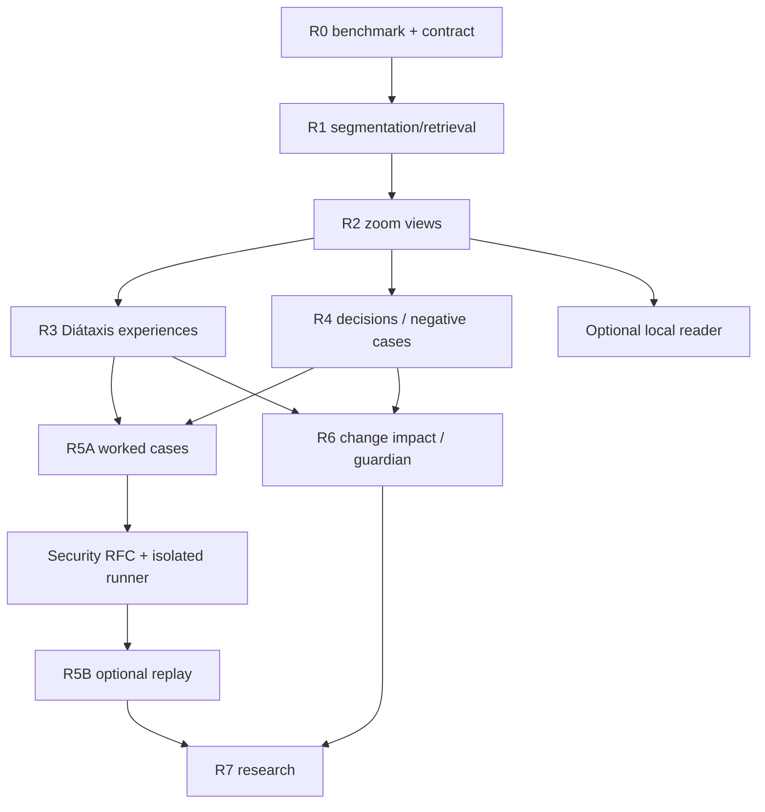

# Lore Knowledge Experience — phased roadmap

**Status:** Proposed implementation plan, not a claim of shipped functionality. **Date:** 2026-10-09. **Baseline:** Lore 0.6. **Normative design proposal:** [Knowledge Experience design](KNOWLEDGE_EXPERIENCE_DESIGN.md).

> Build knowledge that people can **explore, apply, learn from and verify**. Keep current Lore's evidence, historical truthfulness, local-first behavior and task guidance intact.

## 1. Scope and release principles

This is a **capability roadmap, not a release-number promise**. Assign version numbers only once implementation and evaluation justify them. Dates, team sizes, price, benchmark improvements and latency gains are not estimated or guaranteed here.

Phases are ordered by dependencies and value:

1. **R0: baseline and experiment contracts**
2. **R1: contextualized segmentation and retrieval**
3. **R2: evidence-preserving knowledge zoom**
4. **R3: Diátaxis mode-specific experiences**
5. **R4: decisions, negative cases and missing-knowledge capture**
6. **R5: guided and optionally executable learning cases**
7. **R6: change-impact/guardian and optional reader**
8. **R7: cross-project and personalized knowledge, only if justified**

A phase can remain experimental indefinitely. **Do not ship all phases in a single rewrite.** Before advancing, show measured user or agent benefit against current Lore and preserve its invariants.

### 1.1 Ship / no-ship criteria applying to every phase

- Existing 0.6 `lore context` schema 4 readiness, `--fast` schema 2, `--schema-version 3` and evidence/review commands still work with regression coverage.
- Valid claims resolve to source revisions and retain modality, provenance, lifecycle and scope; new views never silently become accepted evidence.
- Local-only, checkout-egress policy, quote integrity, source boundaries, no-op updates, non-mutating context and recoverable publish guarantees remain true.
- New data has schema/version boundaries, no-op fingerprints, coherent invalidation and documented purge/backup behavior.
- Every exposed command has examples, JSON contract, resource bounds, useful fallback behavior and tests.
- Every quality claim is associated with an actual real-model/corpus run and independent review; fixture tests alone are not product validation.
- No default-on tool execution, private-data telemetry, hosted model routing or user tracking.
- Failed or partial generation does not publish a view that appears complete/current.

## 2. Backlog priority and product hypotheses

| Priority | Workstream | Why now | Smallest useful result | Prerequisites |
| --- | --- | --- | --- | --- |
| P0 | Retrieval and segmentation benchmark | Can outperform hierarchy at lower cost | More accurate context units with scope | R0 |
| P0 | Explain + reference at selectable depths | Foundational knowledge experience | Zoom into one project topic with original citations | R1 |
| P0 | Qualifier and omission preservation | Compression can erase critical constraints | Adversarial summary audit | R1 |
| P1 | Goal-specific how-to | Test outcome improvements | One safe task procedure with readiness and checks | R2 |
| P1 | Reviewed decision conditions | Differentiation beyond a wiki | Trace assumptions and suggested reconsideration | R2 |
| P1 | Negative/boundary cases | Captures consequential exceptions | Case retrieval beside a topic | R2 |
| P2 | Tutorials/learning transfer | Distinct learning value | One usable worked exercise | R3 |
| P2 | Tacit-knowledge questions | Captures knowledge sources omit | One reviewed gap with attributed note | R4 |
| P2 | Revision-aware change briefing | High return-to-project utility | Differences since selected publication | R4 |
| P3 | External sandboxed case execution | High payoff, high risk | Pin/replay one operator-approved test | R5 security RFC |
| P3 | Optional visual reader | Strong polish, but not core accuracy | Local mode/depth switch + source drill-down | R2/R3 |
| P3 | Advisory guardian | Potential agent benefit, false-positive risk | Evidence-linked diff risk report | R4/R5 |
| Research | Cross-project analogy and personalization | Authority/privacy complexity | Small opt-in, namespace-safe experiment | Prior gates |

**Explicit non-goals for the first release:** mandatory MCP, graph database, daemon, hosted account, direct trackers, browser automations, autonomous code modification, execution of commands found in Markdown, auto-accepting speculative project decisions or semantic summaries as sources.

## 3. R0 — baseline, datasets and interface RFCs

**Purpose:** prevent building a costly hierarchy that does not outperform current Lore.

### Work items

- **R0.1 Source snapshot.** Pin binary commit, configuration versions, corpus hashes, model aliases/resolved IDs and baseline 0.6 response fields. Distinguish static sources, source reports and bounded checkout observations.
- **R0.2 Evaluation tasks.** Prepare held-out exact-lookup questions, broad orientation, decision-history, procedural tasks and learning-transfer tasks; at least three independent projects for general product claims. Add a document-only corpus.
- **R0.3 Adversarial gold cases.** Include a single rarely mentioned but critical rule; table/header context; staging versus production; superseded ADR; reaffirmed ADR; conflict; deleted source; derived OpenWiki; false chronology; subtle negation; partial procedure; moved document; injection attempt.
- **R0.4 Measurement harness.** Extend `evaluation/` in small scripts; integrate current coding/decision evaluation, cold/warm cache timings, prompt/token usage when reported, actual billed cost only when known, source attribution and blind human scoring.
- **R0.5 Mode and view RFC.** Decide typed `ViewRequest` and `ViewPublication` v1, version negotiation, stable IDs, output budgets, fallbacks and human-readable rendering. Keep schema-4 `context` intact.
- **R0.6 Resource/performance budget.** Record corpus sizes, current call/latency distribution, cost, page churn and selected-retrieval recall before setting quantitative gates.
- **R0.7 Threat review.** Document risks from malicious Markdown, imported memories, secret-bearing checkouts and proposed view caches. Confirm no new implicit egress.

### Deliverables

An executable benchmark manifest, reviewed task labels, pinned baselines, a view API/schema RFC and an approved security/data-handling checklist. No UI, hierarchy or new CLI needed.

### Exit gate

Existing Lore metrics are reproducibly collected; hidden tests and sources cannot leak between benchmark arms; reviewers understand the distinctions between *supported documented claim*, *verified code observation*, *inference* and *test result*. If held-out baselines cannot be established, defer ambitious feature implementation.

## 4. R1 — self-contained segments and better retrieval

**Purpose:** improve the foundational units before doing recursive summarization.

### PR-sized implementation slices

- **R1.1 Segmentation profile v1:** extend `src/sources.rs` with optional, derived context-aware unit metadata; keep existing extraction and section IDs stable unless an explicit migration proves necessary.
- **R1.2 Structural handling:** grouped tables with headers; fenced code with label/context; list procedures with ordering; ADR metadata/decision context; examples with explicit negative conditions.
- **R1.3 Context header:** small generated or deterministic heading/subject context stored as *non-evidentiary retrieval text*. Profile and prompt version part of cache fingerprint.
- **R1.4 Retrieval experiment:** compare original units, contextualized units and contextualized chunks with lexical-only and hybrid embeddings; retain exact ID/path lookup.
- **R1.5 Deduplication and containment:** overlapping context must not create separate evidence confirmations; no false merge across versions, environments or modalities.
- **R1.6 Update/purge:** incremental fingerprinting; deleting or moving input invalidates derived segment metadata; no-op produces zero inference and no byte churn.
- **R1.7 Tests:** table heading retention, procedures split at boundary, nested headings, repeated quote, large Unicode section, ADR acceptance, deleted source, prompt injection, old import with derived material and budget overflow.

### Exit gate

Contextual units improve held-out retrieval or downstream task utility enough to justify maintenance cost. No deterioration in exact reference tasks or critical constraint recall. New retrieval metadata cannot be quoted as primary evidence. If the gain is negligible, proceed to R2 with existing units and do not change segmentation globally.

## 5. R2 — Knowledge Zoom and multi-resolution views

**Purpose:** present clear explanations at several depths, grounded in the same registry.

### PR-sized implementation slices

- **R2.1 Derived-view data model:** versioned node, child, support, coverage, publication and dependency tables in disposable local state; staged migrations and clear purge. Include DAG acyclicity checks.
- **R2.2 Grouping baselines:** topic-based grouping, binary hierarchy and 4-way grouping; optionally adaptive, overlapping concept groups. Measure quality before choosing a default.
- **R2.3 Leaf builder:** compose from current knowledge units plus exact evidence, status and relationship manifests; avoid chains of summaries cited as proof.
- **R2.4 Parent builder:** constrained summary schema; mandatory constraints/exceptions/conflict-endpoints; selected/eligible/omitted counts; explicit level, scope and data basis.
- **R2.5 Cross-level retrieval:** combine summary navigation candidates with direct FTS5, optional embeddings, path and relation retrieval; protect exact identifier searches and negative cases.
- **R2.6 Validation:** deterministic citation/resolution, scope/modality and dependency completeness plus optional fallible semantic verification. Require a truthful evidence-index fallback for rejected summaries.
- **R2.7 Incremental invalidation:** source and graph changes dirty leaf views, affected parent closure and related topic views; stable IDs and no-op guarantee.
- **R2.8 CLI/Markdown spike:** proposed `lore view TOPIC --mode explain --depth LEVEL`; JSON representation and human-readable fallback; stable evidence links and omissions.
- **R2.9 Budget & scaling:** node, depth, fan-out, token, model-call and time limits; sparse on-demand construction; count cold and warm costs; staged publication recovery.
- **R2.10 Usability:** compare 30-second orientation, mental-model accuracy, navigation time, caveat detection and exact citation drill-down to current Lore output.

### Deliverables

A small topic can be explored from orientation to evidence with portable Markdown and JSON. **No special graphical reader is necessary.** Related conflicts, critical exceptions and accepted constraints remain accessible across levels.

### Exit gate

Demonstrate improved comprehension/retrieval against R0's current-Lore baseline without meaningful regression in exact answers, decision history, omissions, privacy or cost. Show at least one negative result where hierarchy isn't superior and ensure direct retrieval remains available. Reject all silently dropped critical constraints in curated fixtures.

## 6. R3 — Diátaxis experiences over common knowledge

**Purpose:** turn understanding into four task-specific formats.

### R3.1 Explain

Concept model, rationale if documented, alternatives, relationships, historical scope, confidence qualifications, original evidence navigation. Prevent invented causal links.

### R3.2 Reference

Deterministic-oriented exact identifiers, enum values, steps/flags, inputs/outputs, environment versions, table cells and error definitions. Precision over prose; report "not available in selected evidence" instead of inventing defaults.

### R3.3 How-to

Goal, prerequisites, condition branches, safe ordered procedure, check/rollback, exact links, expected completion criteria and 0.6 readiness. Never turn a reported implementation into permission to violate an accepted policy.

### R3.4 Tutorial

Learner objective, safe starting state, stepwise action, predictions, observations, feedback, cleanup and transfer exercise. Initially provide **non-executable worked examples**, not new process execution.

### Shared engineering and validation

- **R3.5 Intent routing:** explicit user mode wins; optionally use typed decision-model inference with refusal and unknown fallback; do not allow fast classifier to discard critical records.
- **R3.6 Shared structured composition:** one knowledge snapshot, four renderers with explicit provenance, scope and mode-specific validators. Refuse a mode when source support is inadequate.
- **R3.7 CLI/JSON mode switching:** render from the same supported IDs; content visibility and citations remain consistent across modes.
- **R3.8 Accessibility/Markdown:** meaningful headings, tables, links, conditions and labels without a web app or color-coded truth.
- **R3.9 Usability study:** randomize generic Lore versus mode-specific output for held-out explanation, task completion, exact lookup and novel-task learning tests.

### Exit gate

How-to measurably reduces errors or task time on appropriate held-out tasks; reference does not lose numeric/type accuracy; tutorial users can transfer a learned step; explanations do not overstate source authority. If any mode fails, keep the working modes rather than shipping a generic all-mode promise.

## 7. R4 — decision assumptions, exceptions and knowledge gaps

**Purpose:** preserve reasoning, not merely facts and summaries.

### R4.1 Decision lenses

- Schema for `decision_unit_id`, source-scoped rationale, actual alternatives, documented assumptions, **inferred** condition candidates, applicability, review status and invalidation dependencies.
- Exactly cite rationale *as documented*, never reconstruct a decision maker's motive as fact.
- Generate potential reconsideration when a relevant condition changes, without assigning `superseded` or overriding adopted policy.
- Link a proposed reconsideration to the existing review history without conflating "approve interpretation" and "approve a replacement decision".
- Evaluate false reconsideration suggestions, missed meaningful changes and improved decision accuracy.

### R4.2 Negative and boundary cases

- Add types `positive_example`, `counterexample`, `historical_failure`, `exception` and `incident` with scope, source and version references.
- Attach cases to how-tos, decision lenses and relevant view nodes.
- Make a rare exception visible even in a high-level summary when missing it would change action.
- Separate reported incident resolution from verified reproduction.

### R4.3 Targeted knowledge questions

- Detect questions from ungrounded procedural preconditions, unexplained accepted choices, ambiguous conventions, recurring failure patterns and mismatches between sources/checkout.
- Rank questions by expected decision impact, evidence, uncertainty and human effort.
- Deduplicate, expire stale prompts, capture explicit declines and don't harass maintainers.
- Accept a user's answer as a *new attributable source* through a deliberate authoring workflow—not as an implicit change to the project registry.
- Respect author approval, scope, permission and history. An answered question may remain an unverified recollection.

### Exit gate

Independent reviewers judge that decision lenses and negative cases improve accuracy more often than they trigger misleading reviews. A targeted question is genuinely answerable and consequential; authored answers preserve provenance and are not automatically promoted to runtime facts. Revisions invalidate condition and case applicability correctly.

## 8. R5 — learning cases and explicitly sandboxed replay

**Purpose:** teach and verify behavior beyond prose while keeping source and execution boundaries distinct.

### R5A: safe, no-execution stage

- Define `CaseRecord`: title, scenario, prerequisites, relevant source/decision revision, expected result, negative scenario, verification need and cleanup guidance.
- Render as tutorial/how-to example and link to original evidence.
- Integrate operator-provided test manifest descriptions but do not run commands.
- Test learning transfer using distinct held-out tasks.
- Mark all illustrative outputs as expectations rather than observed results.

### R5B: gated executable stage

**Do not start R5B until a separate threat-model and sandbox RFC is approved.**

- An isolated external runner accepts **operator-selected** command IDs, pinned snapshots and exact sandbox policies; never model-authored arbitrary commands.
- Disable network, host mounts, credentials and production data by default; restrict filesystem, process tree, CPU, memory, disk, output bytes and time.
- Bind observations to tool/runtime identity, source hashes, expected/actual outcome and a signed or otherwise trustworthy local run manifest as feasible.
- Stale results lose the `passed` label when files, tests or runtime assumptions change.
- Review outputs before authoring any durable documentary observation.
- Compare executable cases with equivalent text-only cases, including warm cost, failure explanations and security attack attempts.

### Exit gate

Proof of enforced isolation, negative tests for unauthorized execution and egress, exact reproducibility metadata and real task/learning benefit. If isolation cannot be demonstrated, **ship R5A only**. No code execution through `lore context --inspect`; 0.6 remains read-only.

## 9. R6 — impact briefings, advisory guardian, optional reader

**Purpose:** deliver knowledge where changing project conditions make it useful.

### R6.1 "Since" view

- Compare two explicit project publication IDs, or an opt-in acknowledged baseline.
- Show documented decision/policy/procedure and case changes, affected concepts and relevant task impact.
- Distinguish source edit, changing interpretation, reported outcome, verified observation and historical removal.
- Never infer users' beliefs or memory from a page-open event.
- Provide `lore changes --since ...` as a proposed versioned CLI with JSON and portable Markdown.

### R6.2 Advisory change guardian

- Consume an explicit task, selected paths and optional caller-provided patch/revision; don't claim to inspect a diff unless actually supplied/read.
- Cross-reference accepted constraints, decision conditions, known negative cases and tests.
- Output actionable warnings with severity, applicability, evidence and one specific check. Label unknowns.
- Optimize for fewer *material* missed errors, not maximal number of warnings.
- Do not mutate code, block merges or install hooks by default. Any CI enforcement is a separate, approved future project.

### R6.3 Optional local reader

- Depth and intent controls, concept breadcrumbs, contextual "why/source/what changed" navigation, expandable exceptions, historical timeline and source fragments.
- Can render the same supported JSON contract and Markdown fallback offline.
- Accessibility: keyboard, logical headings, readable contrast, screen reader status labels and small-screen layout.
- Security: escaped untrusted Markdown, CSP, no arbitrary code rendering/execution, no background cloud calls or analytics without opt-in.

### Exit gate

A returning user can correctly identify consequential changes faster than with file diff alone; guardian has measured precision/recall and acceptable interruption rate; static/CLI experience remains fully useful without optional UI.

## 10. R7 — research extensions, not release commitments

- **Cross-project analogy:** compare scoped patterns while preserving project namespace, source authority, confidentiality and incompatibilities. Do not merge decisions across projects.
- **Adaptive personalized explanations:** preferences and voluntarily acknowledged baselines stored locally, exportable/deletable. No opaque "user understands X" claims.
- **Proactive recommendations:** triggered only from explicit update/check workflow, not covert background agent activity. No automatic alerts unless a user separately configures them.
- **More model-efficient view selection:** learned salience/decision routing with calibrated *recall* and strong conservative fallback, never source authority.
- **Alternative presentation:** concept maps, timelines or audio where validated against the same evidence contract; no UI-only stored knowledge.

Advance only when current phases have stable measurements and user demand.

## 11. Suggested PR sequence

A manageable first delivery could be split as follows:

| PR | Target | Scope | Required test |
| --- | --- | --- | --- |
| 01 | R0 | Benchmark manifests and reviewed adversarial gold | Integrity and rubric reproducibility |
| 02 | R0 | View JSON schema RFC + CLI interface tests | Unknown mode, version, budget and scope rejection |
| 03 | R1 | Derived contextual segments | Byte identity, table/procedure/ADR/Unicode tests |
| 04 | R1 | Retrieval ablations | Recall, false-merge and exact lookup regression |
| 05 | R2 | Derived-view SQLite migrations, IDs and DAG | Acyclic IDs, rollback, purge, unknown reference |
| 06 | R2 | Evidence-closed leaf and parent synthesis | Constraint/exception preservation and unsupported-text rejection |
| 07 | R2 | Cross-level retrieval | Exact lookup bypass; relation endpoints and candidate bounds |
| 08 | R2 | Invalidation and staged publication | No-op zero calls, moved/deleted evidence, interrupted publishing |
| 09 | R2 | `lore view` explanation/Markdown/JSON | Evidence drill-down, budget omission and fallback |
| 10 | R3 | Reference and explanation renderers | Numeric precision, temporal/causal review |
| 11 | R3 | How-to with readiness and checks | Applicable procedure and constraint tests |
| 12 | R3 | Tutorial/worked-example contract | Transfer task / no pretend execution |
| 13 | R4 | Sourced decision lens + review workflow | Assumptions vs inference; no accidental supersession |
| 14 | R4 | Exceptions and negative case records | Rare-case retrieval and invalidation |
| 15 | R4 | Gap queue and explicit authored answer | Provenance, consent, declines, deduplication |
| 16 | R5A | Non-executing case browser and worked examples | Case scope, rollback and learner experience |
| 17 | R5B | Separate safe-runner RFC and security harness | Escape/egress/timeout adversarial tests |
| 18 | R6 | Revision-aware briefing and advisory guardian | Factual impact, false alerts, source hashes |
| 19 | R6 | Optional reader using same view API | Accessibility, XSS resistance and offline fallback |

PR numbers are work-package labels, **not GitHub issue numbers** or promises. These can be split further after profiling. Avoid bundling new storage schema and a new execution boundary into one PR.

## 12. Dependencies and critical path

**Critical path to first real user value:** R0 → R1 measurement → R2 evidence-preserving zoom → R3 explanation/reference/how-to. **Differentiator path:** R2 → R4 decision lenses and negative cases. **Safety-sensitive path:** R5A → sandbox RFC → R5B. Don't let R5B delay the useful non-executing product.

## 13. Quality gates, release strategy and telemetry

### 13.1 Test layers

1. **Unit:** canonical segment context, parser boundaries, IDs, DAG cycles, scope filter, budgets and permission state.
2. **Property/mutation:** source delete/edit/move, changed relation across untouched files, ambiguous matches, same-sized code edit, invalid cache, no-op, crash recovery.
3. **Adversarial:** prompt injection, forged citations, negated rule, wrong environment, summary removing a single critical exception, nested derived source, secret leakage, malicious case commands.
4. **Real-model corpus:** different providers/model versions with human-reviewed extraction, summaries and counterfactuals; measure false positives and false negatives.
5. **Product:** time to correct task, independent transfer exercise, correct lookup, impact awareness, guardian interruption rate and human knowledge-capture burden.
6. **Security:** checkout egress separate from documentary egress, execution sandbox boundary, denied network and write attempts, reader XSS and purge completeness.

### 13.2 Suggested numeric policy

Integrity contracts should be **hard requirements**: 100% successfully published citations resolvable for the claimed publication, zero silently lost seeded critical constraints/exceptions, zero automatic decision-policy replacement by generated prose, zero unintended network/execution/write paths, and zero model calls on a genuine no-op update.

Improvements in task time, learning success, cost and retrieval quality require **pre-registered empirical targets** after R0 baseline measurement; choose target and sample size before seeing the new output. Do not claim numerical benefit from tests using synthetic providers or the example 256-leaf tree.

### 13.3 Feature gating and rollback

- New modules/features default to disabled or explicitly experimental until gates pass.
- Migrate derived state independently and leave authoritative source/evidence untouched.
- Preserve both the previous valid view publication and its declared revision while a new build stages.
- Restore previous valid current publication on rejected model output/interrupt only when its inputs are still current; otherwise label stale and provide a deterministic evidence index.
- Release each mode independently; a bad tutorial generator must not break `lore context` or exact reference.
- Use opt-in canary runs to measure cost, omissions and update amplification before wider defaults.
- Publish versioned schemas and deprecation notices; unknown schema versions fail explicitly.

### 13.4 Minimal evaluation report

Record: Git revision; source file hashes and provenance; all selected/omitted candidates; model/provider/prompt; segmentation/grouping/version; mode/depth/scope; initial and repeated model calls; cache and latency; source evidence coverage; human scores; correctness/constraint tests; failures; egress/inspection/execution permissions; actual usage and billing if observed; declared unknowns. Never log raw private text as convenience telemetry.

## 14. Risk register and mitigations

| Risk | Severity | Mitigation |
| --- | --- | --- |
| Hierarchy erases a rare but vital exception | Critical | Hard inclusion + exception/coverage manifest + adversarial gold |
| Newer proposal is presented as current decision | Critical | Reuse existing documentary lifecycle and explicit supersession rules |
| Multi-level synthesis launders hallucinated support | Critical | Original evidence closure, no summary-as-proof, cross-claim review |
| Fast routing silently discards relevant content | High | Always query original units, conservative candidate union and recall measurements |
| Expensive full-tree regeneration | High | Lazy/sparse views, fingerprints, bounded fan-out and dependency closure |
| View becomes stale but still appears current | High | Publication/revision binding, stale markers, fail-safe invalidation |
| Agent output creates an undocumented policy | High | Explicit source-authoring review; no authority promotion |
| Case runner escapes host/sandbox or leaks secrets | Critical | Separate operator-approved runner, independently tested isolation, deny by default |
| Guardian overwhelms developer with false alarms | High | Advisory opt-in, targeted warnings, calibrated precision and human feedback |
| Diátaxis mode labels fail to match user intent | Medium | Manual override, independent mode contracts and usefulness studies |
| Cross-project scope leaks private documents | Critical | Namespace/permission partition, explicit egress and no automatic merges |
| User personalization implies unobserved knowledge | Medium | Optional explicit acknowledged snapshot only, no inferred beliefs |
| Generated docs are edited by hand and overwritten | High | Manifest ownership and explicit `--rebuild`, staged publication |

## 15. Definition of done for any implementation ticket

A ticket is complete only if it includes:

- A specific supported user journey and out-of-scope cases.
- Source/knowledge/derived authority boundaries.
- Versioned request and response representation, and migration/compatibility story.
- Resource, egress, filesystem and execution behavior (including default denial).
- Deterministic contract tests, negative tests, error/fallback behavior.
- Dependency invalidation, no-op, purge and publication coverage as applicable.
- User-facing docs, CLI help, JSON examples and status/omission labels.
- Measured result or explicit "quality not yet measured", including test provenance.
- A change that can be rolled back without losing accepted evidence.

For model-based tickets, add a human-reviewed real-model evaluation, provider identity/usage reporting and a check against unsupported causal, temporal and authority claims. For execution tickets, add a distinct security approval and adversarial sandbox test results.

## 16. Decisions needed before implementation

| Decision | Proposed default | Evidence to reconsider |
| --- | --- | --- |
| Reuse 0.6 knowledge core? | Yes; separate derived views | Only if a missing semantic invariant requires a narrowly scoped migration |
| First content mode? | Explain + exact reference | User trials show how-to provides greater measured value sooner |
| Hierarchy branching? | Start with topic/relations; benchmark binary and 4-way | Ablations justify adaptive clustering |
| Build timing? | Lazy/sparse views | Repeat-use savings exceed update cost and staleness |
| Database? | SQLite derived store | Scale tests show unacceptable cost with bounded SQLite design |
| Execution? | Off, separate runner later | Reviewed sandbox and measured learning benefit |
| Auto-accept decisions? | Never from inference alone | Only explicit authoritative project source + existing rules |
| Reader? | Optional after CLI/Markdown | User demand and accessibility test results |
| Personal state? | No implicit tracking | Clear opt-in requirement and deletion/export design |
| Cross-project? | Research only | Reliable authority separation and actual task benefit |

## 17. Useful source links

- [Detailed design and data contracts](KNOWLEDGE_EXPERIENCE_DESIGN.md)
- [Existing Lore technical design](../DESIGN.md)
- [Lore vision](../VISION.md)
- [0.6 implementation and constraints](V06.md)
- [0.6 decision evaluation](../evaluation/DECISION_INTELLIGENCE.md)
- [Diátaxis](https://diataxis.fr/)
- [RAPTOR](https://arxiv.org/abs/2401.18059)
- [GraphRAG](https://arxiv.org/abs/2404.16130)
- [OpenWiki](https://github.com/langchain-ai/openwiki)

**Bottom line:** prove that a small, accurately grounded knowledge experience helps the user **understand or do something better**; only then add agentic discovery, executable cases, an optional visual reader or automatic change warnings.
