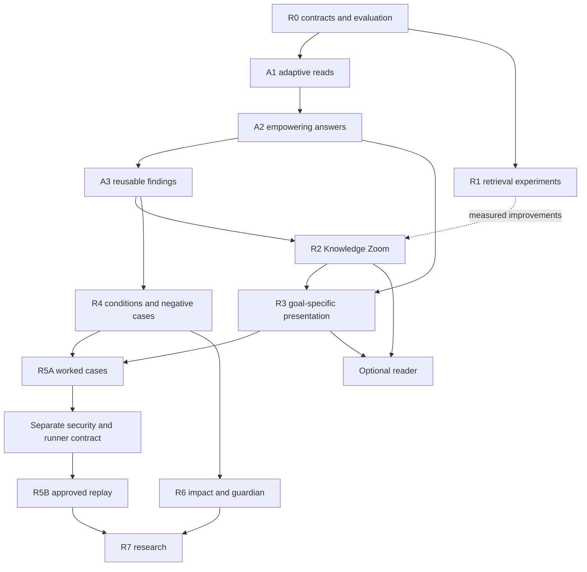

# Lore Knowledge Experience — empowerment-first roadmap

**Status:** Proposed implementation plan, not shipped functionality. **Roadmap revision:** 2. **Date:** 2026-10-09. **Baseline:** Lore 0.6.

**Designs:** [autonomous assistance and user empowerment](AUTONOMOUS_ASSISTANCE_DESIGN.md) and [Knowledge Experience architecture](KNOWLEDGE_EXPERIENCE_DESIGN.md).

> **Maximum useful autonomy. Minimum user burden.** First make Lore do the useful investigation and deliver an actionable answer. Then make that understanding easier to explore, apply, learn from and reuse.

Revision 2 moves adaptive assistance into the first delivery, rather than treating investigation as an optional late-stage agent feature. It preserves the R0–R7 knowledge workstreams and adds A1–A3 as the initial implementation path. Existing phase labels and original work-package labels remain traceable; order and acceptance criteria change. All commands, stores and contracts described as future work remain proposals.

## 1. Scope, priorities and release policy

This is a capability roadmap, not a version-number or calendar promise. A1–A3 form a candidate next-release scope; assign an actual release number only when implementation, migration and outcome evidence justify it. No dates, staffing assumptions, price or performance improvements are guaranteed here.

The intended everyday experience remains one request. Lore chooses useful retrieval, investigation and presentation within accepted permissions. Users should not need to choose investigation flags, graph depth, documentation mode or reasoning effort. Advanced controls remain available to restrict behavior or inspect what happened.

### 1.1 Delivery order

| Stage | User-visible value | Dependency |
| --- | --- | --- |
| R0 | Establish baseline, UX/authority contract and small repeatable fixtures | None; run empirical evaluation alongside the first implementation |
| A1 | Automatically resolve material uncertainty through permitted reads | Existing 0.6 retrieval/inspection plus R0 contract |
| A2 | Answer first, preserve safe progress and avoid unnecessary handoffs | A1; presentation prototyping can run in parallel |
| A3 | Reuse revision-bound investigative findings without stale certainty | A1/A2; no new accepted-facts store |
| R1 | Better contextualized segments and exact retrieval | R0; can proceed alongside A1–A3 |
| R2 | Knowledge Zoom over useful answers, findings and original evidence | A2/A3 interfaces; R1 only where measured helpful |
| R3 | Explain, how-to, tutorial and reference suited to the goal | A2; richer zoom integration follows R2 |
| R4 | Decision conditions, boundary cases and investigate-first gap capture | A1–A3; not dependent on a graphical reader |
| R5A / R5B | Worked learning cases, then separately approved isolated replay | R3/R4; R5B requires independent security evidence |
| R6 | Consequential change briefings, advisory guardian and optional reader | A1–A3/R4; UI can follow R2/R3 independently |
| R7 | Optional personalization and cross-project transfer | Prior correctness, permission and usefulness gates |

**First useful vertical slice:** a behavior-preserving change with contradictory documentation. Lore reads relevant permitted source/test declarations, evaluates the discrepancy, revises its recommendation when needed, and returns a defensible next action without asking the user to do routine investigation. A second query reuses applicable findings only after revalidation. This does not require a hierarchy, GUI, new connector or test runner.

### 1.2 Common release gates

- Preserve explicit schema-2/3/4 contracts, `--fast`, `--no-inspect`, no-cache, source evidence, review history and no-op behavior. A new default has explicit version/migration notes, not silent changes behind an old schema.
- Source-dependent assertions retain exact evidence, revision, scope, modality and authority. Derived findings never become accepted policies through reuse.
- Expand initiative inside accepted grants, not access. Existing denials survive upgrades; a repository's own configuration cannot authorize host execution or egress.
- No generic investigative handoffs when a suitable permitted capability and budget exist. Remaining dependencies identify what is missing and why it affects action.
- Resource exhaustion, capability unavailability and policy/requirements blockers remain distinct. Safe partial work cannot disguise a blocked full task.
- Validate both caution and initiative: fewer false blocks must not increase unsafe proceeding or hidden preconditions.
- Every stateful feature has versioning, bounded storage, invalidation, purge, privacy and crash recovery. Persistent citations outlive disposable cache eviction.
- No secret/unauthorized egress, untrusted process execution, source mutation, hidden telemetry or background continuation by default.
- Every quality claim has an actual reviewed experiment. Synthetic fixtures establish mechanics, not product superiority. Features can ship experimentally with honest status while evidence is collected.

## 2. Backlog priorities

| Priority | Workstream | Smallest useful result | Why it matters |
| --- | --- | --- | --- |
| P0 | Adaptive investigation | Useful permitted checks happen without extra flags | Removes investigative burden |
| P0 | Outcome-first answer and scoped readiness | One recommendation, safe progress and exact remaining dependency | Enables action without hiding uncertainty |
| P0 | Reusable investigations | Revalidated prior findings reduce duplicate work | Compounds project experience |
| P0 | Permission UX and compatibility | Standing grants, restrictive overrides, no repeat prompts | Initiative without surprise access |
| P0 | Full-task and handoff evaluation | Correct progress, burden and unsafe-proceeding metrics | Prevents optimizing apparent confidence |
| P1 | Contextual segmentation/retrieval | More accurate exact and concept retrieval | May add value before a hierarchy |
| P1 | Zoom and explain/reference | Expand a useful answer directly to detail/evidence | Reduces reading and navigation burden |
| P1 | How-to and decision conditions | Applicable steps, tested assumptions where possible | Turns understanding into practical judgment |
| P1 | Negative/boundary cases | Rare consequential exceptions appear when needed | Avoids expensive repeated mistakes |
| P2 | Learning experiences | Prepared worked example and transfer task | Builds capability, not merely familiarity |
| P2 | Investigate-first knowledge gaps | Resolve available gaps; optional focused capture for truly missing knowledge | Improves knowledge without a mandatory review queue |
| P2 | Change impact and advisory guardian | Triage, investigate and explain meaningful risks/changes | Avoids an unfiltered warning feed |
| P3 | Isolated verification/replay | Automatically select an approved check inside a standing grant | More capability after a distinct safety boundary |
| P3 | Local visual reader | Optional mode/depth/evidence interaction | Polish must not delay core usefulness |
| Research | Personalization/cross-project analogy | Explicit opt-in with namespace/authority boundaries | Conditional transfer, never policy merging |

First-release non-goals remain mandatory MCP, graph database, hosted account, daemon, direct tracker setup, browser automation, arbitrary model-authored commands, autonomous code changes, production operation and automatically accepting generated policy. Capability scarcity is not an excuse to abandon useful retained-evidence assistance.

## 3. R0 — baseline, contracts and evaluation foundation

**Purpose:** define the experience and test it without making all research a prerequisite for writing the first useful implementation.

### Work items

- **R0.1 Pin the baseline:** source/build/config/model identities; current 0.6 default versus explicit inspection/investigation, including actual grants and resource ceilings.
- **R0.2 Define outcome tasks:** exact lookup, orientation, behavior-preserving change, policy-changing request, partial progress, document-only assistance and learning transfer. Use independent held-out projects for general claims.
- **R0.3 Adversarial fixtures:** retain prior provenance, chronology, table, exception, deletion, scope and injection cases; add the AT-01–AT-26 autonomy scenarios in the companion specification.
- **R0.4 Extend measurement:** full assistance/caller/correction interaction, completed versus delegated checks, false blocks, unsafe proceeding, model/adapter attempts, cold/warm latency, actual usage and known billing.
- **R0.5 Versioned contracts:** define request/result/controller types, scoped readiness, capability manifest, explicit legacy behavior, progress/cancel events and cache policy. Finalize view types only when needed by R2.
- **R0.6 Set budgets and UX rubrics:** measure 0.6 behavior; choose initial bounded envelopes and pre-register outcome/non-inferiority targets before candidate scoring. No invented probabilistic value estimates.
- **R0.7 Threat review:** distinguish trusted host grants, project preferences, caller restrictions, data classes and source-derived egress; document missing adapter capabilities honestly.

### Deliverables and gate

A contract RFC, adversarial manifest, reproducible baseline collector and independent scoring instructions. R0 contract/fixture readiness unlocks A1 development; held-out studies continue in parallel. Broad quality/default-on claims require reviewed evidence, but lack of a completed study does not indefinitely block an explicitly experimental build. Reviewers must distinguish static inspection, executed checks, source reports, inferences and authority.

## 4. A1 — adaptive read-only assistance

**Purpose:** make Lore own useful investigation immediately using existing foundations.

### PR-sized work packages

- **A1.1 Effective policy resolver:** intersect trusted operator grants, project/root identity, caller access and request restrictions. Preserve old denials and data-class egress restrictions. Expose available capability IDs, not arbitrary tool strings.
- **A1.2 Controller state:** goal/change kind, provisional answer, applicable constraints, material uncertainties, competing hypotheses, completed observations, candidate actions, shared budget and stop reason. No hidden chain-of-thought storage.
- **A1.3 Typed read capabilities:** wrap existing registry/evidence/relation retrieval and no-follow bounded inspection. History reads initially use available snapshots; live history/connectors require an approved adapter, not a promised general capability.
- **A1.4 Action selection:** rank narrow permitted checks by plausible impact on the answer, risk/reversibility and cost. Explicit requested identifiers/modes override routing; a decision model is advisory, never a relevance veto over critical constraints.
- **A1.5 Recommendation revision:** incorporate new evidence and change the action when the premise fails. Do not merely append a warning to an unchanged bad recommendation.
- **A1.6 Stopping:** decision sufficiency, low expected value, no information gain, capability absence, budget exhaustion, authority/requirement dependency, evidence mutation, cancellation and provider failure. No exhaustive-search requirement.
- **A1.7 Resource ledger:** count all model attempts/retries, reads/rereads, indexes, waiting and verification/repair under aggregate bounds; reserve final validation. Independent parallel reads share budgets and cancellation.
- **A1.8 Capability ergonomics:** one understandable standing envelope during trusted setup; no new grant through configure-only/untrusted repo settings; no repeated prompts within the same grant; useful restricted operation without setup nagging.
- **A1.9 Regression scenarios:** AT-01–AT-10, AT-14–AT-16, AT-20–AT-21 and AT-24–AT-26; include no unnecessary reads on an exact lookup and a policy change that must not be authorized by inference.

### Deliverables and exit gate

A future versioned/experimental adaptive command path produces a useful scoped answer with actual completed reads and truthful static-only observations. It works with configured documents alone when checkout access is unavailable. Contract tests prove limits, permissions, legacy behavior and counterevidence revision. Compared with a capability/budget-matched 0.6 inspected arm, measure whether adaptive selection/stopping improves burden or outcome without increasing material errors. Do not attribute gains solely to larger budgets or extra data.

## 5. A2 — action-first UX, safe progress and minimal handoffs

**Purpose:** make the answer empowering rather than an evidence dump or a list of homework.

### PR-sized work packages

- **A2.1 Answer composer:** direct answer/preferred approach first, decisive rationale, main trade-off and next useful action. Do not force every explanation or exact lookup into six compulsory headings.
- **A2.2 Scoped readiness:** distinguish full requested outcome from independent actions; expose completion criteria and material remaining dependencies. A genuine blocker is specific to an action.
- **A2.3 Delegation policy:** complete relevant available checks before handoff. Identify why an unavailable observable is material; distinguish future tests on code not yet changed from checks Lore could perform now.
- **A2.4 Noninteractive behavior:** never wait for stdin to resolve a missing requirement; return structured dependency and useful work. Interactive escalation is one focused request only after meaningful assistance and only when necessary.
- **A2.5 Progressive disclosure:** keep critical constraints visible; place detailed evidence, alternatives, history and budgets behind CLI detail options or reader expansion. The machine contract retains full required manifests.
- **A2.6 Useful degradation:** repair/withdraw an invalid component while retaining independent supported findings. Never detach a material qualifier to make an answer fit. No stale answer relabeled current and no pretend model reasoning on deterministic fallback.
- **A2.7 Agency and feedback:** allow scope narrowing, correction, cancellation and evidence inspection. Occasional synchronous progress explains useful findings, not raw tool chatter. No covert background continuation.
- **A2.8 Golden UX examples:** useful one-value reference; three-versus-five refactor; genuine policy dependency with preparation work; unavailable runner; provider outage; document-only request; optional tutorial exercise; no meaningful independent work.

### Deliverables and exit gate

Users can identify the answer, next action and decisive boundary without reading an investigation log. Reviewers judge meaningful safe progress rather than filler. Tests reject generic delegation when the recorded capability was available and affordable, while permitting honest future implementation checks. Evaluate comprehension, correction effort, avoidable questions, false blocking and unsafe proceeding jointly. The shortest answer or fewest questions alone is not the objective.

## 6. A3 — reusable investigative knowledge

**Purpose:** let each useful investigation reduce future work without turning guesses into accepted facts.

### PR-sized work packages

- **A3.1 Record/schema:** immutable ID/revision, task family/scope/applicability, original evidence, observations, hypotheses/alternatives, counterevidence, action changes, completed checks, validation/coverage, stop reason and concise rationale.
- **A3.2 Derived store:** separate from accepted registry; bounded retention, schema migration, access/data-class labels, no-cache/read-only semantics and transparent actual writes. Routine reuse needs no human approval.
- **A3.3 Revalidation:** bind all supporting source/unit/relationship revisions and inspected file hashes, including deeper follow-ups and dirty files. Check candidate inventories and newly relevant evidence, not only old support hashes.
- **A3.4 Safe partial reuse:** a preserving-change finding cannot authorize a policy change. Reuse unaffected applicable observations while revising dependent recommendations; incomplete indexes become leads, not complete current answers.
- **A3.5 Negative results:** empty bounded search is not global absence; permission denial/refusal/timeout is not domain evidence. Reconsider when capabilities or evidence change.
- **A3.6 Publication lifecycle:** durable views retain referenced observation manifests/artifacts even after answer-cache eviction. Add dependency indexes, invalidation events, journal recovery and purge coverage.
- **A3.7 Retrieval and cost:** use original unit retrieval alongside investigation candidates; avoid correlated-evidence double counting; record reused versus newly performed actions and revalidation cost.
- **A3.8 Tests:** AT-11–AT-13, AT-18–AT-19, AT-21–AT-22 and AT-24; new ADR with unchanged older files, same-size edit, deleted deeper-round file, reduced permission, partial inventory and evicted record cited by a persistent view.

### Deliverables and exit gate

A subsequent related request benefits from safely reusable findings. A new contrary source invalidates or changes the old conclusion even when original evidence remains unchanged. No current view loses its cited observations on eviction. A warm/cold comparison reports avoided work, actual revalidation overhead, stale-answer errors and cross-task leakage controls. Findings remain derived; explicit authoring is required only for new primary notes/policy, not for every reusable insight.

## 7. R1 — contextualized segments and retrieval

**Purpose:** improve the informational units where measurement shows value, without delaying A1–A3.

- **R1.1 Segmentation profile:** extend `src/sources.rs` with derived context metadata; preserve existing extraction/quote identities unless a demonstrated defect requires migration.
- **R1.2 Structures:** tables with headers/units, fences with purpose, procedures with order/rollback, ADR status/decision scope, examples with negative conditions.
- **R1.3 Retrieval headers:** deterministic/generated context is non-evidentiary metadata; preserve modality and prompt/profile fingerprint.
- **R1.4 Ablations:** original units versus contextualized units/chunks; lexical-only versus hybrid; exact identifier/path bypass and direct access to rare exceptions.
- **R1.5 Overlap/deduplication:** inherited context does not create independent corroboration or false merge across version/environment/modality.
- **R1.6 Updates/purge:** invalidate inherited context on changed/deleted/moved sources; true no-op retains bytes with zero inference.
- **R1.7 Tests:** table/procedure splits, repeated headings/quotes, large Unicode section, ADR acceptance, derived import, denied access and budget overflow.

**Exit gate:** measurable retrieval/downstream improvement without exact-reference, constraint-recall or authority regression. When improvement is negligible, keep current units and proceed with useful assistance/views rather than forcing a segmentation redesign.

## 8. R2 — evidence-preserving Knowledge Zoom

**Purpose:** let the user expand a useful answer into a working model, decision detail and exact evidence without navigating first.

- **R2.1 View storage:** versioned nodes, support, coverage, publications and dependencies in disposable derived state; DAG containment checks, migrations, retention and purge.
- **R2.2 Grouping:** compare topic/relationship, binary, four-way and adaptive overlapping groups. Structural node counts are not performance claims.
- **R2.3 Leaves:** source-bound knowledge and applicable investigation findings, with original evidence/observation manifests. No summaries used as proof.
- **R2.4 Parents:** constrained fields preserve critical constraints, rare exceptions, conflict/transition endpoints, qualifiers and included/eligible/omitted counts.
- **R2.5 Cross-level retrieval:** combine views with original lexical/path/semantic/relation access. An upper summary cannot exclude the only decisive lower-level fact.
- **R2.6 Validation/degradation:** source/scope/modal/temporal checks plus fallible semantic review; preserve valid partial help before falling back to an evidence index.
- **R2.7 Incremental invalidation:** source additions, edits, deletions, changed relationships and investigation counterevidence invalidate relevant parents, including untouched original topics.
- **R2.8 CLI/Markdown:** proposed `lore view SUBJECT` infers a sensible mode/depth. Explicit mode/depth/as-of options are advanced, not a required form. Preserve stable links and source status.
- **R2.9 Limits:** sparse on-demand builds, bounded nodes/fan-out/context/calls/deadlines and measured rebuild amplification; coherent staged publication and recovery.
- **R2.10 Usability:** compare orientation accuracy, navigation time, rare-condition discovery and evidence drill-down against current Lore and the simpler A2 presentation.

**Exit gate:** meaningful comprehension/retrieval benefit at measured cost, no erased critical conditions or false current/historical claims. Keep direct retrieval when it outperforms hierarchical routing. A graph canvas or dedicated UI is not required.

## 9. R3 — Diátaxis experiences

**Purpose:** fit the same investigated knowledge to the user's goal, not merely relabel four generic templates.

### R3.1 Explain

Provide the decisive mental model, relevant history, recorded rationale and clearly labeled useful inference. Investigate ambiguity when it affects understanding; avoid invented causal bridges or pointless deep inspection for a simple concept question.

### R3.2 Reference

Use exact identifiers, values/types, inputs/outputs, errors and scope/version conditions. Preserve table context and numeric precision. Resolve material ambiguity using available evidence without delaying a known exact answer with unrelated history.

### R3.3 How-to

Provide goal, prerequisites, branches, safe order, implementation seams, rollback and observable completion. Complete available prerequisite investigations first. Separate completed checks, future implementation verification and external dependencies. Do not invent authority to change policy.

### R3.4 Tutorial

Prepare a bounded learner goal, starting state, purposeful actions/predictions, feedback, cleanup and a distinct transfer task. User exercises are appropriate only because learning was requested. First support non-executing worked examples; never pretend setup or replay passed.

### Shared work

- **R3.5 Routing:** explicit user intent wins; sensible defaults, typed uncertainty/refusal and no cheap-model veto over critical evidence.
- **R3.6 Composition:** one knowledge/observation snapshot with mode-specific schemas and validators. Investigate gaps, then provide the closest useful labeled alternative rather than fabricate or refuse all help.
- **R3.7 Switching:** mode/depth changes reuse authorized evidence and completed work where applicable, not repeat discovery needlessly.
- **R3.8 Accessibility:** meaningful Markdown/JSON, logical headings, screen-reader status and no color-only authority labels.
- **R3.9 Study:** generic versus goal-specific responses, randomized tasks and controlled models/budgets; separately measure lookup, task completion, explanation and skill transfer.

**Exit gate:** each mode has its own observed usefulness and failure boundaries. A failed tutorial experiment must not block good explanation/reference or core task assistance. No polished mode can compensate for missing critical evidence.

## 10. R4 — decisions, negative cases and investigate-first gaps

### R4.1 Decision lenses

Represent a decision's recorded problem/reasons/alternatives, documented assumptions, inferred conditions, applicability, review status and original evidence. Investigate possible condition changes before generating a review suggestion. Return the strongest provisional interpretation and action; use human attention only for consequential unavailable requirements or authority. Approving an interpretation is not superseding an ADR. Measure meaningful reconsiderations, false alarms and decision errors.

### R4.2 Negative and boundary cases

Add positive examples, counterexamples, historical failures, exceptions and incidents with source/environment/version. Attach them to relevant answers, how-tos and lenses. A rare case must survive compression when it changes action. A reported resolution is not a reproduced result; a historical failure is not a permanent prohibition. Reuse its conditions, not an unconditional ban.

### R4.3 Knowledge gaps

Investigate a gap's relevance and available evidence before surfacing it. Resolve from sources, approved tools or revalidated findings where possible; retain explicit non-blocking inference when useful. Keep non-material gaps quiet in ordinary assistance. Only an explicitly requested maintenance session should expose a ranked optional capture queue. Support declines/unknown, deduplication, expiry and attributable volunteered answers. Source authoring remains a separate authorized operation; ordinary investigation reuse requires no approval.

**Exit gate:** fewer material mistakes and less unnecessary human review. A remaining question is actually consequential, unavailable to Lore and answerable; it is not work that Lore merely declined to do. Authored testimony retains scope and provenance without becoming runtime proof.

## 11. R5 — worked cases and separately authorized replay

### R5A: no-execution cases

Define case IDs, scenarios, prerequisites, source/decision revisions, inputs, expected outcomes, negative branches, success/failure conditions and cleanup. Connect them to tutorial/how-to/reference/explanation as appropriate. Lore prepares examples using permitted static evidence and clearly labels expectations versus observations. External test descriptions can be ingested without executing them. Measure transfer to a distinct task, not only recognition of the presented example.

### R5B: isolated verification capability

R5B has a separate threat-model/sandbox RFC and adversarial isolation evidence. It is not necessary to implement A1–A3.

- Bind a standing operator grant to known command/capability IDs, pinned project inputs, approved runtime and resource/network policy. Lore may select a material check automatically within that grant; no confirmation for every execution.
- Deny arbitrary commands from source/model text, credentials, production data, host mutation and network by default. Enforce filesystem, process-tree, CPU/memory/disk/output/time limits and cancellation.
- Record actual argv, input/code/test hashes, tool/runtime, policy, observed results, exit status, output artifacts and redaction. Generated expected output is never execution evidence.
- Invalidate applicability when inputs/tests/runtime/permissions change. Retain historical outcomes honestly without a generic production-verified badge.
- Persist derived observations under cache policy; new primary project notes/policy remain explicitly authored. Do not require humans to approve every result merely to reuse it.
- Compare bounded execution with equivalent text/static cases, including setup overhead, cost, failures and security attacks.

**Exit gate:** enforceable isolation plus actual learning/task benefit, source/observation binding and zero unauthorized execution/egress. If isolation is absent, ship R5A and useful static assistance; do not substitute an unsafe shell or burden users with infrastructure setup to get an answer.

## 12. R6 — impact briefings, advisory guardian and optional reader

### R6.1 Consequential changes

Compare named publication/source baselines or optional explicitly acknowledged revisions. Explain what the user should now understand/do differently about decisions, assumptions, procedures, cases and uncertainties. Investigate important apparent changes; suppress editorial churn. Keep source edits, reported outcomes, changed interpretations and scoped observations distinct. Never infer what someone learned from opening a page. Proposed `lore changes` remains a separate versioned command.

### R6.2 Advisory guardian

Consume a supplied or actually inspected task/patch/revision and relate it to applicable rules, decision conditions, negative cases and checks. Complete available useful investigation before emitting a warning. Provide likely consequence, specific evidence, remedy and exact outstanding dependency—not an untriaged suspicion queue. Deduplicate unchanged findings and measure interruption cost, precision and missed material errors. No source edits, hooks or merge blocking by default; CI enforcement requires a separate policy decision.

### R6.3 Optional local reader

Reuse the same result/view contract for answer-first content, mode/depth controls, breadcrumbs, why/source/changes actions, visible critical constraints and expandable detail. Support correction, narrowing/cancellation and evidence inspection without unnecessary repeated work. Preserve offline Markdown/CLI access, keyboard/screen-reader usability, responsive layout, escaping/CSP and no implicit analytics, remote images/egress or executable Markdown.

**Exit gate:** faster accurate return-to-project understanding, useful low-burden warnings and no dependency on a visual client. A simpler reader that helps users act is preferable to a graph requiring them to reconstruct the answer.

## 13. R7 — research extensions

- **Cross-project analogies:** preserve namespace, authority, privacy, source correlation and conditions under which a lesson will not transfer. A candidate analogy cannot become merged policy.
- **Personalized explanations:** explicit local preferences/acknowledged baselines, portable/deletable; no inferred beliefs or hidden activity tracking.
- **Proactive workflows:** checks may be triggered by explicitly configured update/review workflows. Ordinary requests do not silently install background agents or notifications.
- **More efficient routing:** evaluate learned decision-value selection against bounded heuristics, including false-negative recall and high-cost mistakes. Scores never replace evidence or permission.
- **Alternative presentation:** diagrams, timelines or other media remain views of the same evidence and limitations. No interface-only source of truth.

Advance only with demonstrated demand and earlier outcome/security gates. Research experiments must not reopen the foundational commitment to useful autonomy inside existing permissions.

## 14. PR-sized delivery sequence and traceability

New package labels A01–A12 precede the original 01–19 backlog. They are planning IDs, not GitHub PR numbers. Preserve smaller independent changes, each with observable user benefit and targeted negative tests.

| Package | Phase | Scope | Required evidence |
| --- | --- | --- | --- |
| A01 | R0 | Autonomy fixtures, burden rubric and matched 0.6 baseline | Reproducibility and no solved-task leakage |
| A02 | A1 | Capability manifest, trust resolution and legacy policy | Denied grants, untrusted config, restrictive overrides |
| A03 | A1 | Typed actions/controller and shared budgets | Simple task no-op, bounded calls and byte limits |
| A04 | A1 | Material uncertainty and counterevidence revision | Recommendation changes when premise fails |
| A05 | A1 | Stopping, cancellation and progress events | No endless loop; no background continuation |
| A06 | A2 | Action-first future response schema and composer | Exact lookup/partial progress/true blocker examples |
| A07 | A2 | Delegation/escalation and noninteractive contract | Available check completed, no stdin waiting |
| A08 | A2 | Component validation and useful fallback | Invalid clause cannot poison unrelated findings |
| A09 | A3 | Investigation records/store and permission inheritance | No-cache/read-only/purge/source authority |
| A10 | A3 | Freshness, new-evidence search and selective reuse | New ADR, dirty/deeper file, incomplete inventory |
| A11 | A3 | Durable publication dependencies and eviction | No dangling citations after cache removal |
| A12 | A1–A3 | Matched outcome evaluation and default migration | Benefit versus inspected 0.6; correctness and latency gates |
| 01 | R0 | Original knowledge adversarial gold | Provenance, chronology and exception preservation |
| 02 | R0/R2 | View schema and CLI interface contract | Version, scope, intent and budget checks |
| 03 | R1 | Contextual segments | Table, procedure, ADR and Unicode identities |
| 04 | R1 | Retrieval ablations | Exact lookup, rare constraints and false merges |
| 05 | R2 | Derived views, IDs and DAG | Migrations, rollback, purge and unknown refs |
| 06 | R2 | Evidence-closed leaf/parent synthesis | Mandatory qualifier and support checks |
| 07 | R2 | Cross-level retrieval | Direct bypass and conflict endpoints |
| 08 | R2 | Invalidation/staged publication | New source, deleted evidence and true no-op |
| 09 | R2 | Simple view/Markdown/JSON surface | Defaults, evidence drill-down and partial status |
| 10 | R3 | Explain/reference renderers | Numeric, authority and temporal correctness |
| 11 | R3 | How-to integrated with adaptive checks | Completed prerequisites versus future code tests |
| 12 | R3 | Tutorial/worked examples | Transfer task, no pretend execution |
| 13 | R4 | Investigated decision conditions | No automatic policy supersession |
| 14 | R4 | Negative/boundary cases | Rare-case retrieval and version invalidation |
| 15 | R4 | Investigate-first gaps and optional notes | No routine review burden; explicit authoring |
| 16 | R5A | Worked case browsing | Scope, learner feedback and cleanup |
| 17 | R5B | Separate safe-runner RFC/harness | Escape/egress/resource/cancel tests |
| 18 | R6 | Consequential changes/advisory guardian | Triage value and interruption burden |
| 19 | R6 | Optional reader | Accessibility, XSS/egress and offline fallback |

Package 17 is a new capability boundary, not a prerequisite to completing investigations with already available tools. APIs/schemas should share existing 0.6 types where appropriate; avoid a framework rewrite to accommodate one extra action.

## 15. Dependencies and first release boundary

**First candidate release:** A1–A3, with R0 evaluation and only necessary R1 fixes. It must demonstrate an automatic permitted investigation, counterevidence-based recommendation revision, precise noninteractive dependency, meaningful partial progress, no unnecessary work for an easy request, and safe reuse after source mutation.

**What waits:** full hierarchical rebuild, all four polished modes, sandboxed execution, new connectors, personal profiles, a graphical reader and cross-project transfer. Retaining them as separate workstreams preserves ambition without diluting the immediate experience.

## 16. Validation, rollout, risks and definition of done

### 16.1 Test layers

Unit tests cover typed actions, state transitions, policy intersections, source IDs, hashes, scopes, DAGs, budgets and response contracts. Property/mutation tests cover source additions/deletions/moves, changed relationships, dirty/same-size/deeper file changes, incomplete indexes, no-op, stale reuse and crash recovery. Adversarial tests cover injection, forged citations, negation, scope/policy mistakes, hidden critical exceptions, secret egress, malicious runner requests and poisoned memory.

Real-model tests measure complete task outcomes and reasoning errors with independent review, including missed constraints, false causal/temporal claims and inappropriate authority. Product tests measure reading/correction effort, correct next action, cancellation/overrides, exact lookup, skill transfer, warnings and gap-capture burden. Runner/reader security tests are separate from prompt/schema tests.

### 16.2 Metrics and anti-gaming

Primary: unassisted correct progress and total time/effort to a correct, constraint-respecting outcome. Report task completion, avoidable delegation, true external dependencies, false blocking, unsafe proceeding, unnecessary investigation, clarity/agency, reuse benefit, cold/warm p50/p95 and actual usage/billing where known.

Use matched-capability and matched-budget arms: original sources, current 0.6 default, explicit inspected/investigated 0.6, adaptive without reuse, adaptive with reuse, and naive always-investigate. Later add richer retrieval/views or execution separately. Keep the same coding model, source snapshots and external correctness checks; randomize and isolate caches. A reused prior solution must not leak held-out answers.

Pre-register improvement/non-inferiority targets and sample size after R0 baselines, before scoring candidate output. Zero questions, zero blockers, many checks or confident prose cannot be a standalone target. Hard safety/provenance gates remain mandatory; empirical task scores remain honestly unmeasured until executed.

### 16.3 Rollout and rollback

Prototype the new controller behind an explicit experimental switch. The intended mature product is adaptive by default inside accepted permissions, not a permanent collection of per-query flags. Ship default changes only after version/migration, security, outcome and latency review. Existing deny settings cannot become grants during migration; registry-only adaptive reasoning remains useful.

Migrate derived stores independently, retaining accepted evidence and legacy schemas. Revert a failed controller/view feature without losing source history. A previous publication is a valid current fallback only if its dependencies remain current; otherwise label historical/stale and deliver fresh eligible findings. Separate optional modes/runner/UI so their failures do not break core context or reference. Respect cancellation and no-cache across all new stores.

### 16.4 Risk register

| Risk | Mitigation |
| --- | --- |
| Caution reappears as a required human review queue | Investigate-first contract; ordinary derived reuse needs no approval; measure burden |
| Low blocker count hides unsafe action | Scoped readiness, explicit preconditions, unsafe-proceeding gate |
| Autonomy means endless expensive exploration | Decision-value actions, no-information-gain stop, shared ledger and cancellation |
| Automatic initiative becomes surprise access | Standing trusted grants, deny-preserving migration, typed capabilities |
| Reuse turns speculation into truth | Original provenance, applicability, new-evidence checks and no authority promotion |
| New ADR ignored because old hashes match | Corpus/relationship change cursor, bounded relevant-evidence scan, incomplete-index rules |
| Summary erases a rare decisive exception | Critical inclusion manifests and adversarial retrieval tests |
| Partial verification discards all useful work | Dependency-aware repair/withdrawal and truthful partial output |
| Fallback preserves advice but removes its qualification | Atomic recommendation/condition handling; narrow or withhold action |
| Runner escapes or leaks data | Distinct tested isolation, no arbitrary commands, explicit data-class egress |
| Guardian overwhelms the user | Investigate/triage first, deduplicate, severity/applicability and interruption measures |
| Source-derived summaries leak under reduced access | Restriction inheritance through views/vectors/records and permission revalidation |
| UI implies user knowledge from page views | Explicit acknowledged baselines only; no hidden profiling |
| Generated output overwrites authored text | Manifest ownership, explicit rebuild and staged publication |

### 16.5 Definition of done

Every ticket has a concrete user journey; out-of-scope/failure behavior; source/derived authority boundary; versioned request/result and migration; actual permission/resource/write effects; unit/negative/adversarial tests; invalidation/no-op/purge/publication as applicable; user help and honest examples; measured result or explicit unmeasured status; and rollback without accepted-evidence loss.

Autonomy tickets additionally demonstrate no avoidable handoff within the available capability envelope, correct stopping, scoped partial progress, cancellation and counterevidence revision. Execution tickets require independent sandbox evidence. Model-quality tickets need a real-model evaluation plan/results and actual identities/usage; fixture success is never relabeled empirical utility.

## 17. Settled direction, remaining choices and references

| Question | Decision/default for this proposal | What remains to measure/design |
| --- | --- | --- |
| Who owns available investigation? | Lore; humans are not the default fallback | Typed adapter coverage and task-specific value |
| Everyday effort selection? | Automatic inside standing permissions | Numerical limits and calibrated routing |
| Must uncertainty be eliminated? | No; resolve what changes action, expose material residual conditions | Sufficiency/error and burden trade-offs |
| What ships first? | A1–A3 empowering read-only assistance and reuse | Default rollout requires matched outcome/migration evidence |
| Does every finding need approval? | No; derived findings reuse automatically under policy | Explicit source-authoring review remains separate |
| How to handle true blockers? | Exact missing decision/observable plus meaningful safe work | Do not fabricate safe progress where none exists |
| Hierarchy and segmentation? | Improve when measured; never required navigation | Grouping, salience and stable identity |
| Execution? | Separate approved runner; automatic choice inside grant only | Isolation implementation, cost and actual benefit |
| Reader/personalization? | Optional; CLI/Markdown first, no hidden tracking | Demonstrated usability and privacy value |
| Cross-project transfer? | Research with strict scope and authority separation | Reliable permissions and actual usefulness |

Project references: [autonomy and UX contract](AUTONOMOUS_ASSISTANCE_DESIGN.md), [full knowledge architecture](KNOWLEDGE_EXPERIENCE_DESIGN.md), [vision](../VISION.md), [existing design](../DESIGN.md), [0.6 behavior](V06.md), [0.6 decision evaluation](../evaluation/DECISION_INTELLIGENCE.md).

Research/product context remains [Diátaxis](https://diataxis.fr/), [RAPTOR](https://arxiv.org/abs/2401.18059), [GraphRAG](https://arxiv.org/abs/2404.16130) and [OpenWiki](https://github.com/langchain-ai/openwiki). They motivate experiments, not claims of novelty or measured gains for Lore.

**Acceptance question:** Did Lore do the useful work it could perform and leave the user more able to understand or proceed correctly, with less burden and without inventing certainty or authority?
